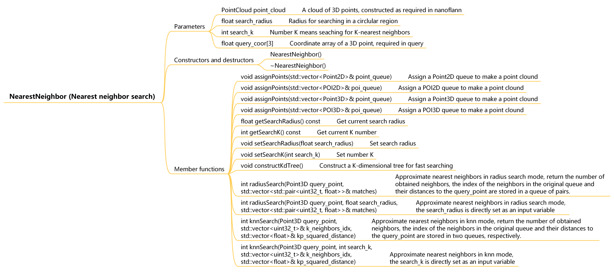
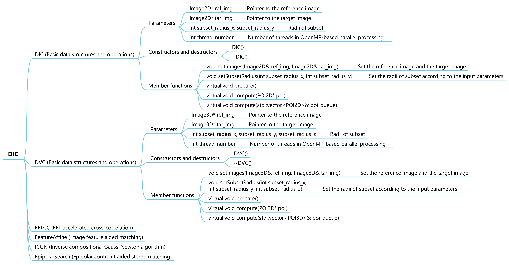
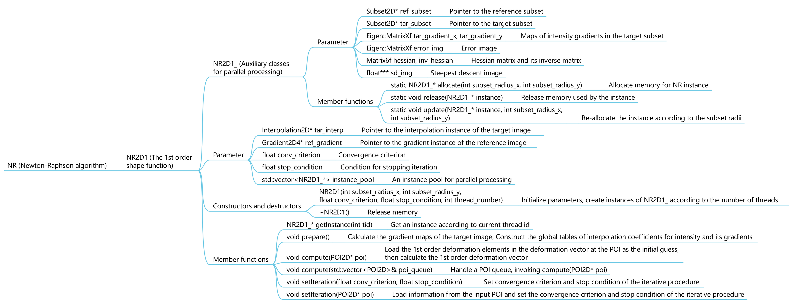
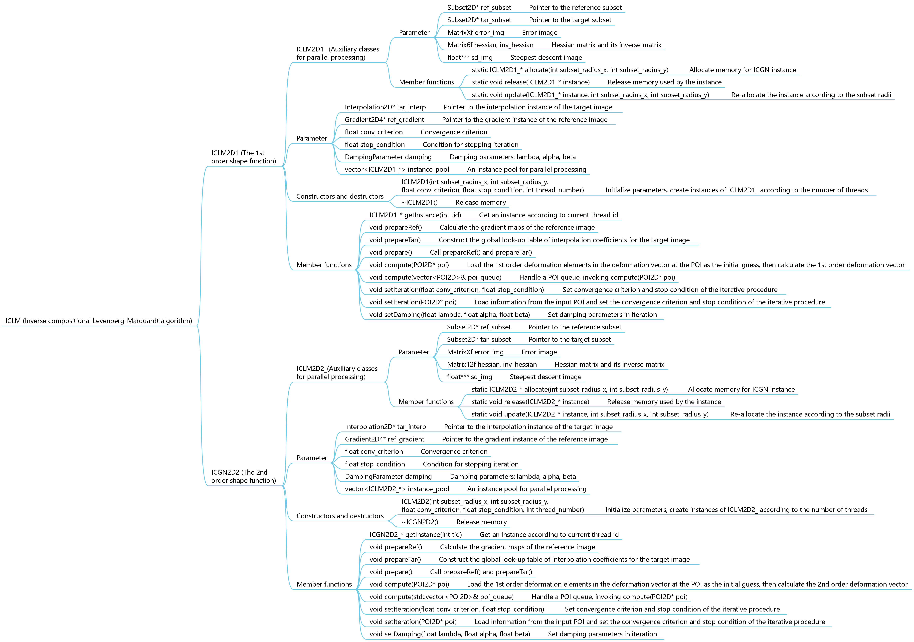

# 4. Processing methods

### 4.1. Basic processing:

(1) Gradient (oc_gradient.h and oc_gradient.cpp). Figure 4.1.1 shows the parameters and methods included in this object. OpenCorr currently provides only one gradient calculation method, i.e. the 4th-order central difference of the 1st-order derivative, which may be the most popular one. In 2D case, grad_img points to an Image2D object for processing. The gradient maps are stored in Eigen matrices gradient_x, gradient_y, and gradient_xy, respectively. In 3D case, grad_img points to an Image3D object for processing. The calculated gradient maps are stored in 3D float arrays gradient_x, gradient_y, and gradient_z.

Member functions:

- getGradientX(), getGradientY() and getGradientZ(), calculate the 1st-order gradient map along x, y, and z directions, respectively;
- getGradientXY(), calculate the mixed 2nd-order gradient map.

*Figure 4.1.1. Parameters and methods included in Gradient object*

(2) Interpolation (oc_interpolation.h and oc_interpolation.cpp). Figure 4.1.2 shows the parameters and methods included in this object. Interpolation is a base class which contains essential parameter, i.e. *interp_img pointing to the Image object for processing. The derived classes BicubicBspline and TricubicBspline (oc_cubic_bspline.h and oc_cubic_bspline.cpp) implement the popular cubic B-spline interpolation method for 2D and 3D cases. Our study indicates that the bicubic B-spline interpolation shows significantly improved accuracy and precision compared with the bicubic interpolation, at a trial computational cost (Pan et al. Theo Appl Mech Lett, 2016, 6(3): 126-130). Details of TricubicBspline can be found in our paper (Yang et al. Opt Laser Eng, 2021, 136: 106323).

Member functions:

- prepare(), construct a global matrix of interpolation coefficients, which is stored in matrix interp_coefficient;
- compute(Point2D& location) or compute(Point3D& location), estimate the grayscale value at the input location.

*Figure 4.1.2. Parameters and methods included in Interpolation object*

(3) NearestNeighbor (oc_nearest_neighbors.h and oc_nearest_neighbors.cpp). Figure 4.1.3 shows the parameters and methods included in this object. It invokes nanoflann (https://github.com/jlblancoc/nanoflann) to approximate the nearest neighbors of a given coordinates among a 3D point cloud, as FLANN (Fast Library for Approximate Nearest Neighbors) demonstrates considerably superior efficiency over the brute force search. Two searching modes are provided by the library: (i) Search in a circular region with a specific radius; (ii) Search for K-nearest neighbors. It is noteworthy that NearestNeighbor may not get all of eligible neighbors occasionally. Users may try brute force search if the number of obtained neighbors are far below the request.

Member function:

- assignPoints(vector& point_queue), assign a Point2D or Point3D queue to make a 3D point could;
- constructKdTree(), construct a K-dimensional tree for fast searching;
- radiusSearch(Point3D query_point), approximate the nearest neighbors to the coordinates of a given 3D point within a region of specific radius, return the number of obtained neighbors;
- knnSearch(Point3D query_point), approximate the K nearest neighbors to the coordinates of a given 3D point, return the number of obtained neighbors;
- getSearchRadius() and getSearchK(), get current parameters in the two searching modes;
- setSearchRadius(float search_radius) and setSearchK(int search_k), set the parameters in the two searching modes.

*Figure 4.1.3. Parameters and methods included in NearestNeighbor object*

(4) Feature (oc_feature.h and oc_feature.cpp). Figure 4.1.4 shows the parameters and methods included in this object. Feature is a base class which contains essential parameters, i.e. ref_img and tar_img pointing to the Image objects (reference image and target image). The derived classes SIFT2D and SIFT3D (oc_sift.h and oc_sift.cpp) provide the methods to extract and match the SIFT features in the two images. Structure sift_config contains the main parameters in feature extraction. Users may refer to the relevant documents of OpenCV for their meanings. Parameter matching_ratio is the threshold of ratio of the shortest distance between the descriptors of reference feature and target feature to the second shortest distance.  The extracted keypoints, after matching, are stored in the Point queues ref_matched_kp and tar_matched_kp.

SIFT2D invokes class SIFT in OpenCV. Its principles and implementation can be found in Lowe's famous paper (Lowe, Int J Comput Vis, 2004, 60(2): 91-110). SIFT3D is developed based on the paper by Rister et al (Rister et al, IEEE Trans Image Process, 2017, 26(10): 4900-4910), some details of implementation can be found in our paper (Yang et al, Opt Lasers Eng, 2021, 136: 106323).

Member functions include:

- setImages(Image& ref_img, Image& tar_img), set ref_img and tar_img;
- prepare(), assign the address of matrices in ref_img and tar_img to OpenCV matrices ref_mat and tar_mat In SIFT2D, initialize the icosahedron for construction of descriptor in SIFT3D;
- compute(), extract the features in reference image and target image, and then match them;
- getSiftConfig(), get current configuration of feature extraction;
- getMatchingRatio(), get current match ratio threshold of feature matching;
- setSiftCong(SiftConfig sift_config), set configuration of feature extraction;
- setMatching(float matching_ratio), set matching ratio threshold of feature matching.

*Figure 4.1.4. Parameters and methods included in Feature object*

(5) Calibration (oc_calibration.h and oc_calibration.cpp). Figure 4.1.5 shows the parameters and methods included in this object. It is used to undistort the pixel coordinates of a 2D point in sensor coordinate system.

Parameters:

- Camera intrinsics, including fx, fy, fs, cx, cy, k1, k2, k3, k4, k5, k6, p1, p2;
- Camera extrinsics, including tx, ty, tz, rx, ry, rz;
- Intrinsic matrix: intrinsic_matrix;
- Rotation matrix: rotation_matrix;
- Translation vector: translation_vector;
- Projection matrix: projection_matrix;
- Convergence criterion and maximum iteration number in preparation of undistortion map: convergence, iteration;
- Map of distorted coordinates in image/retina coordinate system corresponding to the integral pixel coordinates in sensor/pixel system: map_x, map_y.

Member functions:

- updateIntrinsicMatrix(), update camera intrinsic matrix;
- updateRotationMatrix(), update rotation matrix;
- updateTranslationVector(), update translation vector;
- updateProjectionMatrix(), update projection matrix according to the three matrices mentioned above;
- updateMatrices(), update all the four matrices;
- clear(), set the values of all intrinsics and extrinsics to be zero.
- Point2D image_to_sensor(Point2D& point), convert the coordinates of input point from image/retina system to sensor/pixel system;
- Point2D sensor_to_image(Point2D& point), convert the coordinates of input point from sensor/pixel system to image/retina system;
- float getConvergence(), get current convergence criterion;
- int getIteration(), get current upper limit of iteration step;
- setUndistortion(float convergence, int iteration), set parameters in preparation of undistortion map;
- prepare(int height, int width), create a map of distorted coordinates in image/retina system corresponding to the integral pixel coordinates in sensor/pixel system, according to the size of image;
- Point2D distort(Point2D& point), adjust the coordinates of input point (in image/retina coordinate system) according to the distortion model;
- Point2D undistort(Point2D& point), correct the coordinates in sensor system of input point using the prepared map and linear interpolation.

*Figure 4.1.5. Parameters and methods included in Calibration object*

(6) Stereovision (oc_stereovision.h and oc_stereovision.cpp). Figure 4.1.6 shows the parameters and methods included in this object. It is used to reconstruct the coordinates of a 3D point in space based on the two matched 2D points in left view and right view.

Parameters:

- Calibration objects of the two cameras: Calibration view1_cam (principal), view2_cam (secondary);
- Number of CPU threads in parallel processing: int thread_number;
- Fundamental matrix in a binocular stereovision system: Eigen::Matrix3f fundamental_matrix

Member functions:

- updateCameraParameters(Calibration* view1_cam, Calibration* view2_cam), update the objects of cameras;
- void updateFundementalMatrix(), update the fundamental matrix;
- prepare(), update the parameter matrices of the two cameras, as well as the fundamental matrix;
- Point3D reconstruct(Point2D& view1_2d_point, Point2D& view2_2d_point), reconstruct the coordinates of 3D point based on the matched 2D points in view1 and view2.
- reconstruct(view1_2d_point_queue,  view2_2d_point_queue, space_3d_point_queue), handle a batch of point pairs, the results are stored in space_3d_point_queue.

*Figure 4.1.6. Parameters and methods included in Stereovision object*

(7) IO (oc_io.h and oc_io.cpp). Figure 4.1.7 shows the parameters and methods included in this object. It helps code debugging and data analysis. Users can load information of POIs from a CSV datasheet or save the computed results into CSV datasheets.

Parameters:

- File path and delimiter of data: file_path, delimiter;
- Image dimensions: 2D (height, width), 3D (dim_x, dim_y, dim_z);

Member functions:

- setPath(string file_path), set path of CSV datasheet;
- setDelimiter(string delimiter), set delimiter for data picking
- loadPoint2D(string file_path) or loadPoint3D(string file_path), load coordinates of POIs from a CSV datasheet of given file path, create a Point2D or Point3D queue;
- savePoint2D(vector<POI2D> point_queue, string file_path) or savePoint3D(vector<POI3D> point_queue, string file_path), save the coordinates of POIs to a CSV datasheet of given file path;
- loadCalibration(Calibration& calibration_cam1, Calibration& calibration_cam2, string file_path), load calibration parameters of cameras from a CSV file;
- loadTable2D(), loadTable2DS(), or loadTable3D(), load computed results at POIs from a CSV datasheet, create a POI2D, POI2DS, or POI3D queue;
- saveTable2D(vector<POI2D> poi_queue), saveTable2DS(vector<POI2DS> poi_queue), or saveTable3D(vector<POI3D> poi_queue)，save the information of POIs into a CSV datasheet;
- saveDeformationTable2D(vector<POI2D> poi_queue), save the full deformation vectors of POIs into a CSV datasheet;
- saveMap2D(vector<POI2D> poi_queue, OutputVariable out_var), saveMap2DS(vector<POI2DS>& poi_queue, OutputVariable out_var), or saveMap3D(vector<POI3D>& poi_queue, OutputVariable out_var), save specific information of POIs (results of 2D DIC, 3D/stereo DIC, or DVC) into a 2D or 3D map according to the coordinates of POIs, out_variable can be set according to enum OutputVariable;
- saveMatrixBin(vector<POI3D>& poi_queue), save the information of POIs into a binary file. The binary file begins with a head of four integers (data length and three dimensions along x, y, and z directions), the rest part of file are float data of each POIs, in order of : x, y, z, u, v, w, zncc, convergence.
- vector<POI3D> loadMatrixBin(), read the information of POIs from a binary file, store the information into a POI queue. The data structure is same to that in saveMatrixBin().

*Figure 4.1.7. Parameters and methods included in IO object*

### 4.2. DIC/DVC processing:

Figure 4.2.1 shows the parameters and methods included in the base classes of DIC (oc_dic.h and oc_dic.cpp), which contain a few essential parameters:

- Pointer of reference image and target image: ref_img 和 tar_img;
- Subset radii (in x, y and z direction): subset_radius_x, subset_radius_y, subset_radius_z;
- Number of CPU threads in parallel processing: thread_number;
- Switch of self-adaptive subset mode: self_adaptive.

Member functions:

- setImages(Image& ref_img, Image& tar_img), set the pointers of ref_img and tar_img;

- setSubset(int subset_radius_x, int subset_radius_y) or setSubset(int subset_radius_x, int subset_radius_y, int subset_radius_z), set subset radii.

- setSelfAdaptive(bool is_self_adpative), turn on or off the mode of self-adaptive subset; 

  The following are three virtual functions,prepare(), preparation for DIC or DVC processing;

- compute(POI2D* poi) or compute(POI3D* poi), process a single POI;

- compute(std::vector& poi_queue), handle a batch of POIs by calling compute(POI2D* POI) or compute(POI3D* poi).

It is noteworthy that the methods in derive classes are designed for path-independent DIC and DVC, but they can also be employed to realize the DIC/DVC methods with initial guess transfer schemes. For example, the popular reliability-guided DIC can be readily implemented by combining C++ vector and its sort functions with the DIC methods listed below.

*Figure 4.2.1 Parameters and methods included in base classes of DIC object*

(1) FFTCC (oc_fftcc.h and oc_fftcc.cpp), fast Fourier transform (FFT) accelerated cross correlation. Figure 4.2.2 shows the parameters and methods included in this object. The method invokes FFTW library to perform FFT and inverse FFT computation. Its principle can be found in our paper (Jiang et al. Opt Laser Eng, 2015, 65: 93-102; Wang et al. Exp Mech, 2016, 56(2): 297-309). An auxiliary class FFTW is made to facilitate parallel processing, as the procedure need allocate quite a lot of memory blocks dynamically. During the initialization of FFTCC2D or FFTCC3D, a few FFTW instances are created according to the input thread_number. Afterwards, they are invoked in compute(POI2D* POI) or compute(POI3D* POI) through getInstance(int tid). FFTCC can also be used to determine the average speckle size in a subset or an image. 

*Figure 4.2.2. Parameters and methods included in FFTCC object*

(2) FeatureAffine (oc_feature_affine.h and oc_feature_affine.cpp), image feature guided affine estimation. Figure 4.2.3 shows the parameters and methods included in this object. The method estimates the affine matrix according to the keypoints around a POI in order to get the deformation at the POI. Users may refer to our papers (Yang et al. Opt Laser Eng, 2020, 127: 105964; Yang et al, Opt Lasers Eng, 2021, 136: 106323) for the details of principle and implementation. FeatureAffine invokes NearestNeighbor to speed up the search for the features around the POI. Thus, a group of NearestNeighbor instances are created in the constructor of this object, according to the given thread_number. The instances are invoked in compute(POI2D* POI) or compute(POI3D* POI) through getInstance(int tid), in a similar way implemented in module FFTCC.

It is noteworthy that the radius search is first performed in function compute(poi), then the knn search is conducted if the collected neighbor features are less than the minimum requirement. In rare case that there are very few keypoint near the POI, brute force search is employed to collect the nearest features until the number reaches the set minimum value.

*Figure 4.2.3. Parameters and methods included in FeatureAffine object*

(3) ICGN (oc_icgn.h and oc_icgn.cpp), inverse compositional Gauss-Newton algorithms with the 1st-order shape function and the 2nd-order shape function. Figure 4.2.4 show the parameters and methods included in the object. The principle and implementation of ICGN2D1 and ICGN3D1 can be found in our papers (Jiang et al. Opt Laser Eng, 2015, 65: 93-102; Wang et al. Exp Mech, 2016, 56(2): 297-309). Users may refer to the paper by Professor ZHANG Qingchuan's group (Gao et al. Opt Laser Eng, 2015, 65: 73-80) for the detailed information of ICGN2D2. Auxiliary classes (e.g. ICGN2D1_ , ICGN2D2_ , and ICGN3D1_) are made for parallel processing, because the method also requires a lot of dynamically allocated memory blocks. The implementation and usage of the auxiliary classes are similar to the ones in FFTCC.

*Figure 4.2.4. Parameters and methods included in ICGN object*

(4) NR (oc_nr.h and oc_nr.cpp), forward additive Newton-Raphson algorithm. Figure 4.2.5 show the parameters and methods included in the object. NR was the dominant iterative DIC algorithm in 1990s. This classic algorithm has been superseded by ICGN due to its inferior efficiency. Thus, only NR2D1 is provided for the interest in early algorithm. The principle of NR2D1 can be found in the famous paper by Professor Hugh Bruck (Bruck et al. Exp Mech, 1989, 29(3): 261-267). A meticulous comparison between NR and ICGN is given in our paper (Chen et al. Exp Mech, 2017, 57(6): 979-996).

*Figure 4.2.5. Parameters and methods included in NR object*

(5) EpipolarSearch (oc_epipolar_search.h and oc_epipolar_search.cpp), epipolar constraint aided search for stereo matching. Figure 4.2.6 shows the parameters and methods included in this object. The method uses the epipolar constraint between the two views to search for the counterpart (in view2) of a point (in view1), narrowing the searching range within a part of epipolar. The searching range centered at the intersection of epipolar and its normal line crossing a point (estimated according to an initial displacement and a guess of parallax). Users may refer to our paper (Lin et al. Opt Laser Eng, 2022, 149: 106812) for the details of principle and implementation. The searching step is limited to several pixels (less than the convergence radius of ICGN algorithms). ICGN2D1 with lenient convergence criterion and less iteration is invoked to guarantee roughly accurate matching in trials. The result with the highest ZNCC value is reserved and can be fed into ICGN2D2 for high accuracy matching. A simple example (test_3d_reconstruction_epipolar.cpp in folder /examples) demonstrates the reconstruction of a 3D point cloud using this method. Another example (test_3d_reconstruction_epipolar_sift.cpp in folder /examples) demonstrates how to combine the EpipolarSearch and SIFT feature guided FeatureAffine to achieve significantly improved efficiency.

Parameters:

- Instances of two cameras: view1_cam (principal) and view2_cam (secondary);
- Parameters in stepped searching: search_radius, search_step;
- Fundamental matrix to locate epipolar line: fundamental_matrix；
- Parameters in ICGN2D1: icgn_rx, icgn_ry, icgn_conv, icgn_stop;
- Parallax between the two views, which is supposed to follow a bilinear distribution with respect to the location of POI: float parallax_x[3], parallax_y[3], or a constant vector: Point2D parallax.

*Figure 4.2.6. Parameters and methods included in EpipolarSearch object*

(6) ICLM (oc_iclm.h and oc_iclm.cpp), inverse compositional Levenberg-Marquardt algorithms with the 1st-order shape function and the 2nd-order shape function. Figure 4.2.7 show the parameters and methods included in the object. The principle of ICLM can be found in Dr CHEN Bin's paper (Chen & Jungstedt, Opt Laser Eng, 2022, 151: 106930). Its implementation is quite similar to ICGN, only introduces damping item to the inverse Hessian matrix. Our experiments show that the performance of ICLM (especially robustness and computational efficiency) is probably inferior to ICGN.

*Figure 4.2.7. Parameters and methods included in ICLM object*

Figure 4.2.8 shows the parameters and methods included in Strain (oc_strain.h and oc_strain.cpp), which is a module to calculate the strains based on the displacements obtained by DIC module. The method first creates local profiles of displacement components in a POI-centered subregion through polynomial fitting, and then calculates the strains according to the first order derivatives of the displacement profiles. Users may refer to the paper by Professor PAN Bing (Pan et al. Opt Eng, 2007, 46: 033601) for the details of principle. NearestNeighbor is invoked to speed up the search for neighbor POIs near the inspected POI, in a similar way in FeatureAffine. It is noteworthy that the default calculation of strains follows the definition of Cauchy strain. Users may shift to the definition of Green strains by setting parameter approximation.

Parameters:

- Radius of subregion for fitting of local displacement profiles: subregion_radius;
- Minimum number of neighbor POIs involved in facet fitting: neighbor_number_min;
- Lowest ZNCC value required for the neighbor POIs involved in facet fitting: zncc_threshold;
- Description of strain tensor: description, 1 denotes Lagrangian; 2 denotes Eulerian;
- Approximation of strain: approximation, 1 for Cauchy strain; 2 for Green strain;
- Number of CPU threads in parallel processing, thread_number.

Member functions:

- setSubregionRadius(int subregion_radius), set the radius of the POI-centered subregion for fitting of local displacement profiles;
- setNeighborMin(int neighbor_number_min), set minimum number of neighbor POIs;
- setZnccThreshold(float zncc_threshold), set ZNCC threshold;
- setDescription(int description), set description of strain tensor: 1 denotes Lagrangian; 2 denotes Eulerian;
- setApproximation(int approximation), set definition of strains: 1 for Cauchy strain; 2 for Green strain;
- prepare(vector& poi_queue), create the k-dimensional trees for FLANN according to the given POI queue, the element of vector should be POI2D in 2D DIC, POI2DS in 3D/stereo DIC, and POI3D in DVC;
- compute(*poi, vector& poi_queue), calculate the strains at a POI, poi should be POI2D in 2D DIC, POI2DS in 3D/stereo DIC, and POI3D in DVC;
- compute(vector& poi_queue), handle a queue of POIs.

*Figure 4.2.8. Parameters and methods included in Strain object*
