# 7. Software with GUI

OpenCorr GUI is developed using the frame of [Dear ImGui](https://github.com/ocornut/imgui). It aims to facilitate the users to process their experimental data. You can download the package from [Releases on GitHub](https://github.com/vincentjzy/OpenCorr/releases) or the Download page on [opencorr.org](https://opencorr.org/Download). Unzip it (e.g. using 7-Zip) and run OpenCorr.exe, make sure that the other DLL files are in the same folder. Some examples can be found in folder gui_soft in the repository of [GitHub](https://github.com/vincentjzy/OpenCorr) or [opencorr.org](https://opencorr.org/Download). This software is developed by a small team (Mr LI Rui, Mr REN Haoqiang and Dr JIANG Zhenyu). Its function and usage experience are far from perfect at the moment. Any comments and suggestions are greatly appreciated.

OpenCorr GUI is released as shareware, which is free for non-commercial purpose. You can download OpenCorr GUI 2.0 (with limited functions) to have a try. If you would like to use the full function version, please contact us through email (using the mailbox of your institution) and let us know your name, institution, and research project. If you are a graduate student, please provide the information of your supervisor. We will send you the software and keep the information confidential. 

Here is a quick guide of 3D/stereo DIC. Figure 7.1 shows interface, in which the red number indicates the order of the key operations.

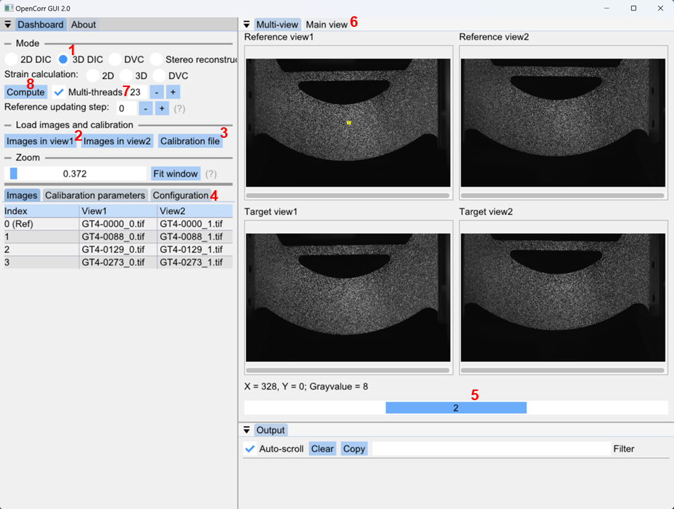

*Figure 7.1. Interface of 3D DIC with order of operations*

1. Check the radio button to select the mode of 3D DIC.

2. Click buttons "Images in view1" and "Images in view2" to load image series of two views. View1 is supposed to be the primary view.  In the file dialog, we can choose multiple files by holding the key "CTRL" or "SHIFT". Once the images are loaded, we can see the list of images below after clicking tab "images" (Figure 7.1). The images are displayed in the right-hand area.

3. Click button "Calibration file" to load calibration parameters of cameras. There is a couple of examples in the folder \gui_soft. We can see the values of these parameters under tab "Calibration parameters" (Figure 7.2). The translation vector [Tx, Ty, Tz] and rotation vector [Rx, Ry, Rz] of view1 are zero as it is the primary view.

   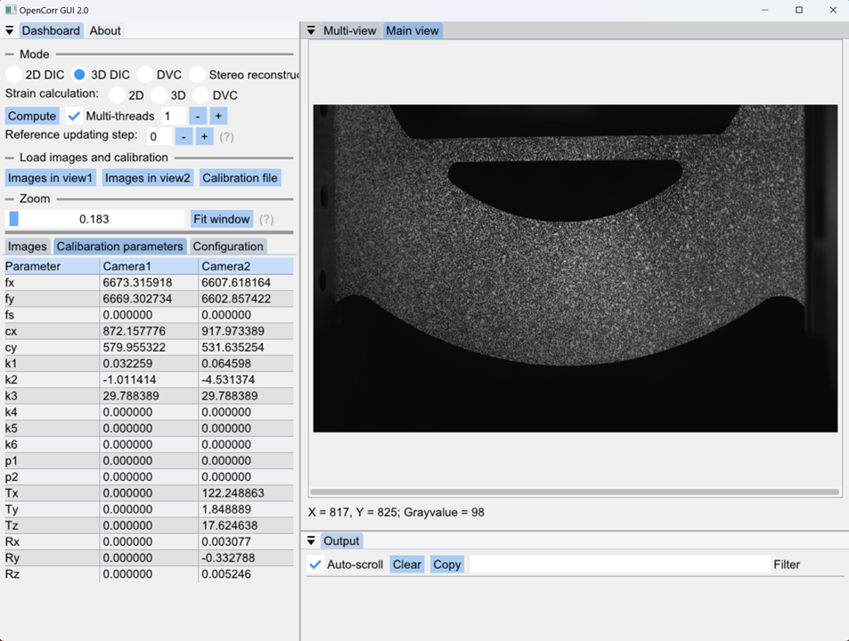

   *Figure 7.2. Loaded calibration parameters and main view of Reference view1*

4. Click tab "Configuration" to show the panel of DIC parameters (Figure 7.3). 

   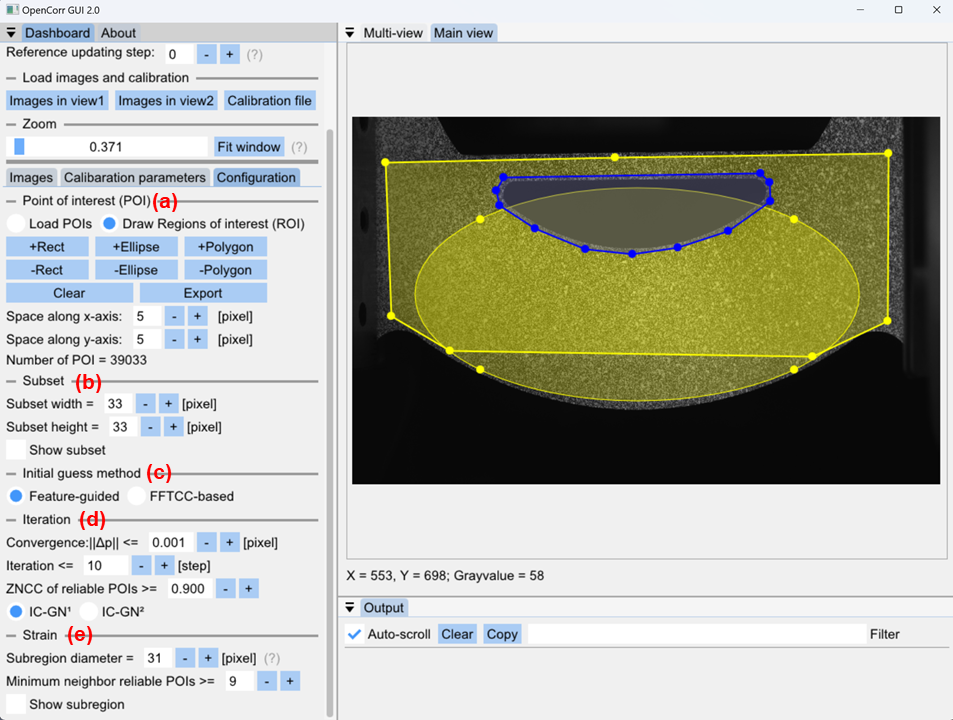

   *Figure 7.3. DIC configuration with main view of Reference view1*

   (a) Set points of interest (POIs). We can place uniformly distributed POIs (by setting the space) in the select area, which is the combination of rectangles, ellipses and polygons ("+" means included and "-" means excluded). The set POI list can be exported to a CSV file and be loaded next time. The CSV file can be opened using excel or any text editor for further adjustment like adding or removing some POIs. 

   (b) Set subset size. Subset can be square or rectangle. Check box "Show subset" to display an example in right-hand view (Figure 7.4). It helps to see whether the subset is large enough to contain unique speckle pattern.

   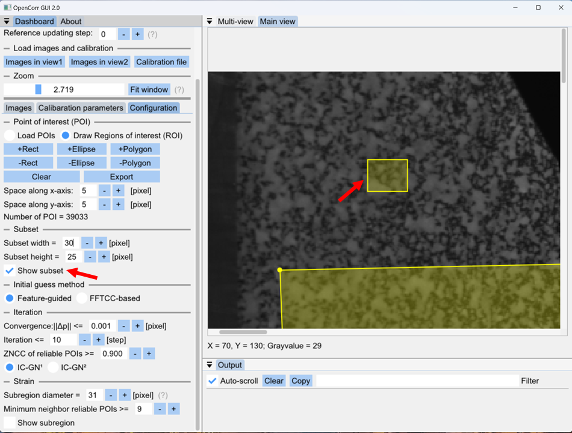

   *Figure 7.4. Set subset*

   (c) Select initial guess method. Feature-guided method is robust but less computational efficient, whereas FFTCC-based method is fast but only suitable to small displacement (not greater than half of subset size).

   (d) Set the parameters in iterative algorithm. We may use the configuration in Figure 7.3, which works well in most of cases. Fine tuning of parameters requires more experience of DIC.

   (e) Set parameters in strain calculation. The subregion for strain calculation at a POI is a regular circle. Check box "Show subregion" to display an example in right-hand view (Figure 7.5). Make sure there are enough neighbor POIs within the subregion. We can see the change of the array of POIs when adjusting the values of POI spaces, as mention in step (a).

   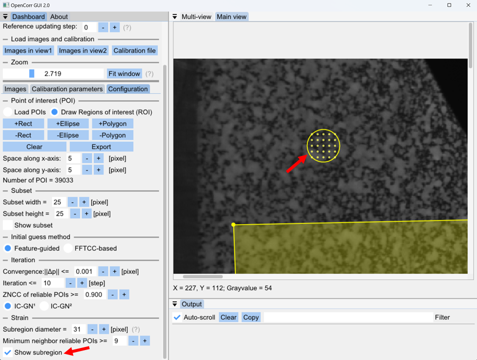

   *Figure 7.5. Set strain calculation*

5. Drag the slider to display the target images in the list (Figure 7.1).

6. Shift between multi-view and single-view by click the tabs. Main view display the content in Reference view1. It provides large view and facilitates the configuration of DIC, as shown in Figure 7.2 and Figure 7.3.

7. Check box "Multi-threads" and set a proper number if we want to perform the computation using multiple CPU threads (Figure 7.1).

8. Click button "Compute" to start processing (Figure 7.1).

The computation results are saved to CSV files, in which the data are organized following the order:

(i) x, y: Coordinates of POIs in reference view1;

(ii) u, v, w: Displacements along x-, y-, and z-axis in world coordinate system

(iii) r1r2 ZNCC, r1t1 ZNCC, r1t2 ZNCC: ZNCC values achieved in the matching between reference view1 and view2, reference view1 and target view 1, reference view1 and target view2, respectively.

(iv) r2_x, r2_y, t1_x, t1_y, t2_x, t2_y: Coordinates of matched POIs in reference view2, target view1, and target view2, respectively.

(v) ref_x, ref_y, ref_z, tar_x, tar_y, tar_z: Coordinates of POIs before and after deformation, in world coordinate system.

(vi) exx, eyy, ezz, exy, eyz, ezx: Strain components.

(vii) subset_rx, subset_ry: Radii of subset, available in self-adaptive DIC.

##### Brief instruction of functions

Figure 7.6 shows the interface to run 2D DIC. One reference image and a bunch of target images can be loaded and displayed in the righthand side window. We can press the CTRL or SHIFT key to select multiple files in file dialog.

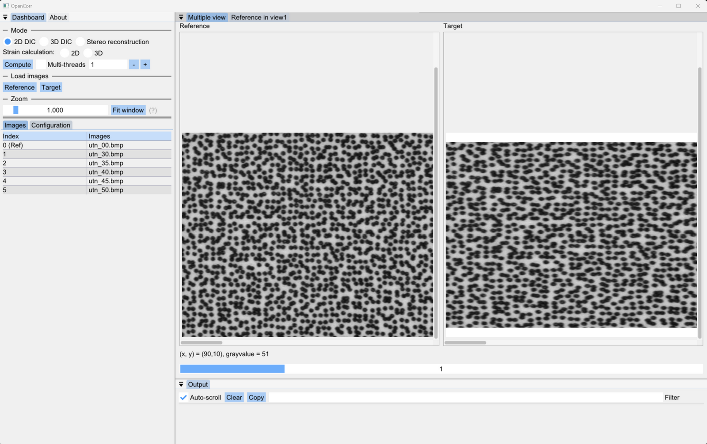

*Figure 7.6. Interface of 2D DIC in multiple view*

We can also shift to single view for convenience to set DIC parameters, as shown in Figure 7.7. A yellow rectangle appears in the center of window once the box of "Show subset" is checked. Then, we can change its size to see if there is a unique speckle pattern within it.

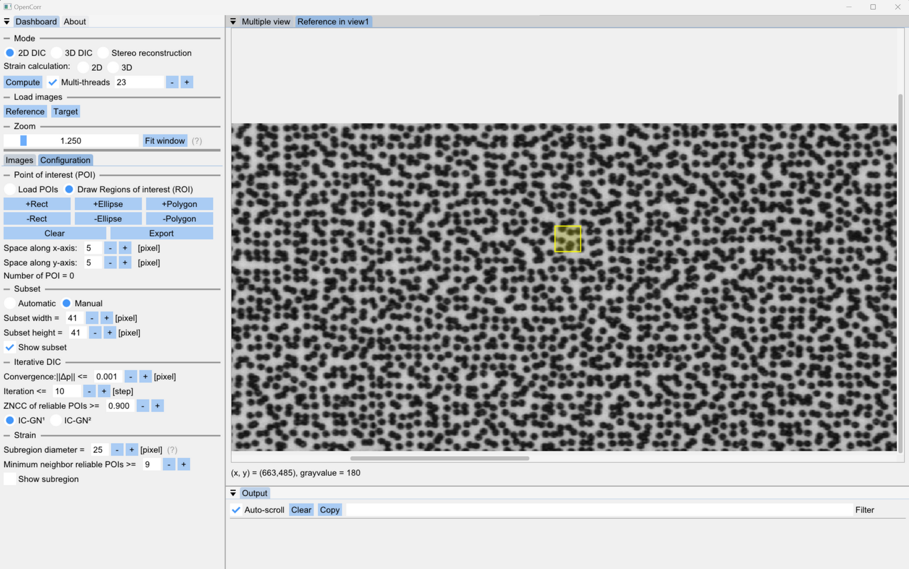

*Figure 7.7. Interface of 2D DIC in single view*

Figure 7.8 shows the interface to run 3D/stereo DIC. The images in left column are regarded as primary view, and the ones in right column are secondary view.

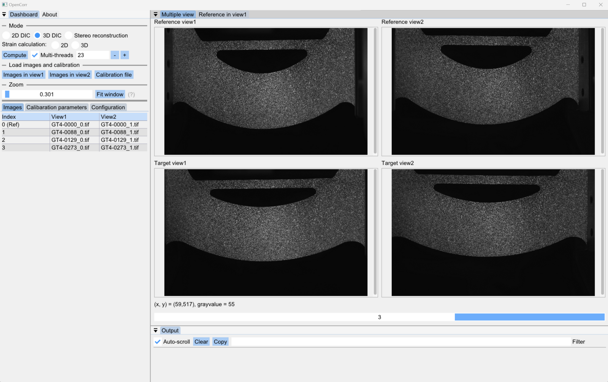

*Figure 7.8. Interface of 3D/stereo DIC in multiple view*

To run 3D/stereo DIC, we need to load the calibration parameters of cameras from a CSV file (Figure7.9). An example of datasheet is given in the package (*_Calibration.csv).

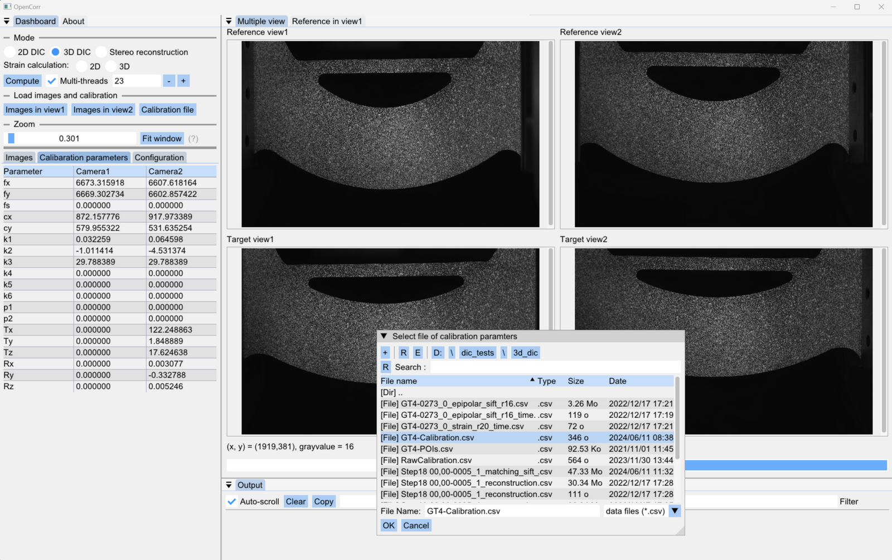

*Figure 7.9. Load calibration parameters of cameras for 3D/stereo DIC*

We can draw the region of interest (ROI) and set the space between the POIs to create a matrix of uniformly distributed POIs, as shown in Figure 7.10. Yellow areas represent the ROI, and blue areas are excluded from ROI. The coordinates of POIs can be exported to a CSV file if we would like to use them in future.

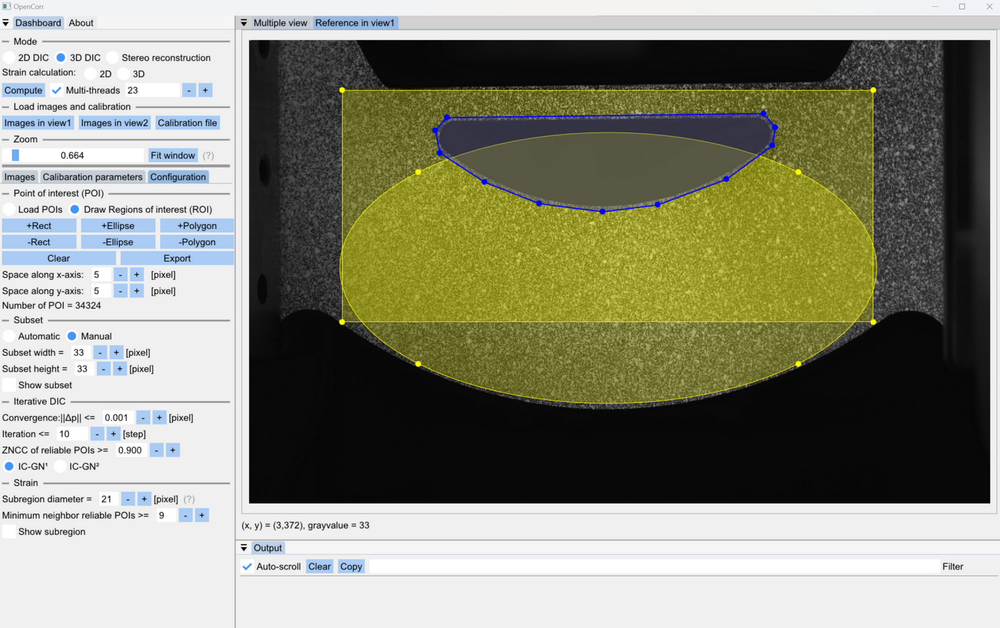

*Figure 7.10. Draw region of interest (ROI) in single view (yellow area means the ROI, blue area means the excluded part)*

Figure 7.11 shows the interface for stereo reconstruction to measure the 3D shape of an object. In addition to drawing ROI and setting POI space, the POIs can be loaded from a previously saved CSV file.

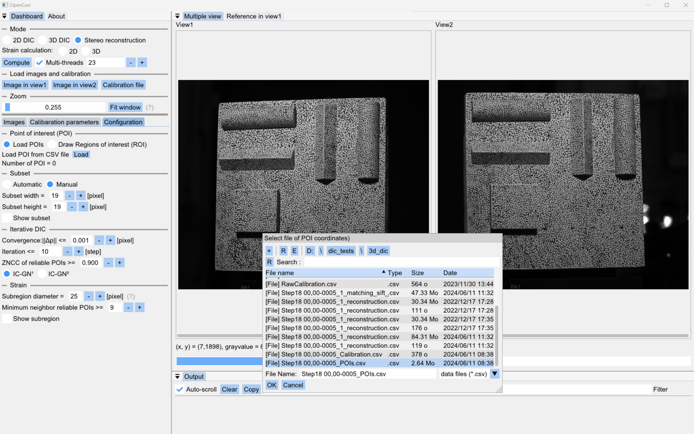

*Figure 7.11. Interface of stereo reconstruction （multiple view）. POIs can be loaded from a CSV file*

Figure 7.12 shows the interface to run DVC. The software supports multi-page TIFF image and binary file (.bin) defined in OpenCorr. We can check the sections by dragging the sliders above views (the green lines indicate the position of sections). The lower-right figure illustrates the 3D coordinate system and the directions of sights.

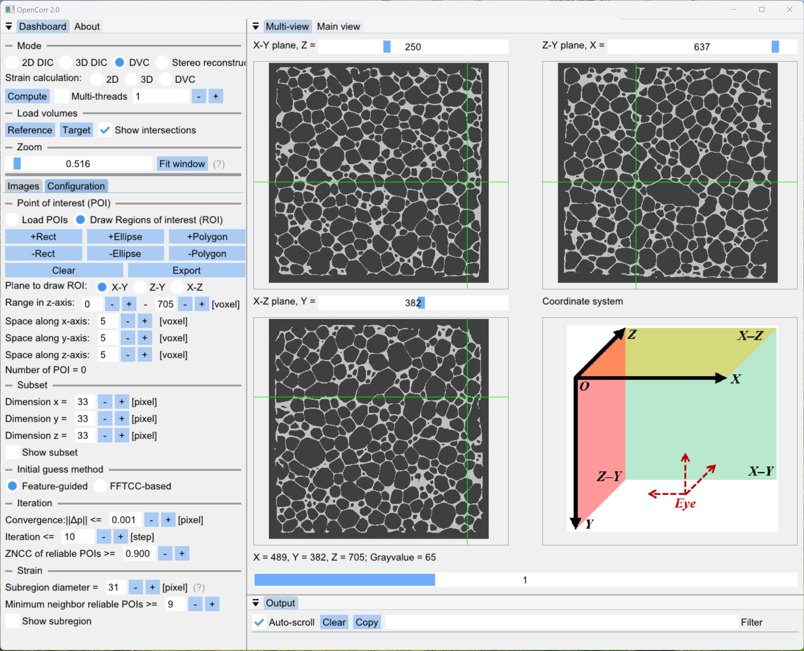

*Figure 7.12. Interface of DVC in multiple view*

We can choose a proper section to draw ROI, and adjust its range in the axis perpendicular to the section (in dashboard), as shown in Figure 7.13.

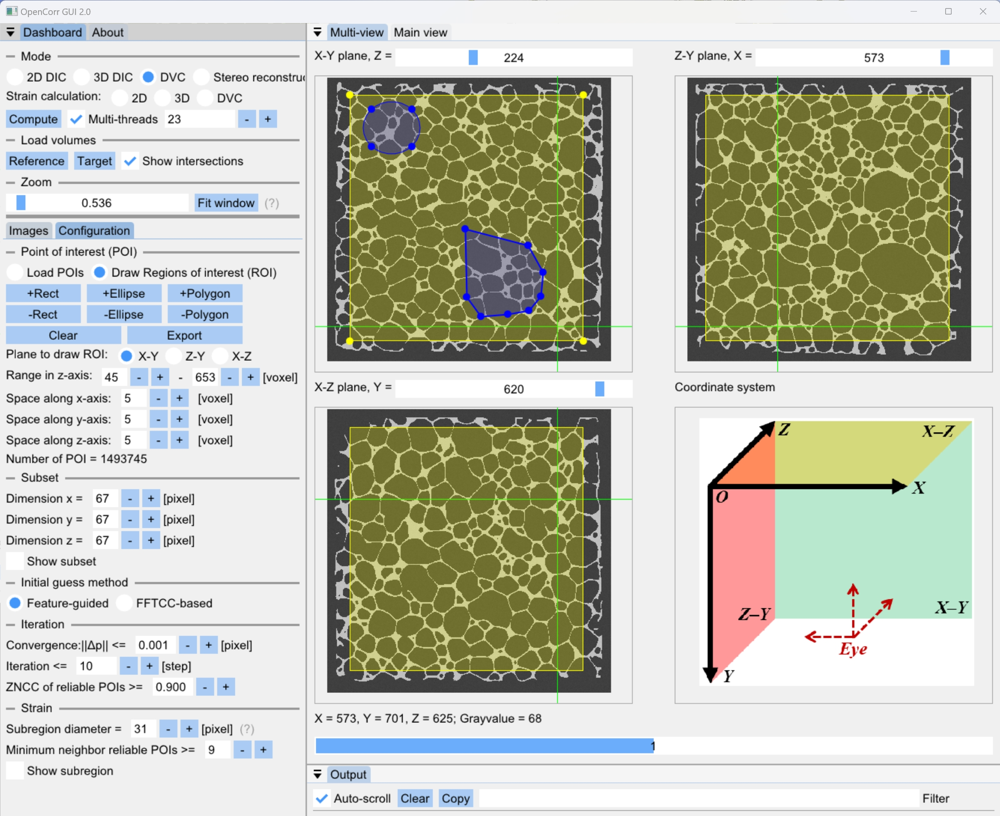

*Figure 7.13. Draw ROI on the selected section in multiple view*

Similar to DIC mode, we can use main view to observe the section with higher resolution (Figure 7.14), as well as check if the sizes of subset or subregion are proper.

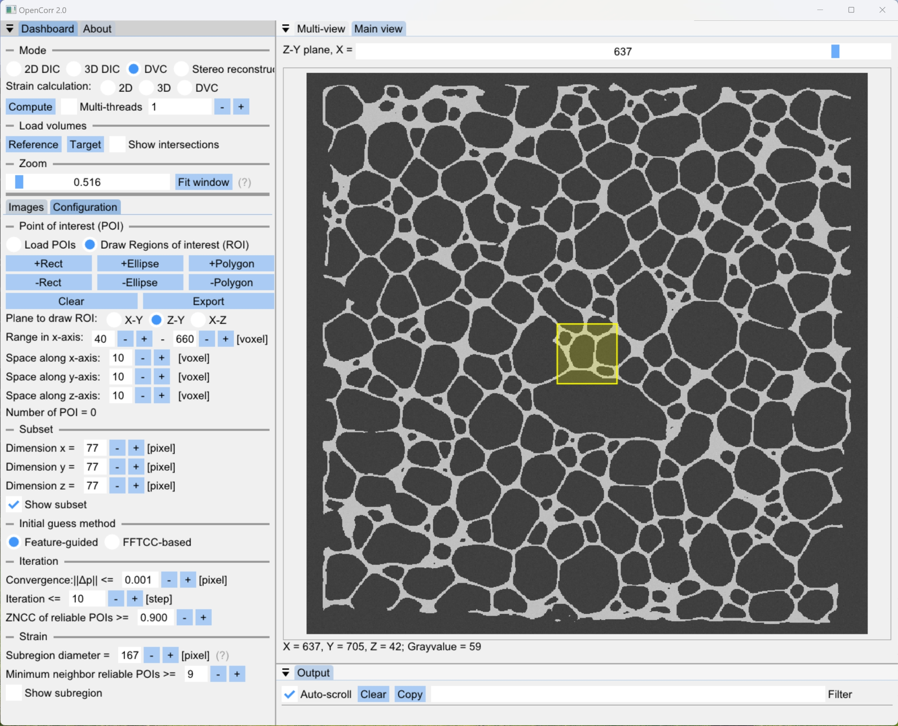

*Figure 7.14. Check section, as well as subset or subregion in main view*

Figure 7.15 shows the interface for strain calculation. We can recalculate the strains based on the previously obtained DIC results. Parameters like subregion size and ZNCC threshold can be adjusted to get reliable results, according to the yellow circle and points within it (they will be displayed when the box "Show subregion" is checked).

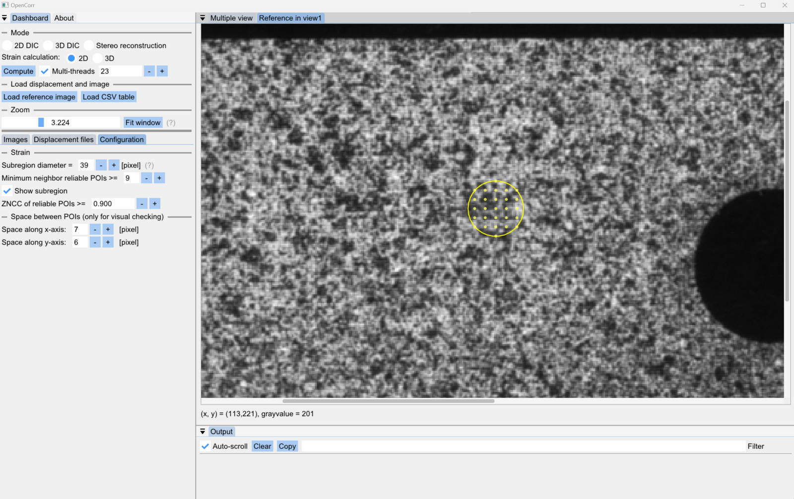

*Figure 7.15. Interface of strain calculation. DIC results need to be loaded from CSV files*
