# 2. Framework

OpenCorr consists of four parts: (1) basic data objects; (2) DIC data objects; (3) basic processing methods; (4) DIC processing methods. Figure 2.1 shows the framework of OpenCorr, which gives a guide to understand the structure of this library. A picture of full structure can be found [here](./img/framework_en.png).
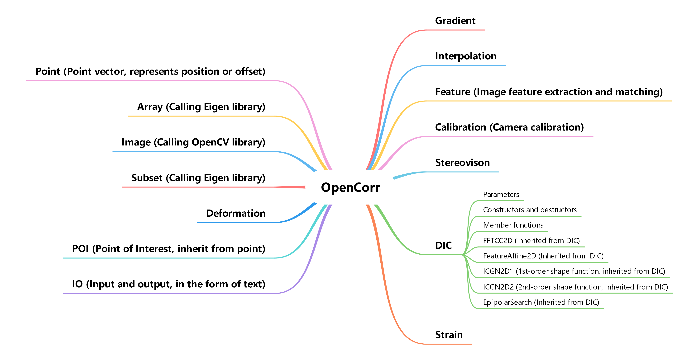
*Figure 2.1. Framework of OpenCorr*

### 2.1. Basic data objects:

(1) Point (oc_point.h and oc_point.cpp). Figure 2.1.1 shows the parameters and methods included in this object. The main parameter of point is its coordinate. It can also be regarded as a vector, indicating the offset from one point to another. Thus, a function (i.e. vectorNorm()) is provided to calculate the magnitude of the vector.  Moreover, operator "+" and "-" are overloaded to perform the superimposition of an offset on the coordinate of a point. Operator "*" and "/" for the coordinate of a point multiplied or divided by a scalar. Operator "<<" is also overloaded to output the coordinate of a point, in the form of  "x, y" (Point2D) or "x, y, z" (Point3D).

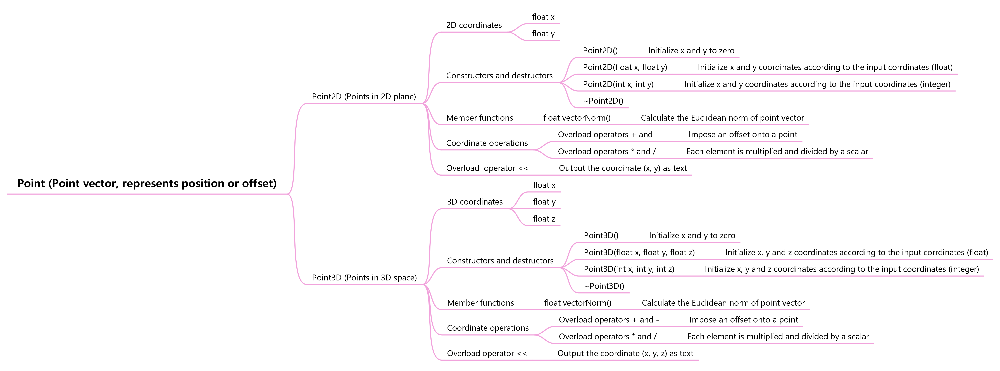
*Figure 2.1.1. Parameters and methods included in Point object*

(2) Array/matrix (oc_array.h and oc_array.cpp). Figure 2.1.2 shows the parameters and methods included in this object. The object is simple, as the operations of matrix in this library call the functions of Eigen. It contains the functions of create and delete two dimensional, three dimensional and four dimensional arrays, as well as the specifical definition of Eigen matrices.

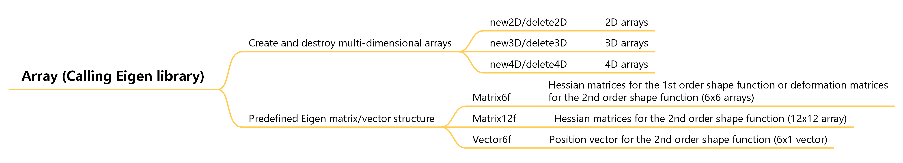
*Figure 2.1.2. Parameters and methods included in Array object*

(3) Image (oc_image.h and oc_image.cpp). Figure 2.1.3 shows the parameters and methods included in this object. OpenCV functions is called to read image file and get its dimension, as well as store the data into the Eigen matrices with same size. Caution: Users working with OpenCV 4 may need to modify the codes of this object, as some basic functions in OpenCV 4 are different from the ones in OpenCV 3.

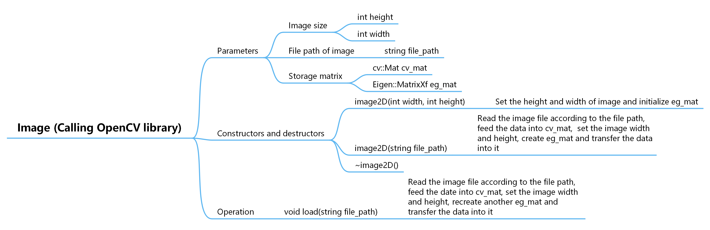
*Figure 2.1.3. Parameters and methods included in Image object*

### 2.2. DIC data objects:

(1) Subset (oc_subset.h and oc_subset.cpp). Figure 2.2.1 shows the parameters and methods included in this object. Subset can be regarded as a special matrix with its center located at a specific point. Its height and width equal to two times of corresponding radius plus one. The constructor of this object sets the parameters mentioned above and initialize the Eigen matrix. Its menber function fill(Image2D* image) is used to read grayscale data in a specific region from an Image object and store the data into its Eigen matrix. Function zeroMeanNorm() performs the zero mean normalization of grayscale value at every point in the subset and return the normalization factor.

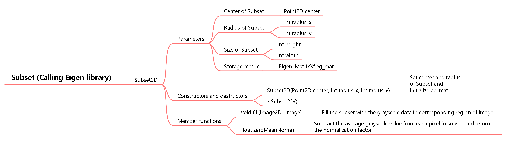
*Figure 2.2.1. Parameters and methods included in Subset object*

(2) Deformation (oc_deformation.h and oc_deformation.cpp). Figure 2.2.2 shows the parameters and methods included in this object. Deformation includes two dimensional one and three dimensional one, which can be described using the first order shape function and the second shape function. In 2D case, the 1st order shape function contains 6 elements (displacement u and v, as well as their gradients along x- and y-axis), its warp_matrix is a 3x3 matrix. The 2nd order shape function contains 12 elements (displacement u and v, as well as their first and second order gradients along x- and y-axis), its warp_matrix is a 6x6 matrix.

Member functions include:

- setDeformation() without input, set the deformation elements according current warp_matrix;
- setDeformation() with input, set the deformation elements and update warp_matrix, according the input;
- setDeformation() with another Deformation instance as input, set the deformation elements and update warp_matrix, according the given instance;
- setWarp(), update warp_matrix according to current deformation elements;
- Point2D warp(Point2D& point), calculate the coordinates of a point after experiencing the deformation.

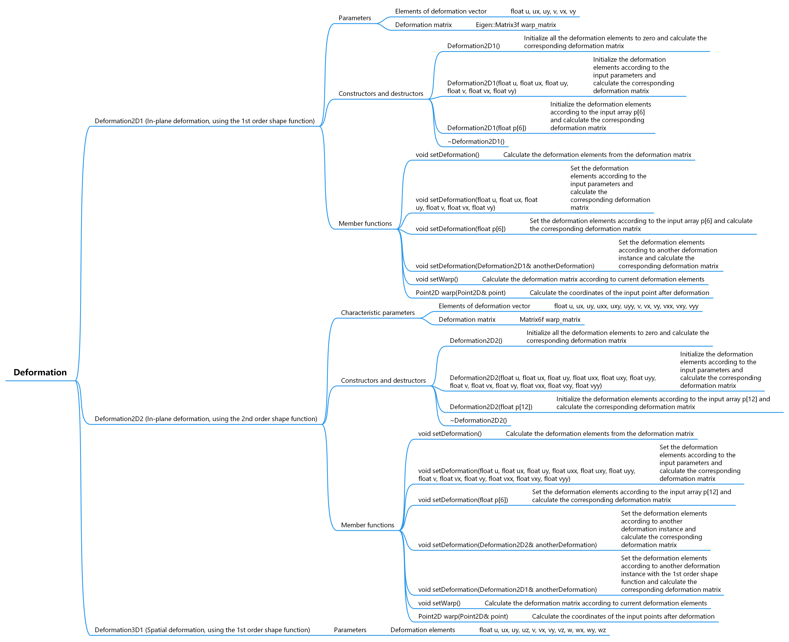
*Figure 2.2.2. Parameters and methods included in Deformation object*

(3) POI (Point of interest, oc_poi.h and oc_poi.cpp). Figure 2.2.3 shows the parameters and methods included in this object. POI inherits the properties and methods from Point object. In addition, it contains a deformation vector and a result vector. The former is used in DIC processsing, and the latter for output results. Especially, POI2DS is an object designed for stereo DIC, which inherits the properties from Point2D, but contains a three dimensional deformation vector of 0th order. The constructor of POI sets the coordinate, and clear the deformation vector and result vector meanwhile.

Member functions include:

- clean(), set all the elements in deformation vector and result vector as zero;
- setIterationCriteria(float conv_criterion, float stop_condition, float neighbor_essential), set the convergence criterion and stop condition of iterative DIC methods, as well as the minimum number required in the neighbor keypoints search when processing the POI.

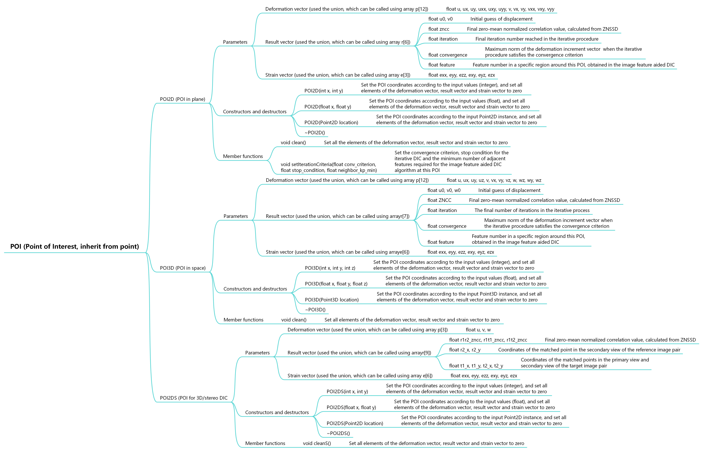
*Figure 2.2.3. Parameters and methods included in POI object*

### 2.3. Basic processing methods:

(1) Gradient (oc_gradient.h and oc_gradient.cpp). Figure 2.3.1 shows the parameters and methods included in this object. OpenCorr currently provides only one gradient calculation method, i.e. 4th-order central difference, which may be the most popular one. grad_img, points to the Image2D object to process, is initialized in constructor. Member functions getGradientX() and getGradientY() are made to calculate the 1st-order gradient map along x and y direction, respectively. getGradientXY() calculates the mixed 2nd-order gradient map. The gradient maps are stored in Eigen matrices gradient_x, gradient_y, and gradient_xy, respectively.

*Figure 2.3.1. Parameters and methods included in Gradient object*

(2) Interpolation (oc_interpolation.h and oc_interpolation.cpp). Figure 2.3.2 shows the parameters and methods included in this object. Interpolation is a base class which contains essential parameter, i.e. interp_img pointing to the Image2D object to process. The derived class BicubicBspline (oc_bicubic_bspline.h and oc_bicubic_bspline.cpp) implemented the popular bicubic B-spline interpolation method. Our study indicates that the bicubic B-spline interpolation shows significaninterpolationtly improved accuracy and precision compared with the bicubic method, at a trial computational cost (Pan et al. Theo Appl Mech Lett, 2016, 6(3):126-130). Member function prepare() calculates the global lookup-table of interpolation coefficients of interp_image, while compute(Point2D& location) estimates the grayscale value at the input location according to the lookup-table.

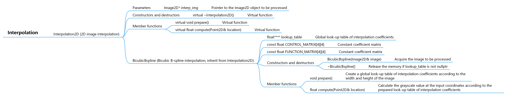
*Figure 2.3.2. Parameters and methods included in Interpolation object*

(3) Feature (oc_feature.h and oc_feature.cpp). Figure 2.3.3 shows the parameters and methods included in this object. Feature is a base class which contains essential parameters, i.e. ref_img and tar_img pointing to the Image2D objects (reference image and target image). Member function setImages(Image2D& ref_img, Image2D& tar_img) is used to update ref_img and tar_img. The derived class SIFT2D (oc_sift.h and oc_sift.cpp) provides the method to extract and match the SIFT features in the two images. Structure sift_config contains the main paramters in feature extraction. Users may refer to the relevant documents of OpenCV for their meanings. Parameter match_ratio is the threshold of ratio of the shortest distance betweeen the descriptors of reference feature and target feature to the second shortest distance. The details of this parameter can be found in Lowe's famous paper (Lowe, Int J Comput Vis, 2004, 60(2):91-110). The extracted keypoints, after matching, are stored in vectors ref_matched_kp and tar_matched_kp.

Member functions include:

- prepare(), assign the address of matrices in ref_img and tar_img to OpenCV matrices ref_mat and tar_mat;
- compute(), extract the features in reference image and target image, and then match them;
- getSIFTconfig(), get current configuration of feature extraction;
- getMatchingRatio(), get current threshold of feature matching;
- setExtraction(SIFTconfig sift_config), set configuration of feature extraction;
- setMatching(float match_ratio), set ratio threshold of feature matching.

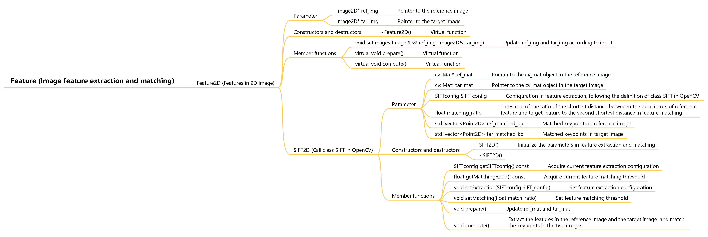
*Figure 2.3.3. Parameters and methods included in Feature object*

(4) Calibration (oc_calibration.h and oc_calibration.cpp). Figure 2.3.4 shows the parameters and methods included in this object. 

Parameters include:

- Camera intrinsics, including fx, fy, fs, cx, cy, k1, k2, k3, k4, k5, k6, p1, p2;
- Camera extrinsics, including tx, ty, tz, rx, ry, rz;
- Intrinsic matrix: intrinsic_matrix;
- Rotation matrix: rotation_matrix;
- Translation vector: translation_vector;
- Projection matrix: projection_matrix;
- Convergence criterion and stop condition in undistortion: convergence, iteration;
- Map of distorted coordinates in image coordinate system: map_x, map_y.

Member functions include:

- updateIntrinsicMatrix(), update camera intrinsic matrix;
- updateRotationMatrix(), update rotation matrix according to rotation angles;
- updateTranslationVector(), update translation vector;
- updateProjectionMatrix(), update projection matrix according to the three matrices mentioned above;
- Point2D image_to_sensor(Point2D& point), convert the coordinate of input point from image/retina system to sensor/pixel system;
- Point2D sensor_to_image(Point2D& point), convert the coordinate of input point from sensor/pixel system to image/retina system;
- setUndistortion(float convergence, int iteration), set parameters in undistortion procedure;
- prepare(int height, int width), create a map of distorted coordinates in image/retina system corresponding to the integer coordinates in sensor/pixel system, according to the size of image;
- Point2D distort(Point2D& point), adjust the coordinate of input point (in image/retina coordinate system) according to the distortion model;
- Point2D undistort(Point2D& point), correct the coordinate of input point through an iterative procedure.

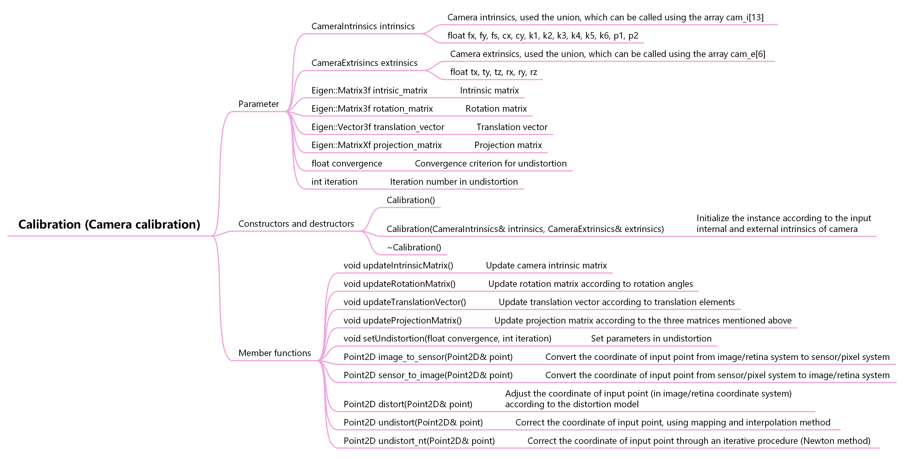
*Figure 2.3.4. Parameters and methods included in Calibration object*

(5) Stereovision (oc_stereovision.h and oc_stereovision.cpp). Figure 2.3.5 shows the parameters and methods included in this object. It is used to reconstruct the 3D coordinate of a point in space based on the two matched 2D points in left view and right view.

Parameters include:

- Calibration objects of the two cameras, view1_cam (principal), view2_cam (secondary);
- Number of CPU threads in parallel processing, thread_number;

Member functions include:

- updateCameraParameters(Calibration* view1_cam, Calibration* view2_cam), update the objects of cameras;
- prepare(), update the parameter matrices of the two cameras;
- Point3D reconstruct(Point2D& view1_2d_point, Point2D& view2_2d_point), reconstruct the coordinate of 3D point based on the mtatched 2D points in view1 and view2.
- reconstruct(vector<Point2D>& view1_2d_point_queue, vector<Point2D>& view2_2d_point_queue, vector<Point3D>& space_3d_point_queue), handle a batch of points, the results are stored in space_3d_point_queue.

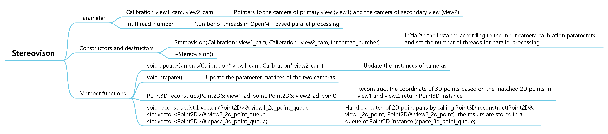
*Figure 2.3.5. Parameters and methods included in Stereovision object*

(6) IO (oc_io.h and oc_io.cpp). Figure 2.3.6 shows the parameters and methods included in this object. It helps developers during code debugging. Users can load information of POIs from csv datasheet or save the computed results into csv datasheets.

Parameters include:

- File path and delimiter of data, file_path, delimiter;
- image size, height, width;

Member functions include:

- setPath(string file_path), set path of csv file;
- setDelimiter(string delimiter), set delimiter for data picking
- loadTable2D(), load information from csv datasheet, create a POI2D queue;
- loadPOI2D(), load coordinates of POIs from csv datasheet, create a Point2D queue;
- loadTable2DS(), load information from csv datasheet, create a POI2DS queue;
- saveTable2D(vector<POI2D> POI_queue)，save the information of POIs into csv datasheet;
- saveDeformationTable2D(vector<POI2D> POI_queue), save the full deformation vectors of POIs into csv datasheet;
- saveMap2D(vector<POI2D> POI_queue, char variable), save specific information of POIs (2D DIC results) into a 2D map according the coordinates of POIs, variable can be set as 'u', 'v', 'c'(zncc), 'd'(convergence), 'i'(iteration), 'f'(feature), 'x' (exx), 'y' (eyy), 'r' (exy);.
- saveTable2DS(vector<POI2DS> POI_queue), specifically for Stereo/3D DIC, save the information of POIs into csv datasheet;
- saveMap2DS(vector<POI2DS>& poi_queue, char variable), save specific information of POIs (3D/stereo DIC results) into a 2D map according the coordinates of POIs, variable can be set as 'u', 'v', 'w', 'c'(r1r2_zncc), 'd'(r1t1_zncc), 'e'(r1t2_zncc), 'x' (exx), 'y' (eyy), 'z' (ezz), 'r' (exy) , 's' (eyz), 't' (ezx).

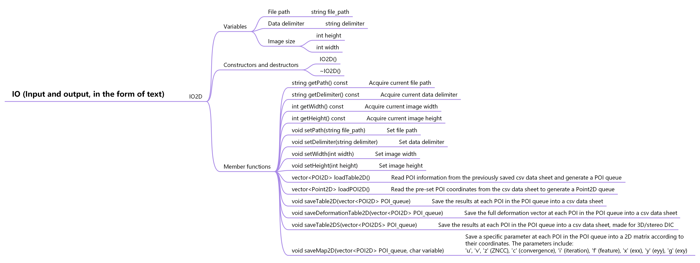

*Figure 2.3.5. Parameters and methods included in IO object*

### 2.4. DIC processing methods:

The base class DIC (oc_dic.h and oc_dic.cpp) contains a few essential parameters:

- Pointer of reference image and target image, ref_img 和 tar_img;
- Subset radii (in x and y direction), subset_radius_x, subset_radius_y;
- Number of CPU threads in parallel processing, thread_number.

Member function setImages(Image2D& ref_img, Image2D& tar_img) is used to set the pointers of ref_img and tar_img, and setSubsetRadii(int subset_radius_x, int subset_radius_y) for setting subset radii. Three virtual member functions indicate the forms of main functions in this class: prepare() for preparation; compute(POI2D* POI) to process single POI, and compute(std::vector& POI_queue) to process a batch of POIs.

It is noteworthy that the methods in derive classes are designed for path-independent DIC, but they can also be employed to realize the DIC methods with initial guess transfer mechanisms. For example, the popular reliability-guided DIC can be readily implemented by combining C++ vector and its sort functions with the DIC methods listed below.

(1) FFTCC2D (oc_fftcc.h and oc_fftcc.cpp), fast Fourier transform aided cross correlation. Figure 2.4.1 shows the parameters and methods included in this object. The method calls FFTW library to perform FFT and inverse FFT calculation. Its principle can be found in our paper (Jiang et al. Opt Laser Eng, 2015, 65:93-102). An auxiliary class FFTW is made to facilitate parallel processing, as the procedure need allocate quite a lot of memory blocks dynamically. During the initialization of FFTCC2D, a few FFTW instances are created according to the input thread_number. Afterwards, they are called in compute(POI2D* POI) through getInstance(int tid). The POIs stored in container vector can be processed by compute(std::vector& POI_queue).

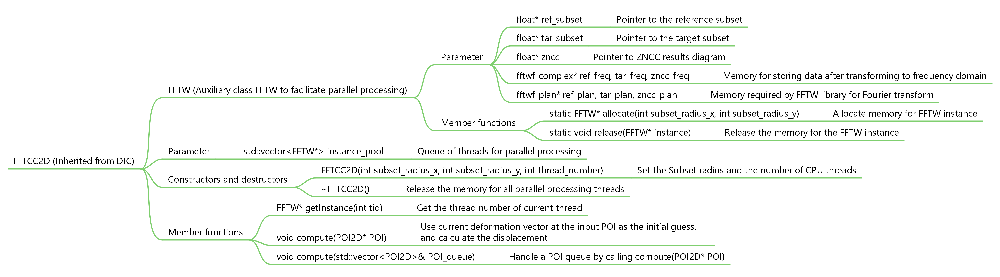
*Figure 2.4.1. Parameters and methods included in FFTCC2D object*

(2) FeatureAffine2D (oc_feature_affine.h and oc_feature_affine.cpp), image feature aided affine estimation. Figure 2.4.2 shows the parameters and methods included in this object. The method estimates the affine matrix according to the keypoints around a POI in order to get the deformation at the POI. Users may refer to our paper (Yang et al. Opt Laser Eng, 2020, 127:105964) for details of principle and implementation. It is noteworthy at those POIs with few keypoints nearby, compute(POI2D* POI) corrects the nearest kepoints out of searching region until the number reaches the set minimun value.

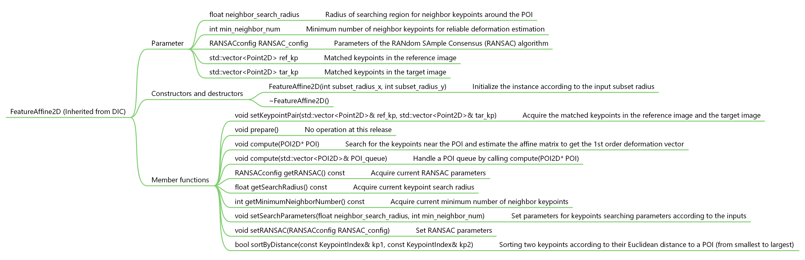
*Figure 2.4.2. Parameters and methods included in FeatureAffine2D object*

(3) ICGN2D1 (ICGN algorithm with 1st-order shape function) and ICGN2D2 (ICGN algorithm with 2nd-order shape function), codes are stored in oc_icgn.h and oc_icgn.cpp. Figure 2.4.3 and Figure 2.4.4 show the parameters and methods included in the two objects. The principle and implementation of ICGN2D1 can be found in our paper (Jiang et al. Opt Laser Eng, 2015, 65:93-102). Users may refer to the paper by Professor ZHANG Qingchuan's group (Gao et al. Opt Laser Eng, 2015, 65:73-80) for detailed information of ICGN2D2. Auxiliary classes ICGN2D1_ and ICGN2D2_ are made for parallel processing because the procedures also require a lot of dynamically allocated memory blocks. The implementation and usage are similar to the one in FFTCC2D.

*Figure 2.4.3. Parameters and methods included in ICGN2D1 object*

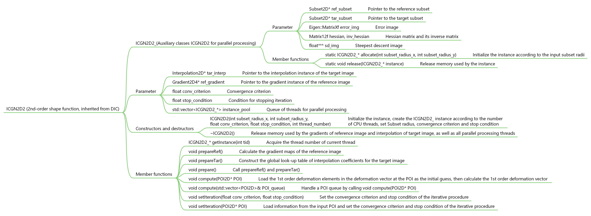
*Figure 2.4.4. Parameters and methods included in ICGN2D2 object*

(4) EpipolarSearch (oc_epipolar_search.h and oc_epipolar_search.cpp), Epipolar constraint aided search for stereo matching. Figure 2.4.5 shows the parameters and methods included in this object. The method uses the epipolar constraint between the two views, search the counterpart (in view2) of a point (in view1), narrowing the searching range in part of epipolar line. The searching range centered at intersection epipolar line and its normal line crossing a point estimated according to an initial displacement and  a guess of parallax. And the searching step is limited to a couple pixels (less than convergence radius). Users may refer to our paper (Lin et al. Opt Laser Eng, 2022, 149:106812) for details of principle and implementation. This method calls ICGN2D1 method with lenient convergence criterion and less iteration to guarantee roughly accurate matching in trials, and reserve the result with highest ZNCC value, which can be fed into ICGN2D2 method for high accuracy matching. Caution: Multi-thread processing is NOT suggested in compute(std::vector<POI2D>& poi_queue), which may mess the processing around with the ICGN2D1 instance running in multi-thread mode. test_3d_reconstruction_epipolar.cpp in folder /samples gives a simple example, which demonstrates the reconstruction of a 3D point cloud using this module.

Parameters include:

- Objects of two cameras: view1_cam (principal) and view2_cam (secondary);
- Fundamental matrix to locate epipolar line, fundamental_matrix；
- Parameters in stepped searching, search_radius, search_step, parallax;
- Parameters in ICGN2D1: icgn_sr_x, icgn_sr_y, icgn_conv, icgn_stop;

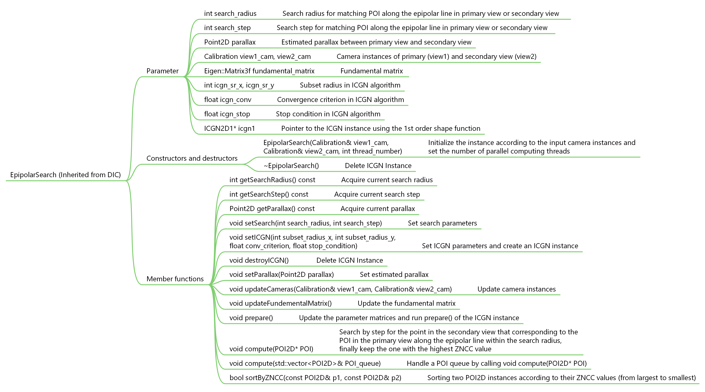

*Figure 2.4.5. Parameters and methods included in EpipolarSearch object*

(5) Strain2D (oc_strain.h and oc_strain.cpp), calculation of the strains on measured surface based on the displacements obtained by DIC. Figure 2.4.6 shows the parameters and methods included in this objects. The method first creates local profiles of displacement components in POI-centered subregion through polynomial fitting, and then calculates the Green-Lagrangian strains according to the first order derivatives of the profile. Users may refer to the paper by Professor PAN Bing (Pan et al. Opt Eng, 2007, 46:033601) for the details of the principle.

Parameters include:

- Radius of subregion for local dispacement profile fitting: subregion_radius;
- Minimum number of neighbor POIs involved in fitting: min_neighbor_num;
- Lowest ZNCC value required for the neighbor POIs involved in fitting: zncc_threshold;
- Description of strain tensor: 1 denotes Lagrangian; 2 denotes Eulaerian: description;
- POI queue for processing: std::vector<POI2D> poi2d_queue for 2D DIC, std::vector<POI2DS> poi2ds_queue for 3D/stereo DIC.

Member functions include:

- setSubregionRadius(int subregion_radius), set the radius of the POI-centerd subregion for fitting of local displacement profiles;
- setMinNeighborNumer(int min_neighbor_num), set minimum number of neighbor POIs;
- setZNCCthreshold(float zncc_threshold), set ZNCC threshold;
- setDescription(int description), set description of strain tensor: 1 denotes Lagrangian; 2 denotes Eulaerian;
- void setPOIQueue(std::vector<POI2D>& poi_queue), set POI queue for processing, the element of vector should by POI2D in 2D DIC and POI2DS in 3D/stereo DIC;
- compute(POI2D* POI), calculate the strains at a POI.

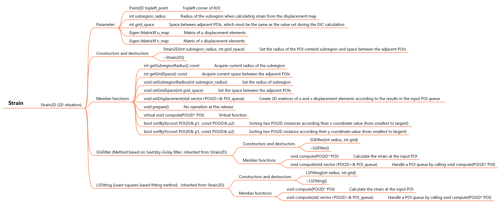
*Figure 2.4.6. Parameters and methods included in Strain2D object*
