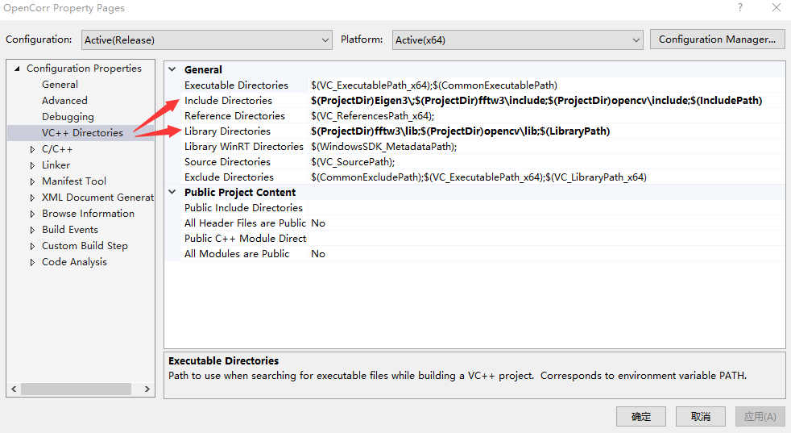
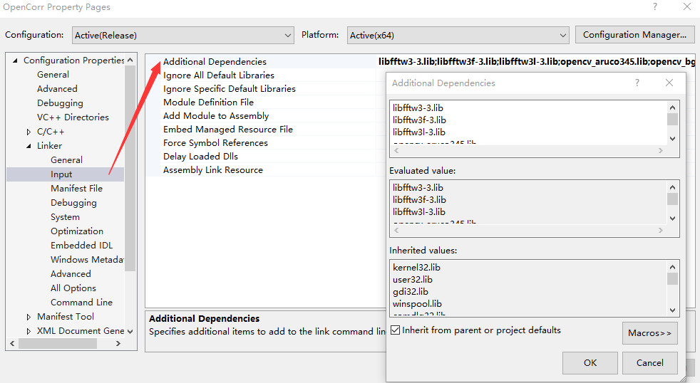
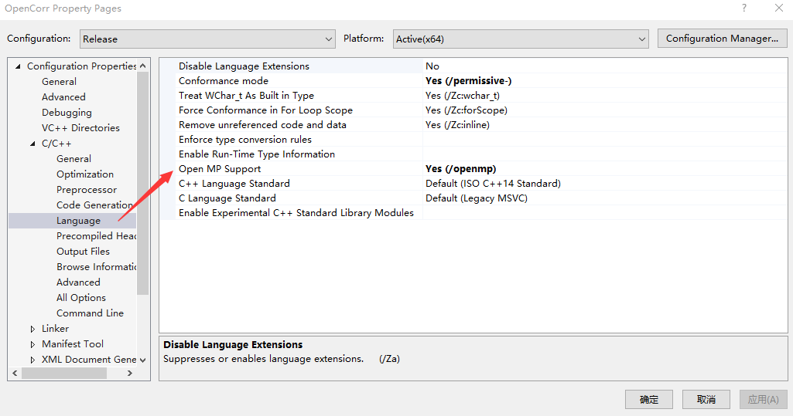

# 1. Get started

OpenCorr is developed and tested in Microsoft Visual Studio 2019 (VS, community version) on Windows 10. The codes follow the standard of ISO C++ 14, theoretically it can be compiled on other OS like Linux. Developers working in Linux or Unix may refer to a sample of CMake script (/samples/CMakeLists.txt). To use this library, the users are supposed to have basic knowledge and skill about integrated development environment like VS. The building environment requires three freeware libraries:

- Eigen 3.3.9 ([eigen.tuxfamily.org](http://eigen.tuxfamily.org)), used for basic operations of matrix.
- OpenCV 3.4.5 ([opencv.org](http://opencv.org)), used to read images, and in the  modules related with image feature and stereovision.
- FFTW 3.3.9 ([fftw.org](http://fftw.org)), used to calculate cross correlation.

These libraries provide excellent instructions for installation. The main procedure can be summarized as the following steps:

1. Download the source files (e.g. .h or .cpp), static library files (.lib), and dynamic link library files (.dll) from the websites;
2. Place them into proper directories in your computer. For example, I created a solution in VS with name of OpenCorr and a project with same name. The source codes are stored in folder "D:\OpenCorr\OpenCorr\", the files of source codes and static libraries of the three libraries are also placed in folder "D:\OpenCorr\", as shown in Figure 1.1;

   

   *Figure 1.1. An example of directory structure*

3. Set the paths of source files and static library files in VS, as illustrated in Figure 1.2;
   
   *Figure 1.2. Illustration of setting paths in Visual Studio 2019*

4. Set the additional dependencies in Project->Properties. Open the Additional Dependencies dialog, as shown in Figure 1.3;
   

   *Figure 1.3. Illustration of setting additional dependencies in Visual Studio 2019*

Then add the name list of static library files into the editbox. Beware that the file names end with "d" in Debug mode.

>libfftw3-3.lib
>libfftw3f-3.lib
>libfftw3l-3.lib
>opencv_aruco345.lib
>opencv_bgsegm345.lib
>opencv_bioinspired345.lib
>opencv_calib3d345.lib
>opencv_ccalib345.lib
>opencv_core345.lib
>opencv_datasets345.lib
>opencv_dnn_objdetect345.lib
>opencv_dnn345.lib
>opencv_dpm345.lib
>opencv_face345.lib
>opencv_features2d345.lib
>opencv_flann345.lib
>opencv_fuzzy345.lib
>opencv_hfs345.lib
>opencv_highgui345.lib
>opencv_img_hash345.lib
>opencv_imgcodecs345.lib
>opencv_imgproc345.lib
>opencv_line_descriptor345.lib
>opencv_ml345.lib
>opencv_objdetect345.lib
>opencv_optflow345.lib
>opencv_phase_unwrapping345.lib
>opencv_photo345.lib
>opencv_plot345.lib
>opencv_reg345.lib
>opencv_rgbd345.lib
>opencv_saliency345.lib
>opencv_shape345.lib
>opencv_stereo345.lib
>opencv_stitching345.lib
>opencv_structured_light345.lib
>opencv_superres345.lib
>opencv_surface_matching345.lib
>opencv_text345.lib
>opencv_tracking345.lib
>opencv_video345.lib
>opencv_videoio345.lib
>opencv_videostab345.lib
>opencv_xfeatures2d345.lib
>opencv_ximgproc345.lib
>opencv_xobjdetect345.lib
>opencv_xphoto345.lib

5. Place the dynamic link library files (.dll) into the folder where the executable programs are built (e.g. "D:\OpenCorr\x64\Release\", as shown in Figure 1.1), or the directories listed in system Path;

6. Set OpenMP support to enable the acceleration on multi-core CPU, as shown in Figure 1.4.
   
   *Figure 1.4. Illustration of setting OpenMP support in Visual Studio 2019*

To facilitate the configuration for beginners, we made a zip package of the three libraries and share it on [pan.baidu.com](https://pan.baidu.com/s/17qdAhXJZPLWydYiowwEzig) (code: vyfy). Users may download and unzip it, then set the paths according to the instructions provided above.

There are a few examples in the folder "samples" along with images, which demonstrate how to make a DIC program using the modules in OpenCorr. Before building the executables, make sure that the file paths in the codes are correctly set. 
