# OpenCorr: 开源DIC/DVC程序开发库

OpenCorr是一个开源的C++程序开发库，旨在提供一套轻量而高效的开发工具，帮助对数字图像相关法（Digital image correlation, DIC）或数字体图像相关法（Digital volume correlation, DVC）感兴趣的用户学习DIC/DVC算法的原理及实现，或者根据自己的特定需求，像组装乐高积木一样，开发制作DIC/DVC处理软件。

目前程序和文档均在迭代开发中，因此本网站近期会进行较为频繁的更新。在此过程中，我们会不断修订程序，添加新模块，以及完善使用文档。大家如有问题或建议，欢迎联系我们。具体可通过以下途径获得帮助：

1. 给我们写Email: zhenyujiang (at) scut.edu.cn

2. 在GitHub上交流

3. 加入OpenCorr的公共讨论群：597895040

   

OpenCorr的代码通过GitHub发布和维护，网址为 https://github.com/vincentjzy/OpenCorr

# 重要更新记录

- 2021.04.23，OpenCorr正式上线
- 2021.04.30，针对OpenMP优化了DIC模块的结构，改造了立体视觉模块的结构
- 2021.05.08，初步完成了OpenCorr架构的说明文档
- 2021.05.17，针对Linux系统进行了兼容性调整，发布了网页首图
- 2021.06.12，发布了根据DIC结果计算应变的示例，更新了相应文档
- 2021.08.14，发布了GPU加速的ICGN模块和调用示例，具体说明请见第三节（3. GPU加速模块）
- 2021.11.03，发布了实现 Stereo DIC（3D DIC）的示例，全面完善了相应模块和文档

# 目录

1. 如何使用OpenCorr
2. OpenCorr的组织架构
> 2.1. 基本数据对象；2.2. DIC数据对象；2.3. 基本数据处理方法；2.4. DIC处理方法
3. GPU加速模块
4. 致谢
5. 开发人员
6. 相关论文

## 1. 如何使用OpenCorr

OpenCorr面向的是具备一定C++程序开发基础的用户。这套程序开发库在微软Windows 10专业版的Visual Studio 2019（VS2019 社区版）内开发，因此使用者需要掌握这一集成开发环境（Integrated development environment, IDE）的基本配置和使用技能。由于代码遵循ISO C++ 14标准开发，而且依赖的几个开源程序库也是类似的情况，因此理论上OpenCorr可以在其它操作系统，诸如Linux或Unix下编译，但这样做要求使用者会正确配置CMake（samples 目录下提供了一个CMake脚本的示例 CMakeLists.txt）。

编译和运行OpenCorr的程序和范例首先需要正确安装以下程序库：

- Eigen 3.3.9 (eigen.tuxfamily.org), 用于矩阵的基本操作；
- OpenCV 3.4.5 (opencv.org), 用于图像的读写，图像特征和立体视觉的模块也会调用；
- FFTW 3.3.9 (fftw.org), 用来快速计算互相关判据。

上述开发库在图像处理领域久负盛名，其官网提供非常详尽的指南和下载资源。在Windows 10系统上安装可以归纳为以下几个主要步骤：

（1）从官网上下载这些开发库的源代码（包括.h和.cpp等文件）以及相应的静态库（.lib文件）或动态库（.dll文件）。

（2）将这些文件放到合适的目录下，图1.1展示了我机器上的目录结构，首先在IDE中创建一个名为OpenCorr的解决方案及同名的项目，保存OpenCor源代码的目录与其它开发库的目录并列放在主目录（D:\OpenCorr\）下。

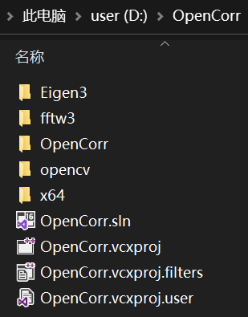

图1.1 目录结构的示例
（3）在IDE中添加相应文件的路径，具体如图1.2所示，点击菜单上项目->属性->VC++目录，然后在“包含目录”里添加开发库源代码文件的目录，在“库目录”项里添加开发库静态库文件的目录。

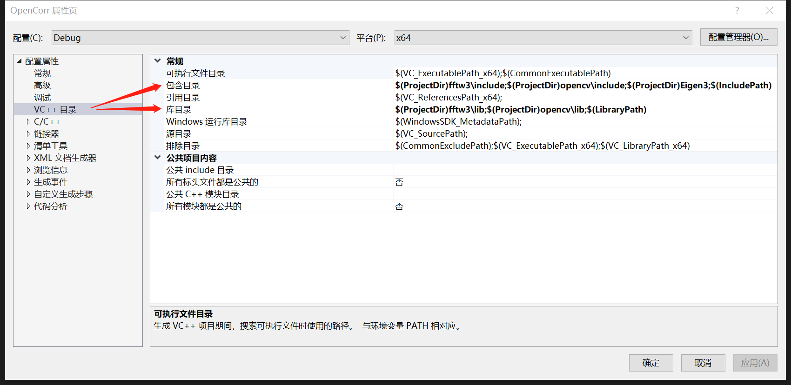

图1.2 Visual Studio内设置开发库目录示例
（4）设置链接器附加依赖项，打开项目->属性->链接器->输入->附加依赖项对话框，如图1.3所示。

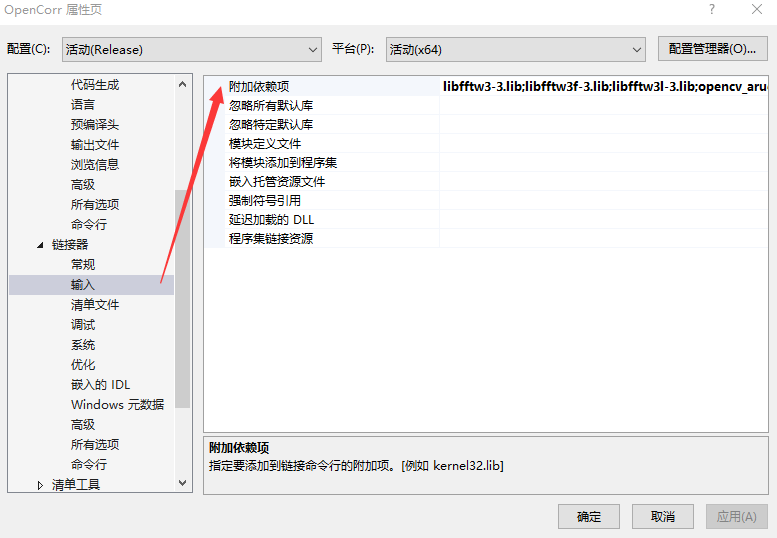

图1.3 Visual Studio内设置附加依赖项示例
将静态库文件（.lib）的文件名列表输入文本框后点击确定。对于Release模式，可以直接复制下面的列表粘贴至文本框。注意在Debug模式下，相应的文件名（不包括扩展名）以字母d结尾。

libfftw3-3.lib
libfftw3f-3.lib
libfftw3l-3.lib
opencv_aruco345.lib
opencv_bgsegm345.lib
opencv_bioinspired345.lib
opencv_calib3d345.lib
opencv_ccalib345.lib
opencv_core345.lib
opencv_datasets345.lib
opencv_dnn_objdetect345.lib
opencv_dnn345.lib
opencv_dpm345.lib
opencv_face345.lib
opencv_features2d345.lib
opencv_flann345.lib
opencv_fuzzy345.lib
opencv_hfs345.lib
opencv_highgui345.lib
opencv_img_hash345.lib
opencv_imgcodecs345.lib
opencv_imgproc345.lib
opencv_line_descriptor345.lib
opencv_ml345.lib
opencv_objdetect345.lib
opencv_optflow345.lib
opencv_phase_unwrapping345.lib
opencv_photo345.lib
opencv_plot345.lib
opencv_reg345.lib
opencv_rgbd345.lib
opencv_saliency345.lib
opencv_shape345.lib
opencv_stereo345.lib
opencv_stitching345.lib
opencv_structured_light345.lib
opencv_superres345.lib
opencv_surface_matching345.lib
opencv_text345.lib
opencv_tracking345.lib
opencv_video345.lib
opencv_videoio345.lib
opencv_videostab345.lib
opencv_xfeatures2d345.lib
opencv_ximgproc345.lib
opencv_xobjdetect345.lib
opencv_xphoto345.lib

（5）对于OpenCV和FFTW，还需要把动态链接库文件放到合适的目录下，可以放在编译代码产生的可执行程序（.exe文件）目录下，例如图1.1中的x64\Release。这些文件也可以放在操作系统Path参量包含的目录里（可通过Windows 10设置->关于->高级系统设置->高级->环境变量->系统变量->Path 查看和修改）。

（6）如果希望使用多核CPU加速程序运行，还需要在项目属性中开启OpenMP支持，如图1.4所示。点击菜单上项目->属性->C/C++->语言，将OpenMP支持设置为“是”。

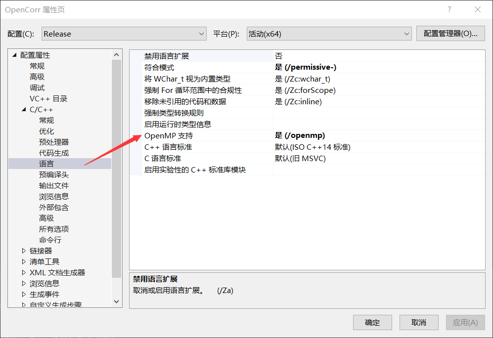

图1.4 Visual Studio内设置OpenMP支持示例
为了方便初学者配置开发环境，我们将上述三个开发库的所有文件做成一个压缩包，放在百度网盘上供大家下载（提取码：vyfy），将压缩包解开后根据上面的指南配置即可。

配置好开发环境，就可以尝试使用OpenCorr了。我们在GitHub网站的samples目录下提供了一些程序范例和图像，供使用者尝试。在编译这些程序前，同样需要注意正确设置IDE和代码内的文件路径。

## 2. OpenCorr的组织架构

OpenCorr的组织架构如图2.1所示。这个程序开发库大致可以分为四部分：（1）基本数据对象；（2）DIC数据对象；（3）基本数据处理方法；（4）DIC处理方法。

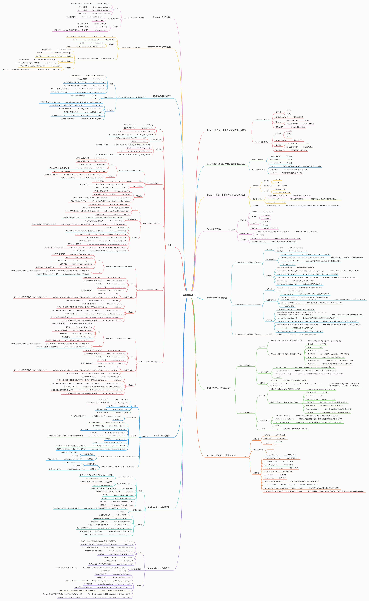

图2.1 OpenCorr的组织架构示意图

### 2.1. 基本数据对象

（1）点（Point），代码保存在oc_point.h和oc_point.cpp文件中。图2.2展示了point对象的参数和方法，Point的主要参数是它的坐标，构造函数用于生成指定坐标的point对象。由于point也可以视为矢量，表示点之间的偏移，因此我们制作了vectorNorm() 函数来计算该矢量的模长。同时，我们重载了基本运算符，其中“+”和“-”表示点的坐标叠加上一个正或负的偏移量，“*”和“/”表示点的坐标分别乘以或除以一个标量。运算符“<<”被重载，用于直接输出point的坐标，格式为”x, y”（Point2D）或”x, y, z”(Point3D)。

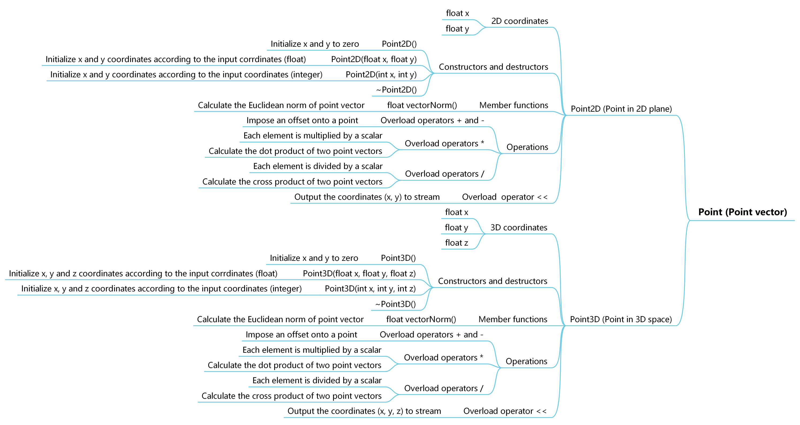

图2.1.1 Point对象的参数和方法
（2）数组/矩阵（Array），代码保存在oc_array.h和oc_array.cpp文件中。图2.1.2展示了Array对象的参数和方法。由于OpenCorr中的矩阵运算主要调用Eigen完成，该对象的定义较为简单。主要包括创建和删除二维、三维和4维数组的函数，以及自定义的Eigen数组类型。

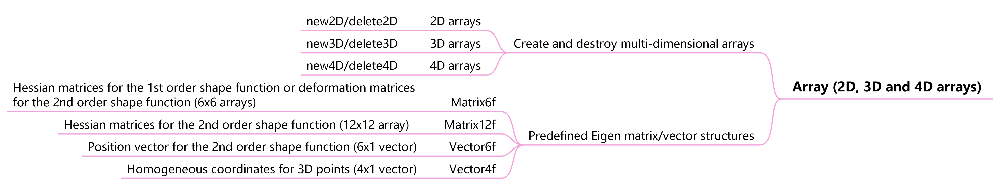

图2.1.2 Array对象的参数和方法
（3）图像（Image），代码保存在oc_image.h和oc_image.cpp文件中。图2.1.3展示了Image对象的参数和方法。Image对象调用OpenCV的函数读取图像，获取其尺寸信息，并将其保存至尺寸相同的Eigen矩阵中。使用OpenCV 4的用户请注意：OpenCV 4与OpenCV 3的一些基本函数略有差异，需要在OpenCorr的相应部分进行修改。

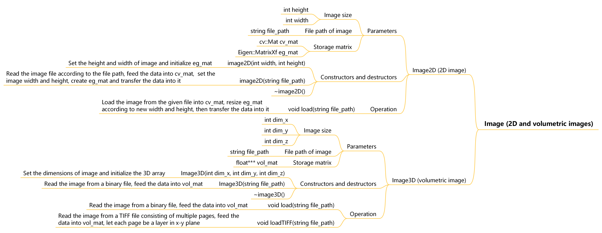

图2.1.3 Image对象的参数和方法

### 2.2. DIC数据对象

（1）Subset（子区），代码保存在oc_subset.h和oc_subset.cpp文件中。图2.2.1展示了Subset对象的参数和方法。Subset可以视为一个特别的矩阵，其中心位于点center，高和宽分别等于对应的子区半径的两倍再加一。它的构造函数主要用于设定上述参数并初始化相应的Eigen矩阵。它的成员函数fill(Image2D* image)实现从image对象中读取Subset参数定义位置的灰度数据并填入子区，zeroMeanNorm()则在完成子区所有元素零均值归一化处理的同时，返回归一化系数。

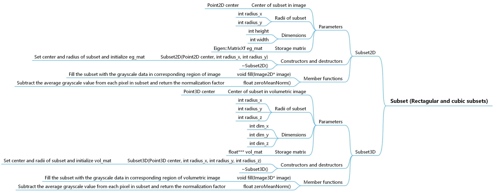

图2.2.1. Subset对象的参数和方法
（2）Deformation（变形），代码保存在oc_deformation.h和oc_deformation.cpp文件中。图2.6展示了Deformation对象的参数和方法。Deformation包括二维变形和三维变形，变形可以通过一阶形函数和二阶形函数描述。在二维变形中，一阶形函数包括6个元素（位移u和v，及其分别在x和y方向的梯度），对应的变形矩阵warp_matrix的维度为3×3。二阶形函数包括12个元素（位移u和v，及其分别在x和y方向的一阶及二阶梯度），对应的变形矩阵warp_matrix的维度为6×6。构造函数的功能为根据输入参数初始化变形分量和变形矩阵。

主要成员函数包括：

- 无参数的setDeformation()，根据当前warp_matrix的内容设定变形分量；
- 有参数的setDeformation()，根据输入参数设定变形分量，更新相应的wrap_matrix；
- 用另一个变形对象作为参数的setDeformation()，根据给定变形对象设定变形分量，更新相应的wrap_matrix；
- setWarp()；根据当前变形分量计算warp_matrix；
- Point2D warp(Point2D& point)，计算输入点经过变形后的新坐标。

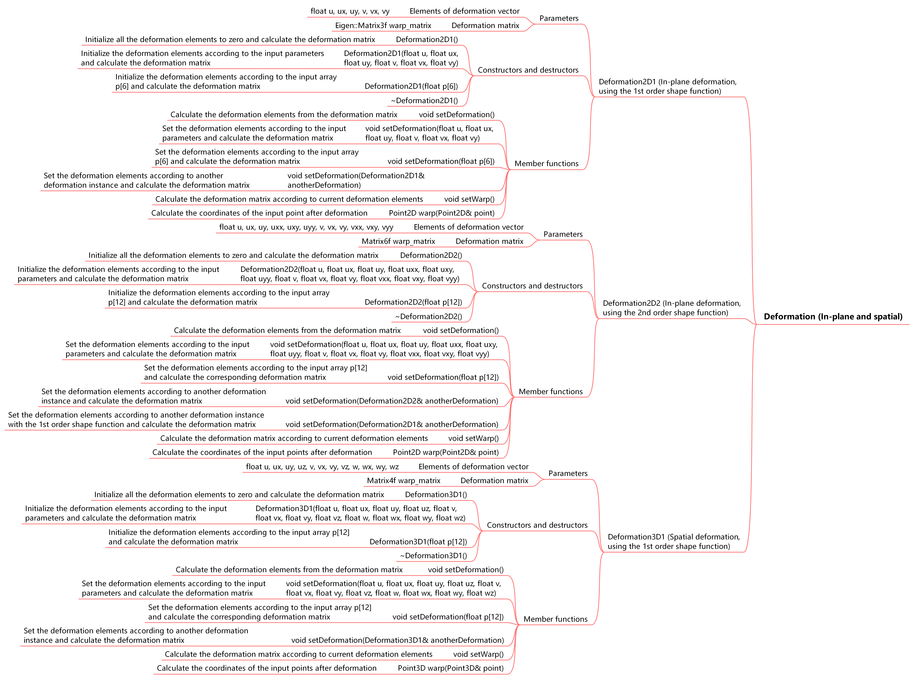

图2.2.2. Deformation对象的参数和方法
（3）POI（考察点，Point of interest），代码保存在oc_poi.h和oc_poi.cpp文件中。图2.2.3示了POI对象的参数和方法。POI对象继承point的属性和方法，在此基础上增加了一个变形矢量deformation和一个结果矢量result，分别用于进行DIC处理和输出结果。其中POI2DS是针对Stereo DIC设计的对象，它继承了Point2D，但包含的变形矢量是三维零阶的。POI的构造函数的功能是根据输入的坐标设定POI的位置并将其中的deformation和result对象清零。

主要成员函数包括：

- clean()，将deformation和result中所有元素清零；
- setIterationCriteria(float conv_criterion, float stop_condition, float neighbor_essential)，该功能用于设定迭代DIC方法处理特定POI时的收敛判据和停止条件，以及特征辅助方法中POI近邻搜索关键点的最低数量。

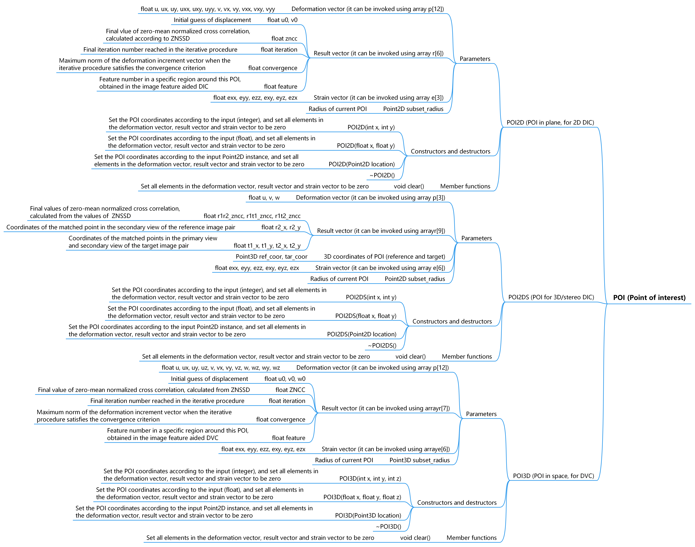

图2.2.3. POI对象的参数和方法

### 2.3. 基本数据处理方法

（1）Gradient（计算梯度），代码保存在oc_gradient.h和oc_gradient.cpp文件中。图2.3.1展示了Gradient对象的参数和方法。本程序开发库目前只提供常用的四阶中心差分方法。grad_img为指向待处理Image2D对象的指针，在构造函数中初始化。成员函数getGradientX()、getGradientY()和getGradientXY()分别计算x和y方向的一阶梯度图，以及二阶混合梯度图，结果保存在对应的Eigen矩阵gradient_x、gradient_y和gradient_xy里。

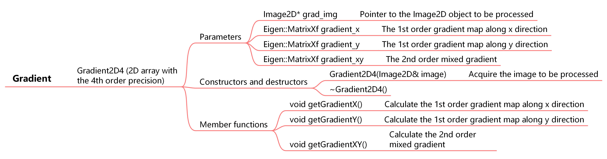

图2.3.1. Gradient对象的参数和方法
（2）Interpolation（计算插值），代码保存在oc_interpolation.h和oc_interpolation.cpp文件中。图2.3.2展示了Interpolation对象的参数和方法。Interpolation是一个基类，包含了基本的参数，interp_img是指向待处理Image2D对象的指针，在构造函数中初始化。派生类BicubicBspline（代码保存在oc_bicubic_bspline.h和oc_bicubic_bspline.cpp文件中）提供常用的双三次B样条插值方法。我们的研究表明，双三次B样条插值方法的精度明显优于双三次插值，但计算代价只有轻微的增加（Pan et al. Theo Appl Mech Lett, 2016, 6(3):126-130）。成员函数prepare()计算图像的全局插值系数查找表，结果保存在lookup_table中。compute(Point2D& location)根据全局插值系数表计算输入点坐标处的灰度值。

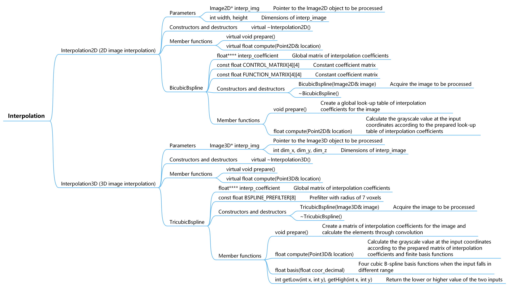

图2.3.2. Interpolation对象的参数和方法
（3）Feature（图象特征提取和匹配），代码保存在oc_feature.h和oc_feature.cpp文件中。图2.3.3展示了Feature对象的参数和方法。Feature2D是一个基类，包含了基本的参数，即指向参考图和目标图Image2D对象的指针（ref_img和tar_img）。成员函数setImages(Image2D& ref_img, Image2D& tar_img)，根据输入更新ref_img和tar_img。派生类SIFT2D（代码保存在oc_sift.h和oc_sift.cpp文件中）提供经典的SIFT特征提取和匹配方法。sift_config包含了特征提取的主要参数，各参数的具体含义可参考OpenCV的相关文档，match_ratio为特征匹配时两图中特征描述符最近距离和次近距离之比的阈值，其说明参见Lowe的论文（Lowe, Int J Comput Vis, 2004, 60(2):91-110）。提取的关键点经过匹配后分别存储在向量ref_matched_kp和tar_matched_kp中。

主要成员函数包括：

- prepare()，将ref_img和tar_img地址赋予OpenCV矩阵ref_mat和tar_mat；
- compute()，提取参考图和目标图中的特征并进行匹配；
- getSIFTconfig()，获取当前特征提取参数；
- getMatchingRatio()，获取当前特征匹配阈值；
- setExtraction(SIFTconfig sift_config)，设定特征提取参数；
- setMatching(float match_ratio)，设定特征匹配阈值。

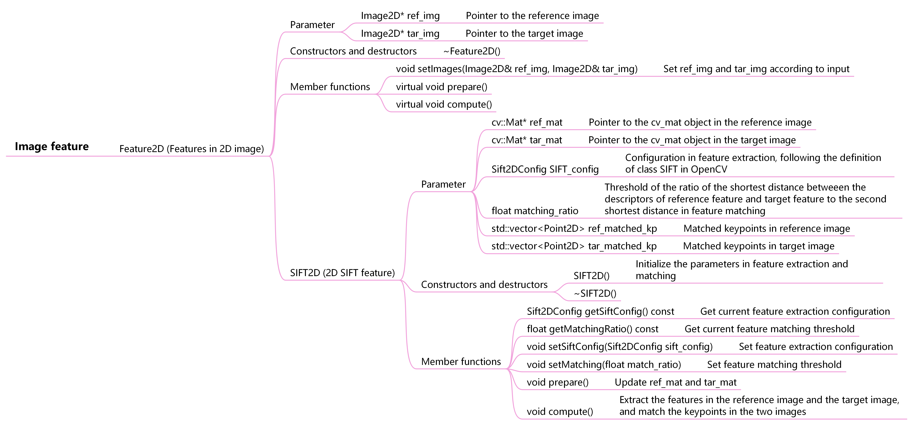

图2.3.3. Feature对象的参数和方法
（4）Calibration（相机标定），代码保存在oc_calibration.h和oc_calibration.cpp文件中。图2.3.4展示了Calibration对象的参数和方法。

主要参数包括：

- 相机内参 intrinsics，内容为fx, fy, fs, cx, cy, k1, k2, k3, k4, k5, k6, p1, p2；
- 相机外参 extrinsics，内容为tx, ty, tz, rx, ry, rz；
- 内参矩阵 intrinsic_matrix；
- 旋转矩阵 rotation_matrix；
- 平移向量 translation_vector；
- 投影矩阵 projection_matrix；
- 进行图像畸变矫正的收敛判据和迭代次数上限 convergence, iteration；
- 图象畸变矫正时的坐标参考图 map_x, map_y。

主要成员函数包括：

- updateIntrinsicMatrix()，更新相机内参矩阵；
- updateRotationMatrix()，根据旋转角更新旋转矩阵；
- updateTranslationVector()，根据平移分量更新平移矢量；
- updateProjectionMatrix()，根据上述三个矩阵更新投影矩阵；
- Point2D image_to_sensor(Point2D& point), 将输入点的坐标从图像坐标系（物理单位）转换至传感器坐标（像素单位）;
- Point2D sensor_to_image(Point2D& point), 将输入点的坐标从传感器坐标（像素单位）转换至图像坐标系（物理单位）;
- setUndistortion(float convergence, int iteration)，设定畸变矫正的迭代参数；
- prepare(int height, int width)，根据图像尺寸生成整像素图像坐标对应的含畸变的物理坐标映射图；
- distort(Point2D& point)，根据畸变参数对输入点的物理坐标进行调节；
- undistort(Point2D& point)，矫正输入点的像素坐标。

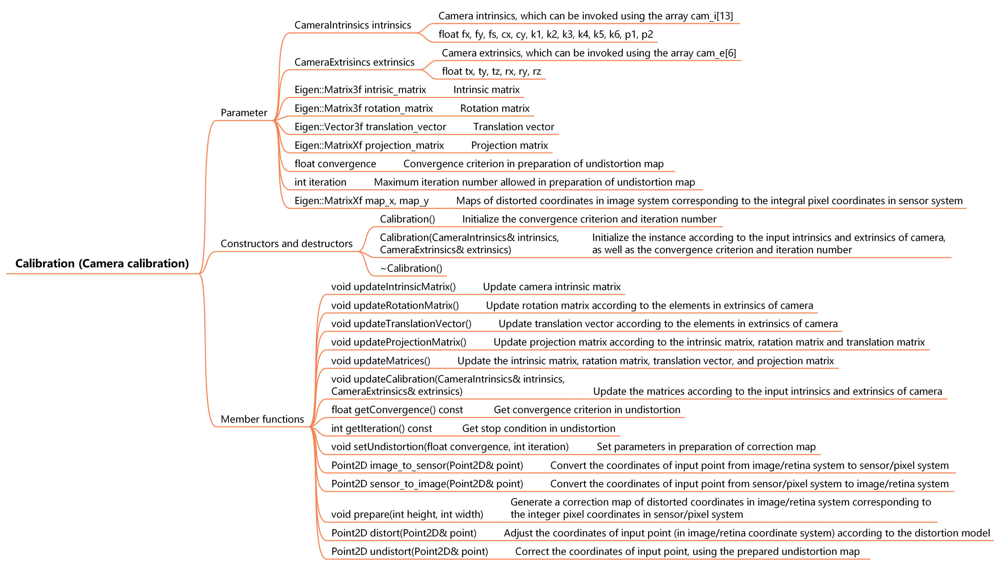

图2.3.4. Calibration对象的参数和方法
（5）Stereovision（立体视觉），代码保存在oc_stereovision.h和oc_stereovision.cpp文件中。图2.3.5展示了Stereovision对象的参数和方法。其主要功能是根据左右视场中匹配的二维点坐标重构空间中的三维点坐标。

主要参数包括：

- 相机对象，view1_cam（主相机） 和 view2_cam（次相机）；
- 调用OpenMP进行并行处理的线程数，thread_number；

主要成员函数包括：

- updateCameraParameters(Calibration* view1_cam, Calibration* view2_cam)，更新相机对象；
- prepare()，更新各相机中的参数矩阵；
- Point3D reconstruct(Point2D& view1_2d_point, Point2D& view2_2d_point)，根据主次视场匹配的点坐标重构对应的空间点坐标；
- reconstruct(vector<Point2D>& view1_2d_point_queue,vector<Point2D>& view2_2d_point_queue, vector<Point3D>& space_3d_point_queue)，处理一批点，结果保存在队列space_3d_point_queue。

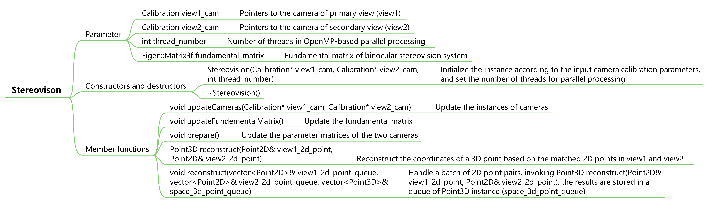

图2.3.5. Stereovision对象的参数和方法

（6）IO（文件输入和输出），代码保存在oc_io.h和oc_io.cpp文件中，图2.3.6展示了IO对象的参数和方法。该模块主要用于辅助程序测试，其主要功能是从文本格式的csv文件中读取POI的坐标和内容信息，或者将计算的结果输出文本格式的csv文件中。

主要参数包括：

- 文件路径和文本分隔符，file_path，delimiter；
- 图像尺寸，height，width；

主要成员函数包括：

- setPath(string file_path)，设定csv文件路径；
- setDelimiter(string delimiter)，设定数据分隔符；
- loadTable2D()，从csv数据表中读取信息，生成POI队列；
- loadPOI2D()，从csv数据表中读取预设的POI坐标信息，生成Point2D队列；
- saveTable2D(vector<POI2D> POI_queue)，将POI队列的信息存入csv数据表；
- saveDeformationTable2D(vector<POI2D> POI_queue)，将POI队列中各POI的完整变形矢量信息存入数据表；
- saveTable2DS(vector<POI2DS> POI_queue)，针对Stereo/3D DIC制作，将POI队列中各POI的信息存入数据表；
- saveMap2D(vector<POI2D> POI_queue, char variable)，将POI队列中各POI的主要信息依照其坐标保存为二维矩阵，variable目前包括 'u', 'v', 'z' (ZNCC), 'c' (convergence), 'i' (iteration), 'f' (feature), 'x' (exx), 'y' (eyy), 'g' (exy)。

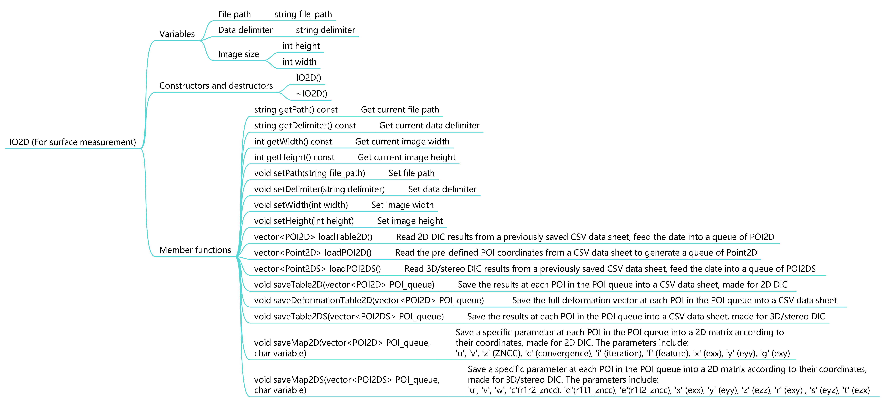

图2.3.6. IO对象的参数和方法

### 2.4. DIC处理方法

DIC基类的代码保存在oc_dic.h和oc_dic.cpp文件中。其主要参数包括：

- 指向参考图和目标图的指针，ref_img 和 tar_img；
- 子区半径（x和y方向），subset_radius_x, subset_radius_y；
- 调用OpenMP进行并行处理的线程数，thread_number。

主要的成员函数setImages(Image2D& ref_img, Image2D& tar_img)用来设定参考图和目标图指针，setSubsetRadii(int subset_radius_x, int subset_radius_y)用来设定子区半径。其余三个虚函数展示了该类中的主要方法，即prepare()（准备工作）和compute(POI2D* POI)（处理单个POI）和compute(std::vector& POI_queue)（处理一批POI）。该基类下有数个派生类，实现了各种DIC方法。这些方法虽然针对path-independent DIC的策略开发，但是很容易使用它们实现初值传递的DIC策略，例如目前较为流行的reliability-guided DIC方法，可以简捷地运用C++中的vector容器及其排序方法，结合下面提供的DIC方法加以实现。

（1）FFTCC2D（基于快速傅里叶变换的互相关方法），代码保存在oc_fftcc.h和oc_fftcc.cpp中。图2.4.1展示了FFTCC2D对象的参数和方法。该方法调用FFTW库完成快速傅里叶变换及逆变换运算，其原理可参见我们的论文（Jiang et al. Opt Laser Eng, 2015, 65:93-102）。由于处理过程中需要动态申请不少内存块，因而制作了一个FFTW类辅助并行计算。在FFTCC2D类初始化时，根据设定的线程数初始化相应数目的FFTW实例，然后在compute(POI2D* POI)中通过getInstance(int tid)获取当前的CPU线程号进行运算。对于装入vector容器的一系列POI，可调用compute(std::vector& POI_queue)进行批处理。

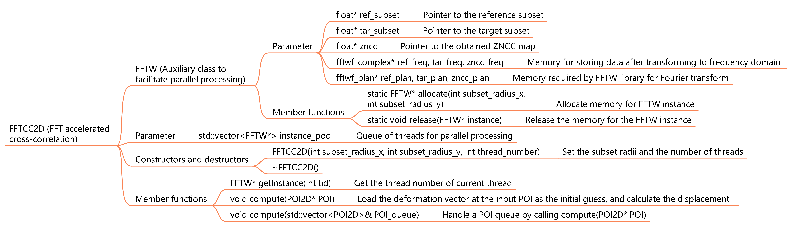

图2.4.1. FFTCC2D对象的参数和方法
（2）FeatureAffine2D（图像特征辅助的仿射变换方法），代码保存在oc_feature_affine.h和oc_feature_affine.cpp中。图2.4.2展示了FeatureAffine2D对象的参数和方法。该方法利用POI邻近的图像特征点拟合仿射变换矩阵，以此估计POI的变形，其原理可参见我们的论文（Yang et al. Opt Laser Eng, 2020, 127:105964）。注意对于考察POI周围特征点过少的情况，compute(POI2D* POI)会继续收集搜索区域之外距离最近的特征点，直至数目达到预设的下限值。

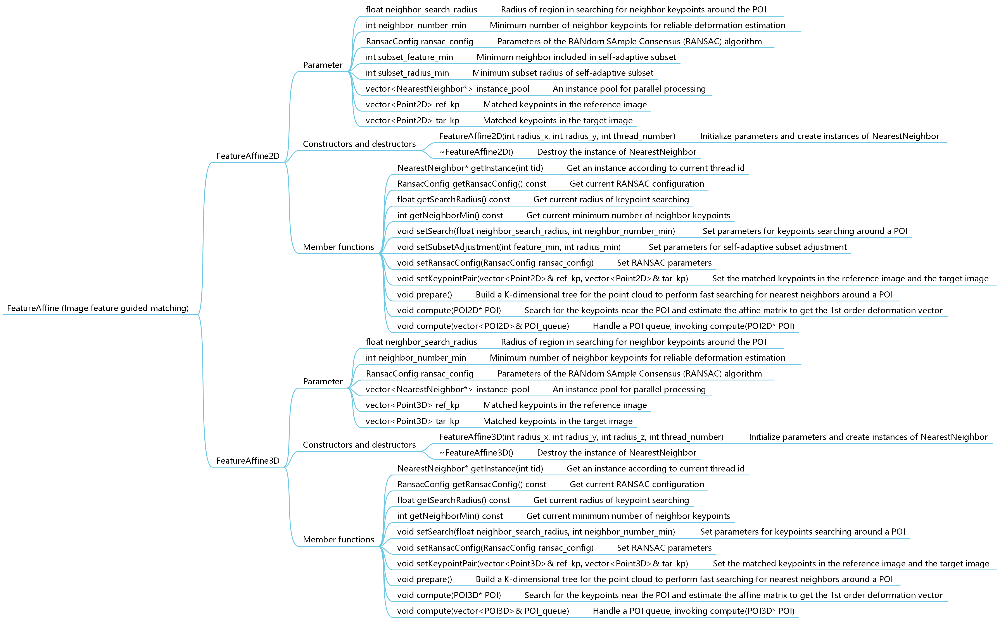

图2.4.2. FeatureAffine2D对象的参数和方法
（3）ICGN2D1（一阶形函数的ICGN方法）和ICGN2D2（二阶形函数的ICGN方法），代码保存在oc_icgn.h和oc_icgn.cpp中。图2.4.3和图2.4.4展示了这两个对象的参数和方法。ICGN2D1方法的原理可参见我们的论文（Jiang et al. Opt Laser Eng, 2015, 65:93-102），ICGN2D2方法的原理可参见张青川教授团队的论文（Gao et al. Opt Laser Eng, 2015, 65:73-80）。由于ICGN方法处理过程中也需要动态申请大量内存块，因而制作了相应的辅助类 ICGN2D1_ 和 ICGN2D2_ 协助多线程并行计算。在类初始化时，根据设定的线程数初始化相应数目的辅助类实例，然后在compute(POI2D* POI)中通过getInstance(int tid)获取当前的CPU线程号进行运算。对于装入vector容器的一系列POI，可调用compute(std::vector& POI_queue)进行批处理。

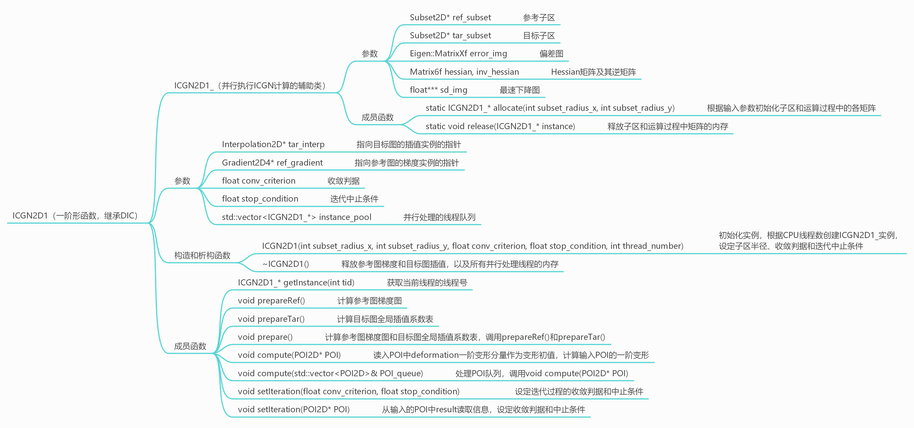

图2.4.3. ICGN2D1对象的参数和方法

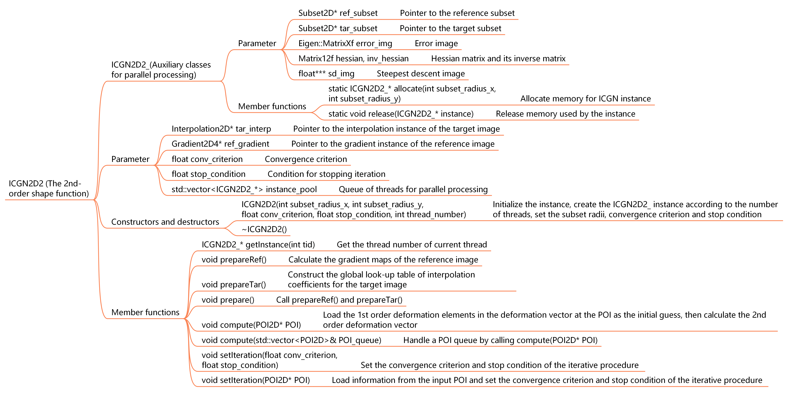

图2.4.4. ICGN2D2对象的参数和方法

（4）EpipolarSearch（极线约束辅助的搜索），代码保存在oc_epipolar_search.h和oc_epipolar_search.cpp文件中。图2.4.5展示了EpipolarSearch对象的参数和方法。该方法针对立体视觉所需的匹配，利用两个视角图像之间存在的极线约束，将搜索一个视图中的点在另一个视图中的对应点的范围缩小至极线的一部分。搜索范围的中心落在极线与其一条垂线的交点，该垂线同时通过一个根据初始位移和猜测的视差估计的点。搜索的步长限制在几个像素（低于ICGN算法的收敛半径）。其原理可参见我们的论文（Lin et al. Opt Laser Eng, 2022, 149:106812）。该方法中调用了ICGN2D1（收敛判据较为宽松，迭代次数较少）以确保搜索中匹配的精度，保留ZNCC值最高的结果。该结果可作为变形初值输送给1CGN2D2方法，进行高精度的匹配。注意在此方法中，批处理函数compute(std::vector<POI2D>& poi_queue)要避免使用多线程模式，以避免与其调用的ICGN2D1方法（缺省使用多线程模式）相互干扰。 samples 目录下的test_3d_reconstruction_epipolar.cpp展示了如何使用这一模块进行立体匹配，重构目标物表面点云坐标。

主要参数包括：

- 相机对象: view1_cam (principal) and view2_cam (secondary);
- 步进搜索中参数, search_radius, search_step, parallax;
- 估算极线的基础矩阵，fundamental_matrix；
- 调用ICGN2D1的参数: icgn_sr_x, icgn_sr_y, icgn_conv, icgn_stop。

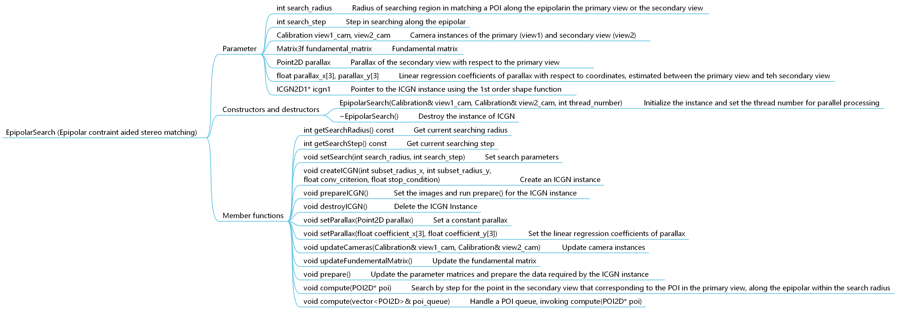

图2.4.5. EpipolarSearch对象的参数和方法

（5）Strain（计算应变），代码保存在oc_strain.h和oc_strain.cpp文件中。图2.4.6展示了Strain对象的参数和方法。目前提供平面内应变的计算，该方法先用多项式拟合子区域（subregion）内的位移分量曲面，然后根据其一阶微商计算应变。原理可参考潘兵教授的论文（Pan et al. Opt Eng, 2007, 46:033601）。其参数包括：

- ROI的左上角：topleft_point
- 拟合局部位移分量曲面的子区域半径：subregion_radius
- POI间距：grid_space
- 位移分量的二维矩阵：u_map, v_map

主要成员函数：

- setSubregionRadius(int subregion_radius)，设置拟合局部位移分量曲面的子区域半径；
- setGridSpace(int grid_space)，设置POI间距，该参数必须与DIC计算时设置的数值相等；
- setDisplacement(std::vector& POI_queue)，根据POI队列各元素的位移分量，生成 u_map 和 v_map；
- compute(POI2D* POI)，计算POI的应变。

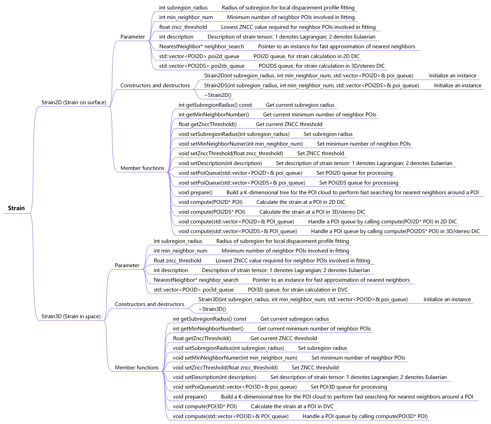

图2.4.6. Strain对象的参数和方法

## 3. GPU加速模块

GPU加速模块目前提供对ICGN算法的加速，可支持一阶和二阶形函数。开发者可以通过动态链接库调用。

- 硬件要求：英伟达显卡，显存建议不低于2GB

- 软件要求：Windows操作系统，CUDA ToolKit 11.4

GPU加速ICGN模块包括三个文件：头文件（opencorr_gpu.h），静态库（OpenCorrGPULib.lib）和动态链接库（OpenCorrGPULib.dll）。开发环境的配置与 FFTW 等程序库类似，包括以下四个步骤：

（1） 将 opencorr_gpu.h 放到 opencorr.h 所在目录下，如图3.1所示。

图3.1 将头文件 opencorr_gpu.h 置于 opencorr.h 同一目录下

（2）在IDE中添加静态库文件的路径（以 OpenCorrGPULib.lib 置于图1.1中 opencorrGPU\lib 目录下的情况为例），具体如图3.2所示，点击菜单上项目->属性->VC++目录，在“库目录”项里添加开发库静态库文件的目录。

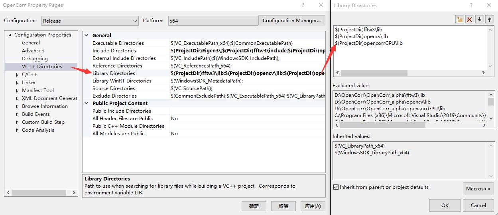

图3.2 在Visual Studio内设置库目录

（3）打开项目->属性->打开链接器->输入->附加依赖项对话框，添加 OpenCorrGPULib.lib 项，如图3.3所示。

图3.3. 在Visual Studio内设置附加依赖项

（4） 将 OpenCorrGPULib.dll 放到编译生成的可执行文件（.exe）同一目录下。

调用模块的方法可参考 samples 目录下的 test_2d_dic_gpu_icgn2.cpp。注意为了保持模块运行效率，其数据结构与CPU版略有差异，因此需要将参考图和目标图转换为一维数组。POI队列也需要另行生成，从CPU版本中定义的POI队列获取位置和通过其它DIC算法估计的变形初值。在计算完毕后，再将结果回传至原POI队列，以便使用 OpenCorr 的输出函数保存结果。

## 4. 致谢

OpenCorr 中提供的 DIC/DVC 算法是我们近年来在该领域一系列探索的成果，这些研究工作得到了多个国家自然科学基金项目的资助。在此，特别感谢一直以来给予我大力支持的两位合作者：新加坡南洋理工大学的钱克矛教授和华南理工大学的董守斌教授。

## 5. 开发人员

- 蒋震宇 博士，现为华南理工大学教授、博士生导师
- 张铃启，现为日本东京工业大学在读博士生
- 王添翼 博士，现为美国布鲁克海文国家实验室博士后
- 陈蔚 博士，现为美的集团先行研究主任工程师
- 黄健文，现为商汤科技软件工程师
- 杨俊荣，现为腾讯科技软件工程师
- 林傲宇，现为中国南方电网工程师

## 6. 相关论文

用户可参阅我们发表的论文，以便深入了解OpenCorr中算法的原理。

[1] Z. Jiang, Q. Kemao, H. Miao, J. Yang, L. Tang, Path-independent digital image correlation with high accuracy, speed and robustness, Optics and Lasers in Engineering (2015) 65: 93-102.

[2] L. Zhang, T. Wang, Z. Jiang, Q. Kemao, Y. Liu, Z. Liu, L. Tang, S. Dong, High accuracy digital image correlation powered by GPU-based parallel computing, Optics and Lasers in Engineering (2015) 69: 7-12.

[3] T. Wang, Z. Jiang, Q. Kemao, F. Lin, S.H. Soon, GPU accelerated digital volume correlation, Experimental Mechanics (2016) 56(2): 297-309.

[4]. Z. Pan, W. Chen, Z. Jiang, L. Tang, Y. Liu, Z. Liu, Performance of global look-up table strategy in digital image correlation with cubic B-spline interpolation and bicubic interpolation, Theoretical and Applied Mechanics Letters (2016) 6(3): 126-130.

[5] W. Chen, Z. Jiang, L. Tang, Y. Liu, Z. Liu, Equal noise resistance of two mainstream iterative sub-pixel registration algorithms in digital image correlation, Experimental Mechanics (2017) 57(6): 979-996.

[6] J. Huang, L. Zhang, Z. Jiang, S. Dong, W. Chen, Y. Liu, Z. Liu, L. Zhou, L. Tang, Heterogeneous parallel computing accelerated iterative subpixel digital image correlation, Science China Technological Sciences (2018) 61(1):74-85.

[7] J. Yang, J. Huang, Z. Jiang, S. Dong, L. Tang, Y. Liu, Z. Liu, L. Zhou, SIFT-aided path-independent digital image correlation accelerated by parallel computing, Optics and Lasers in Engineering (2020) 127: 105964.

[8] J. Yang, J. Huang, Z. Jiang, S. Dong, L. Tang, Y. Liu, Z. Liu, L. Zhou, 3D SIFT aided path independent digital volume correlation and its GPU acceleration, Optics and Lasers in Engineering (2021) 136: 106323.

[9] A. Lin, R. Li, Z. Jiang, S. Dong, Y. Liu, Z. Liu, L. Zhou, L. Tang, Path independent stereo digital image correlation with high speed and analysis resolution, Optics and Lasers in Engineering (2022) 149: 106812.
