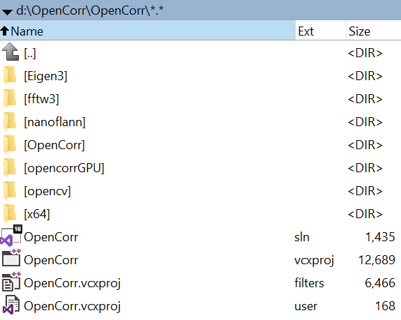
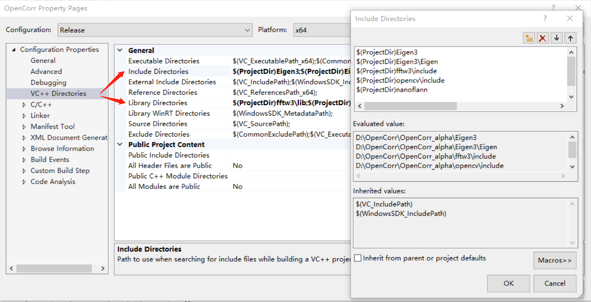
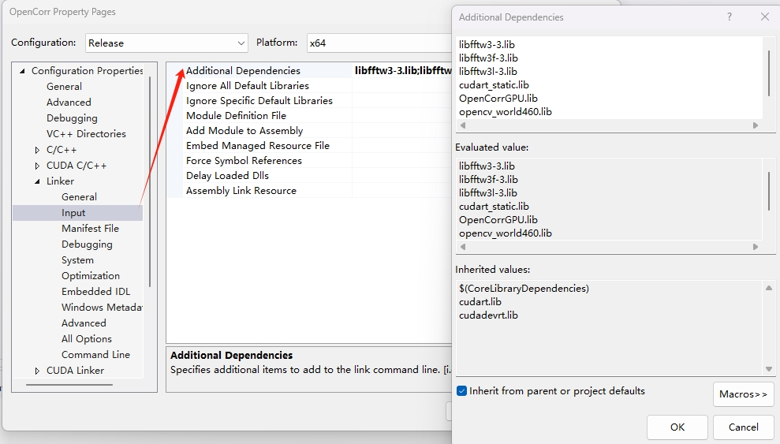
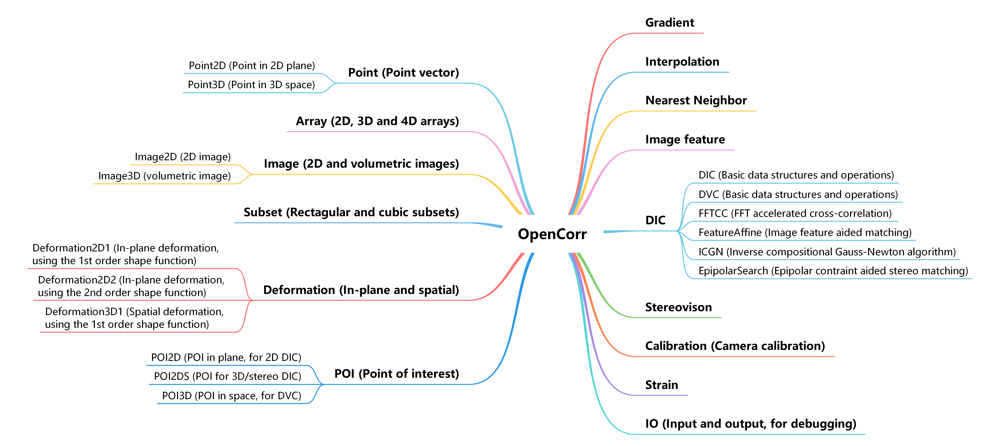
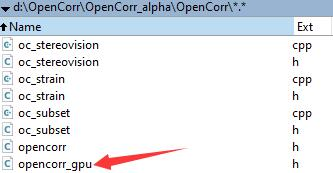
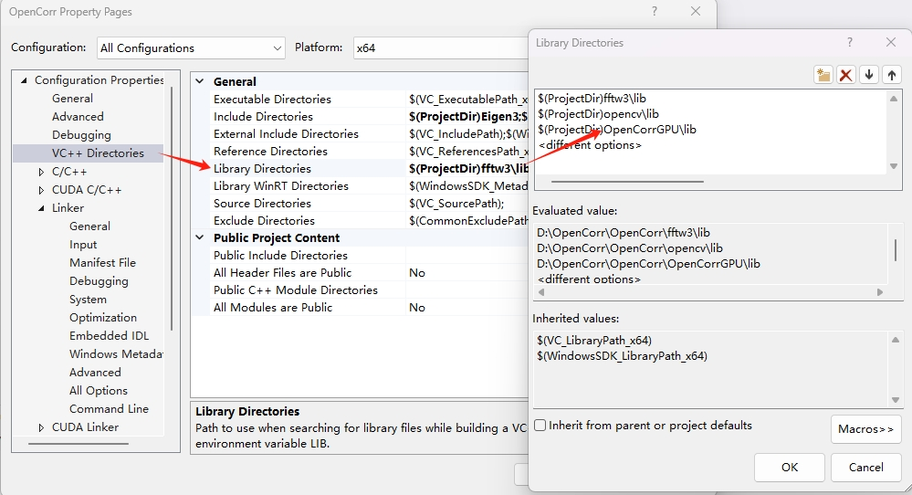
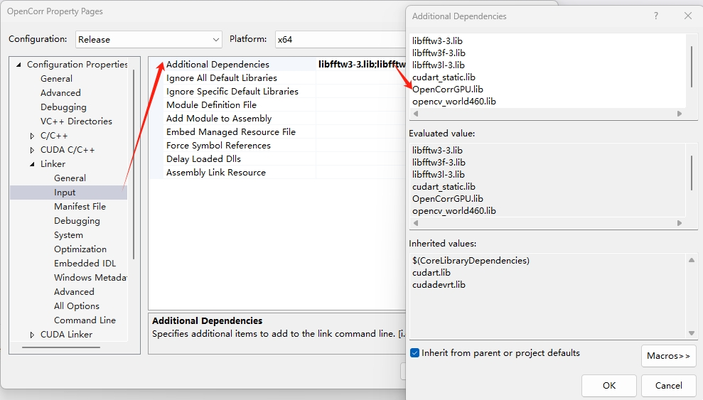

# OpenCorr: 开源数字图像相关法C++程序开发库

OpenCorr是一个开源的C++程序开发库，旨在提供一套轻量而高效的开发工具，帮助对数字图像相关法（Digital image correlation, DIC）或数字体图像相关法（Digital volume correlation, DVC）感兴趣的用户学习和研究算法的原理及实现，或者根据自己的特定需求，像组装乐高积木一样，开发新的DIC或DVC算法，或制作相关处理软件。

大家如有问题或建议，欢迎联系我们。具体可通过以下途径获得帮助：

1. 给我们写Email: zhenyujiang (at) scut.edu.cn

2. 在GitHub的项目讨论区交流

3. 加入OpenCorr的QQ讨论群：597895040

   

OpenCorr的代码和文档通过GitHub发布和维护，网址为 https://github.com/vincentjzy/OpenCorr

# 重要更新记录

- 2021.04.23，OpenCorr正式上线
- 2021.04.30，针对OpenMP优化了DIC模块的结构，改造了立体视觉模块的结构
- 2021.05.08，初步完成了OpenCorr架构的说明文档
- 2021.05.17，针对Linux系统进行了兼容性调整，发布了网页首图
- 2021.06.12，发布了根据DIC结果计算应变的示例，更新了相应文档
- 2021.08.14，发布了GPU加速的ICGN模块和调用示例，具体说明请见第五节（5. GPU加速模块）
- 2021.11.03，发布了实现 Stereo DIC（3D DIC）的示例，全面完善了相应模块和文档
- 2021.11.16，完善了Strain模块，实现了目标表面二维和三维应变场的计算
- 2022.04.27，重要更新，内容包括：（i）引入nanoflann加速Feature Affine算法和应变计算中的近邻点搜索；（ii）将第三方程序库（Eigen和OpenCV）升级至最新稳定版；（iii）进一步规范代码
- 2022.05.03，开发了为极线约束辅助匹配估计视差的方法，提供了一个进行立体匹配和重构的示例，展示了SIFT特征和极线约束结合使用的方法。
- 2022.06.23，发布了DVC模块，包括3D FFTCC和3D ICGN算法，其它模块也进行了相应的扩充。
- 2022.10.13，修复了GPU加速ICGN模块显存泄漏的故障。
- 2022.10.21，修复了FeatureAffine和Strain模块在多线程模式下调用NearestNeighbor实例冲突的问题。
- 2022.12.23，OpenCorr 1.0正式发布，增加了3D SIFT特征提取和匹配模块，3D SIFT特征引导的FeatureAffine模块，更新了文档和程序范例。
- 2022.12.23，OpenCorr 1.0正式发布，增加了3D SIFT特征提取和匹配模块，3D SIFT特征引导的FeatureAffine模块，更新了文档和程序范例。
- 2023.01.13，常规更新，内容包括：（i）增加了Newton-Raphson算法模块（NR），仅适用于2D DIC；（ii）提供了一个自适应DIC的范例，可针对每个POI动态优化其子区形状和尺寸；（iii）修复了Interpolation模块中一个潜在bug；（iv）更新代码和文档。

# 目录

1. 如何使用OpenCorr
2. OpenCorr的组织架构
3. 数据对象
4. 处理方法
5. GPU加速模块
6. 实例说明
7. 致谢
8. 开发人员
9. 相关论文
10. 影响

## 1. 如何使用OpenCorr

OpenCorr面向的是具备一定C++程序开发基础的用户。这套程序开发库在微软Windows 10专业版上的Visual Studio 2019（VS2019 社区版）内开发，因此使用者需要掌握这一集成开发环境（Integrated development environment, IDE）的基本配置和使用技能。由于代码遵循ISO C++ 14标准开发，而且依赖的几个开源程序库也是类似的情况，因此OpenCorr可以在其它操作系统（诸如Linux或Unix）中或使用其它C++编译器（例如GCC）编译。GitHub项目的examples 目录下提供了一个CMake脚本的示例 CMakeLists.txt ([https://github.com/vincentjzy/OpenCorr/examples/CMakeLists.txt](https://github.com/vincentjzy/OpenCorr/examples/CMakeLists.txt)) 供在Linux或Unix中开发的用户参考。

编译和运行OpenCorr的程序和范例首先需要正确安装以下四个开源程序库：

- Eigen 3.4.0（eigen.tuxfamily.org），用于二维矩阵的基本操作；
- OpenCV 4.6.0（opencv.org，用于图像的读写，2D图像特征提取和匹配；
- FFTW 3.3.5 （fftw.org），用来快速计算互相关判据；
- nanoflann （https://github.com/jlblancoc/nanoflann），用于快速估计点云中某一点的近邻点。

上述开发库大多在图像处理领域久负盛名，其官网提供非常详尽的指南和下载资源。在Windows 10系统上安装可以归纳为以下几个主要步骤：

（1）从官网上下载这些开发库的源代码（包括.h和.cpp等文件）以及相应的静态库（.lib文件）或动态库（.dll文件）。

（2）将这些文件放到合适的目录下，图1.1展示了我计算机上的目录结构，首先在VS 2019中创建一个名为OpenCorr的解决方案及同名的项目，OpenCor源代码的目录（OpenCor）与其它开发库的目录并列放在主目录（D:\OpenCorr\）下。

图1.1 Visual Studio解决方案目录结构的示例

（3）在IDE中添加相应文件的路径，具体如图1.2所示，点击菜单 项目-->属性-->VC++目录，然后在“包含目录”里添加开发库源代码文件的目录，在“库目录”项里添加开发库静态库文件的目录。

图1.2 Visual Studio内设置开发库目录示例

（4）设置链接器附加依赖项，打开 项目-->属性-->链接器-->输入-->附加依赖项对话框，如图1.3所示。

图1.3 Visual Studio内设置附加依赖项示例

将静态库文件（.lib）的文件名列表输入文本框后点击确定。对于Release模式，可以直接复制下面的列表粘贴至文本框。注意在Debug模式下，opencv库相应的文件名（不包括扩展名）以字母d结尾。

libfftw3-3.lib
libfftw3f-3.lib
libfftw3l-3.lib
opencv_world460.lib

（5）对于OpenCV和FFTW，还需要把动态链接库文件放到合适的目录下，可以放在编译代码产生的可执行程序（.exe文件）目录下，例如图1.1中的x64\Release。这些文件也可以放在操作系统Path参量包含的目录里（可通过Windows 10 设置-->关于-->高级系统设置-->高级-->环境变量-->系统变量-->Path 查看和修改）。

（6）如果希望使用多核CPU加速程序运行，还需要在项目属性中开启OpenMP支持，如图1.4所示。点击菜单 项目-->属性-->C/C++-->语言，将OpenMP支持设置为“是”。

图1.4 Visual Studio内设置OpenMP支持示例

为了方便初学者配置开发环境，我们将一个完整的Visual Studio解决方案做成zip压缩包，放在[opencorr.org](https://orpencorr.org/Download)供大家下载。将压缩包解开后（可使用7-Zip），直接用VS 2019或更高版本的Visual Studio打开OpenCorr.sln文件，即可开始调试代码。注意根据解压缩文件的目录正确设置IDE的路径，具体可参考上面的安装说明。

配置好开发环境，就可以尝试使用OpenCorr的模块制作DIC或DVC程序了。我们在GitHub项目的examples目录下提供了一些程序范例和图像，供使用者尝试。在编译这些程序前，同样需要正确设置IDE和代码内的文件路径。

## 2. OpenCorr的架构

OpenCorr的架构如图2.1所示。这个程序开发库大致可以分为两部分：（1）数据对象 （图中左半部分）；（2）处理方法（图中右半部分）。

图2.1 OpenCorr的架构示意图

## 3. 数据对象

### 3.1. 基本数据

（1）点（Point），代码保存在oc_point.h和oc_point.cpp文件中。图3.1.1展示了point对象的参数和方法，Point的主要参数是它的坐标，构造函数用于生成指定坐标的point对象。由于point也可以视为矢量，表示点之间的偏移，因此我们制作了vectorNorm() 函数来计算该矢量的模长。同时，我们重载了基本运算符，其中“+”和“-”表示点的坐标叠加上一个正或负的偏移量，“\*”和“/”表示点的坐标分别乘以或除以一个标量。当运算符两侧均为point对象时，“\*”表示矢量的点积，而“/”表示矢量的叉积。“<<”被重载，用于直接输出point的坐标，格式为”x, y”（Point2D）或”x, y, z”(Point3D)。

图3.1.1 Point对象的参数和方法

（2）数组（Array），代码保存在oc_array.h和oc_array.cpp文件中。图3.1.2展示了Array对象的参数和方法。由于OpenCorr中的二维矩阵运算主要调用Eigen完成，该对象的定义较为简单。主要包括创建和删除二维、三维和四维数组的函数，以及自定义的Eigen矩阵类型。

图3.1.2 Array对象的参数和方法

（3）图像（Image），代码保存在oc_image.h和oc_image.cpp文件中。图3.1.3展示了Image对象的参数和方法。对于二维图像，Image对象调用OpenCV的函数读取图像，获取其尺寸信息，并将其保存至尺寸相同的Eigen矩阵。三维体图像则保存在自定义二进制编码文件中，文件的格式为文件头（包含三个整型数，分别为体图像x，y和z方向的尺寸）和一个三维浮点数矩阵。注意三维矩阵亦可视为一维数组，存储的维度顺序为x，y和z。另一种体图像文件格式为包含多页的TIFF图像，可调用OpenCV的函数读取，其中每一页作为x-y平面的一层。

图3.1.3 Image对象的参数和方法

### 3.2. DIC/DVC数据

（1）Subset（子区），代码保存在oc_subset.h和oc_subset.cpp文件中。图3.2.1展示了Subset对象的参数和方法。Subset可以视为一个特别的矩阵，其中心位于点center，其每个维度的长度分别等于对应的子区半径两倍再加一。

成员函数：

- fill(Image2D* image)或fill(Image3D* image)，从image对象中读取Subset参数定义位置的灰度数据并填入子区；
- zeroMeanNorm()，在完成子区所有点上灰度零均值归一化处理的同时，返回归一化系数。

图3.2.1 Subset对象的参数和方法

（2）Deformation（变形），代码保存在oc_deformation.h和oc_deformation.cpp文件中。图3.2.2展示了Deformation对象的参数和方法。Deformation包括二维变形和三维变形，变形可以通过一阶形函数和二阶形函数描述。在二维变形中，一阶形函数包括6个元素（位移u和v，及其分别在x和y方向的梯度），对应的变形矩阵warp_matrix的维度为3×3。二阶形函数包括12个元素（位移u和v，及其分别在x和y方向的一阶及二阶梯度），对应的变形矩阵warp_matrix的维度为6×6。在三维变形中，一阶形函数包括12个元素（位移u，v和w，及其分别在x，y和z方向的一阶梯度），对应的变形矩阵warp_matrix的维度为4×4。

成员函数：

- 无参数的setDeformation()，根据当前warp_matrix的内容设定变形分量；
- 有参数的setDeformation()，根据输入参数设定变形分量，更新相应的wrap_matrix；
- 用另一个变形对象作为参数的setDeformation()，根据给定变形对象设定变形分量，更新相应的wrap_matrix；
- setWarp()；根据当前变形分量计算warp_matrix；
- Point2D warp(Point2D& point)或Point3D warp(Point3D& point)，计算输入点经过变形后的新坐标。

图3.2.2 Deformation对象的参数和方法

（3）POI（考察点，Point of interest），代码保存在oc_poi.h和oc_poi.cpp文件中。图3.2.3示了POI对象的参数和方法。POI对象继承point的属性和方法，在此基础上增加了一个变形矢量deformation、一个结果矢量result和一个应变矢量strain，以及一个Point对象subset_radius。其中deformation矢量用于保存DIC计算的变形或提供计算的变形初值，result矢量存储用于后续分析的计算参数（例如变形初值、最终的ZNCC、收敛时的最大位移增量、迭代次数和POI周围的近邻图像特征数），strain矢量存储计算的应变，subset_radius存储处理该考察点的所用的子区半径。POI2DS是针对3D/Stereo DIC设计的对象，它继承了Point2D，但包含的deformation矢量是三维零阶的，result矢量内则包括三个最终ZNCC值（分别为DIC运算和立体匹配的结果），POI分别在两帧参考视野和目标视野中的二维坐标，以及重构的变形前后三维点坐标（ref_coor和tar_coor）。

主要成员函数包括：

- clear()，将deformation、result、strain和subset_radius中所有元素清零。

图3.2.3 POI对象的参数和方法

## 4. 处理方法

### 4.1. 基本处理

（1）Gradient（计算梯度），代码保存在oc_gradient.h和oc_gradient.cpp文件中。图4.1.1展示了Gradient对象的参数和方法。本程序开发库目前只提供常用的一阶微商的四阶中心差分方法。对二维图像，grad_img为指向待处理Image2D对象的指针，计算得到的梯度图保存在对应的Eigen矩阵gradient_x、gradient_y和gradient_xy里。对三维图像，grad_img为指向待处理Image3D对象的指针，计算得到的梯度图保存在对应的三维浮点数矩阵gradient_x、gradient_y和gradient_z里。

成员函数：

- getGradientX()，getGradientY()，getGradientZ()，计算x、y、z方向的一阶梯度图；
- getGradientXY()，计算二阶混合梯度图。

图4.1.1 Gradient对象的参数和方法

（2）Interpolation（计算插值），代码保存在oc_interpolation.h和oc_interpolation.cpp文件中。图4.1.2展示了Interpolation对象的参数和方法。Interpolation是一个基类，包含了基本的参数，即指向待处理Image对象的指针*interp_img。派生类BicubicBspline和TricubicBspline（代码保存在oc_cubic_bspline.h和oc_cubic_bspline.cpp文件中）提供常用的双三次和三三次B样条插值方法。我们的研究表明，双三次B样条插值方法的精度明显优于双三次插值，但计算代价只有轻微的增加（Pan et al. Theo Appl Mech Lett, 2016, 6(3): 126-130）。三三次B样条插值的具体信息可参见我们的论文（Yang et al. Opt Laser Eng, 2021, 136: 106323）。

成员函数：

- prepare()，计算图像的全局插值系数矩阵，结果保存在矩阵interp_coefficient中；
- compute(Point2D& location)和compute(Point3D& location)，根据插值系数计算输入点坐标处的灰度值。

图4.1.2 Interpolation对象的参数和方法

（3）NearestNeighbor（近邻估计），代码保存在(oc_nearest_neighbor.h和oc_nearest_neighbor.cpp文件中。图4.1.3展示NearestNeighbor对象的参数和方法。该类调用了nanoflann(https://github.com/jlblancoc/nanoflann)估计三维点云中指定坐标的近邻点。快速近邻估计库（FLANN，Fast Library for Approximate Nearest Neighbors）提供的方法相比暴力搜索（brute force search）而言，效率上会有显著提升。nanoflann支持两种搜索模式：（i）搜索指定半径圆形区域内的近邻点或（ii）搜索最近邻的K个点。注意近邻估计偶尔无法准确估计所有符合条件的近邻点，因此发现获得的近邻点异常少时，可改用简单的暴力搜索再试一次。

成员函数：

- assignPoints(vector& point_queue)，根据赋予的Point2D或Point3D队列生成三维点云；
- constructKdTree()，构造用于快速搜索的KD树结构；
- radiusSearch(Point3D query_point)，估计三维点云中给定三维坐标周围指定半径圆形范围内的近邻点，返回近邻点的数目；
- knnSearch(Point3D query_point)，估计三维点云中给定三维坐标周围最近邻的K个点，返回近邻点的数目；
- getSearchRadius()，获取当前搜索半径；
- getSearchK()，获取当前搜索K值；
- setSearchRadius(float search_radius)，设定指定半径搜索的半径；
- setSearchK(int search_k)，设定K近邻搜索的K值。

图4.1.3 NearestNeighbor对象的参数和方法

（4）Feature（图象特征提取和匹配），代码保存在oc_feature.h和oc_feature.cpp文件中。图4.1.4展示了Feature对象的参数和方法。Feature2D和Feature3D是基类，包含了基本的参数，即指向参考图和目标图Image对象的指针（ref_img和tar_img）。派生类SIFT2D和SIFT3D（代码保存在oc_sift.h和oc_sift.cpp文件中）提供二维和三维的SIFT特征提取和匹配方法。sift_config结构包含了特征提取的主要参数，各参数的具体含义可参考OpenCV的相关文档，matching_ratio参数为特征匹配时两图中特征描述符最近距离和次近距离之比的阈值。提取的关键点经过匹配后分别存储在Point队列ref_matched_kp和tar_matched_kp中。

SIFT2D调用OpenCV中的SIFT类，其原理及参数说明可参见Lowe的论文（Lowe, Int J Comput Vis, 2004, 60(2): 91-110）。SIFT3D参考了Rister等人的论文（Rister et al, IEEE Trans Image Process, 2017, 26(10): 4900-4910），具体实现方法亦可参考我们的论文（Yang et al, Opt Lasers Eng, 2021, 136: 106323）。

主要成员函数包括：

- setImages(ref_img, tar_img)，设定ref_img和tar_img；
- prepare()，在SIFT2D中，将ref_img和tar_img地址赋予OpenCV矩阵ref_mat和tar_mat，在SIFT3D中，初始化用于建立特征描述符的正二十面体表面正三角片参数；
- compute()，提取参考图和目标图中的特征并进行匹配；
- getSiftConfig()，获取当前特征提取参数；
- getMatchingRatio()，获取当前特征匹配阈值；
- setExtraction(SIFTconfig sift_config)，设定特征提取参数；
- setMatching(float matching_ratio)，设定特征匹配阈值。

图4.1.4 Feature对象的参数和方法

（5）Calibration（相机标定），代码保存在oc_calibration.h和oc_calibration.cpp文件中。图4.1.5展示了Calibration对象的参数和方法。其主要功能是根据相机标定参数矫正传感器坐标系中点的像素坐标。

主要参数：

- 相机内参 intrinsics，内容为fx, fy, fs, cx, cy, k1, k2, k3, k4, k5, k6, p1, p2；
- 相机外参 extrinsics，内容为tx, ty, tz, rx, ry, rz；
- 内参矩阵 intrinsic_matrix；
- 旋转矩阵 rotation_matrix；
- 平移向量 translation_vector；
- 投影矩阵 projection_matrix；
- 建立图像畸变矫正映射图的收敛判据和迭代次数上限 convergence, iteration；
- 传感器坐标系中整像素位置对应的含畸变的图像坐标系中x和y坐标 map_x, map_y。

成员函数：

- updateIntrinsicMatrix()，更新相机内参矩阵；
- updateRotationMatrix()，更新旋转矩阵；
- updateTranslationVector()，更新平移矢量；
- updateProjectionMatrix()，根据上述三个矩阵更新投影矩阵；
- updateMatrices()，更新上述四个矩阵；
- Point2D image_to_sensor(Point2D& point), 将输入点的坐标从图像坐标系（物理单位）转换至传感器坐标（像素单位）;
- Point2D sensor_to_image(Point2D& point), 将输入点的坐标从传感器坐标（像素单位）转换至图像坐标系（物理单位）;
- float getConvergence()，获取当前的迭代收敛判据；
- int getIteration()，获取当前的迭代次数上限；
- setUndistortion(float convergence, int iteration)，设定建立畸变矫正映射图的迭代参数；
- prepare(int height, int width)，根据图像尺寸生成传感器坐标系中整像素位置对应的含畸变的物理坐标映射图；
- distort(Point2D& point)，根据畸变参数对输入点的物理坐标进行调节；
- undistort(Point2D& point)，根据畸变矫正映射图矫正输入点的像素坐标。

图4.1.5 Calibration对象的参数和方法

（6）Stereovision（立体视觉），代码保存在oc_stereovision.h和oc_stereovision.cpp文件中。图4.1.6展示了Stereovision对象的参数和方法。其主要功能是根据左右视场中匹配的二维点坐标重构空间中的三维点坐标。

主要参数：

- Calibration view1_cam 和 view2_cam，相机对象，其中view1_cam为主相机，view2_cam为次相机；
- int thread_number，调用OpenMP进行并行处理的线程数；
- Eigen::Matrix3f fundamental_matrix，双目立体视觉模型中的基础矩阵。

成员函数：

- updateCameraParameters(Calibration* view1_cam, Calibration* view2_cam)，更新相机对象；
- void updateFundementalMatrix()，更新基础矩阵；
- prepare()，更新各相机中的参数矩阵以及基础矩阵；
- Point3D reconstruct(Point2D& view1_2d_point, Point2D& view2_2d_point)，根据主次视场匹配的点坐标重构对应的空间点坐标；
- reconstruct(vector<Point2D>& view1_2d_point_queue,vector<Point2D>& view2_2d_point_queue, vector<Point3D>& space_3d_point_queue)，处理一批点，结果保存在队列space_3d_point_queue中。

图4.1.6 Stereovision对象的参数和方法

（7）IO（文件输入和输出），代码保存在oc_io.h和oc_io.cpp文件中，图4.1.7展示了IO对象的参数和方法。该模块主要用于辅助程序测试，其主要功能是从文本格式的CSV数据表中读取POI的坐标和计算结果，或者将计算结果输出至文本格式的CSV数据表。

主要参数包括：

- 文件路径和文本分隔符：file_path，delimiter；
- 图像尺寸：2D（height，width），3D（dim_x，dim_y，dim_z）；

主要成员函数包括：

- setPath(string file_path)，设定CSV数据表路径；
- setDelimiter(string delimiter)，设定数据分隔符；
- loadTable2D()，loadTable2DS()或loadTable3D()，从CSV数据表中读取计算结果，生成POI2D，POI2DS或POI3D队列；
- loadPoint2D(string file_path)或loadPoint3D(string file_path)，从输入路径的CSV数据表中读取预设的POI坐标信息，生成Point2D或Point3D队列；
- saveTable2D(vector<POI2D>& POI_queue)，saveTable2DS(vector<POI2DS>& poi_queue)或saveTable3D(vector<POI3D>& poi_queue)，将POI队列的计算结果存入CSV数据表；
- saveDeformationTable2D(vector<POI2D>& POI_queue)，将POI2D队列中各POI的完整变形矢量信息存入数据表；
- saveMap2D(vector<POI2D>& POI_queue, char variable)，将POI队列中各POI的指定variable信息（2D DIC 结果）依照其坐标保存为二维矩阵，variable目前包括 'u', 'v', 'c' (ZNCC), 'd' (convergence), 'i' (iteration), 'f' (feature), 'x' (exx), 'y' (eyy), 'r' (exy)；
- saveMap2DS(vector<POI2DS>& poi_queue, char variable), 将POI队列中各POI的指定variable信息（3D/stereo DIC 结果）依照其坐标保存为二维矩阵，variable目前包括 'u', 'v', 'w', 'c'(r1r2_zncc), 'd'(r1t1_zncc), 'e'(r1t2_zncc), 'x' (exx), 'y' (eyy), 'z' (ezz), 'r' (exy) , 's' (eyz), 't' (ezx)；
- saveMap3D(vector<POI3D>& POI_queue, char variable)，将POI队列中各POI的指定variable信息（DVC结果）依照其坐标保存为三维矩阵，variable目前包括 'u', 'v', 'w', 'c'(zncc), 'x' (exx), 'y' (eyy), 'z' (ezz), 'r' (exy) , 's' (eyz), 't' (ezx)；
- saveMatrixBin(vector<POI3D>& poi_queue), 将POI队列的计算结果存入二进制文件，二进制文件的文件头为四个整数 (数组长度和图像的x，y及z方向尺寸)，紧接着是一个单精度浮点数一维矩阵（按先x，再y，然后z的顺序排列）;
- vector<POI3D> loadMatrixBin(), 从二进制数据文件中读取计算结果，保存为POI队列。二进制文件的文件头中图像的x，y及z方向尺寸分别存入IO对象的dim_x，dim_y和dim_z中。

图4.1.7 IO对象的参数和方法

### 4.2. DIC/DVC处理

图4.2.1展示了DIC基类的主要参数和方法，代码保存在oc_dic.h和oc_dic.cpp文件中。

主要参数：

- 指向参考图和目标图的指针，ref_img 和 tar_img；
- 子区半径（x，y和z方向），subset_radius_x, subset_radius_y, subset_radius_z；
- 调用OpenMP进行并行处理的线程数，thread_number。

成员函数：

- setImages(Image& ref_img, Image& tar_img)，设定参考图和目标图指针；
- setSubsetRadius(int subset_radius_x, int subset_radius_y)或setSubsetRadius(int subset_radius_x, int subset_radius_y, int subset_radius_z)，设定子区半径。

其余三个虚函数展示了该类中的主要方法，即

- prepare()，准备工作；
- compute(POI2D* poi)或compute(POI3D* poi)，处理单个POI；
- compute(std::vector& poi_queue)，处理一批POI。

该基类下有数个派生类，实现了各种DIC方法。这些方法虽然针对path-independent DIC的策略开发，但是很容易使用它们实现初值传递的策略，例如目前较为流行的reliability-guided DIC方法，可以简捷地运用C++中的vector容器及其排序方法，结合下面提供的DIC方法加以实现。

图4.2.1 DIC基类的参数和方法

（1）FFTCC（快速傅里叶变换加速的互相关方法），代码保存在oc_fftcc.h和oc_fftcc.cpp中。图4.2.2展示了FFTCC对象的参数和方法。该方法调用FFTW库完成快速傅里叶变换及逆变换运算，其原理可参见我们的论文（Jiang et al. Opt Laser Eng, 2015, 65:93-102; Wang et al. Exp Mech, 2016, 56(2): 297-309）。由于处理过程中需要动态申请不少内存块，因而制作了一个FFTW类辅助并行计算。在FFTCC2D和FFTCC3D类初始化时，根据设定的线程数初始化相应数目的FFTW实例池，然后在compute(poi)中通过getInstance(int tid)根据当前的CPU线程号获取一个FFTW实例进行运算。对于装入vector容器的一系列POI，可调用compute(std::vector& poi_queue)进行批处理。FFTCC亦可用于计算自相关值，从而估计子区或全图内的散斑平均尺寸。

图4.2.2 FFTCC对象的参数和方法

（2）FeatureAffine（图像特征辅助的仿射变换方法），代码保存在oc_feature_affine.h和oc_feature_affine.cpp中。图4.2.3展示了FeatureAffine2D对象的参数和方法。该方法利用POI邻近的图像特征点拟合仿射变换矩阵，以此估计POI的变形，其原理可参见我们的论文（Yang et al. Opt Laser Eng, 2020, 127: 105964; Yang et al, Opt Lasers Eng, 2021, 136: 106323）。FeatureAffine使用NearestNeighbor加速POI附近特征点的搜索，因此在初始化时，根据设定的CPU线程数生成NearestNeighbor实例池，然后在compute(poi)中通过getInstance(int tid)根据当前的CPU线程号获取一个NearestNeighbor实例进行运算。

注意compute(poi)先调用NearestNeighbor中的指定半径范围搜索，若搜索到的特征点低于预设数量下限，则使用K近邻模式搜索。对于极少数POI周围特征点过少的情况，会采用brute force search模式距离最近的特征点，直至数目达到预设的数量下限。

图4.2.3 FeatureAffine对象的参数和方法

（3）ICGN（Inverse compositional Gauss-Newton方法），代码保存在oc_icgn.h和oc_icgn.cpp中。图4.2.4展示了ICGN对象的参数和方法。ICGN2D1和ICGN3D1方法的原理可参见我们的论文（Jiang et al. Opt Laser Eng, 2015, 65: 93-102; Wang et al. Exp Mech, 2016, 56(2): 297-309），ICGN2D2方法的原理可参见张青川教授团队的论文（Gao et al. Opt Laser Eng, 2015, 65: 73-80）。由于ICGN方法处理过程中也需要动态申请大量内存块，因而制作了相应的辅助类 （ICGN2D1_ 、 ICGN2D2_ 和ICGN3D1_） 协助多线程并行计算。与FFTCC模块类似，在类初始化时，根据设定的线程数初始化相应数目的辅助类实例池，然后在compute(poi)中通过getInstance(int tid)根据当前的CPU线程号获取一个辅助类实例进行运算。对于装入vector容器的一系列POI，可调用compute(std::vector& poi_queue)进行批处理。

图4.2.4 ICGN对象的参数和方法

(4) NR（Newton-Raphson方法），代码保存在oc_nr.h和oc_nr.cpp中。图4.2.5展示了NR对象的参数和方法。NR 曾是1990年代标志性的迭代DIC算法，但这一经典算法逐渐被ICGN取代，因为后者的精度相当而效率更高。因此，我们只制作了NR2D1 供对早期DIC算法感兴趣的朋友参考。关于该算法的原理可参见Hugh Bruck教授当年广为流传的论文（Bruck et al. Exp Mech, 1989, 29(3): 261-267）. NR和ICGN之间更细致的对比亦可参考我们的论文 （Chen et al. Exp Mech, 2017, 57(6): 979-996）。

图4.2.5 NR对象的参数和方法

（5）EpipolarSearch（极线约束辅助的搜索），代码保存在oc_epipolar_search.h和oc_epipolar_search.cpp文件中。图4.2.5展示了EpipolarSearch对象的参数和方法。该方法针对立体视觉所需的匹配，利用两个视角图像之间存在的极线约束，将搜索一个视图中的点在另一个视图中的对应点的范围缩小至极线的一部分。搜索范围的中心落在极线与其一条垂线的交点，该垂线同时通过一个根据初始位移和猜测的视差估计的点，其原理可参见我们的论文（Lin et al. Opt Laser Eng, 2022, 149: 106812）。搜索的步长限制在几个像素（低于ICGN算法的收敛半径），视差可设定为一个定值或视场内像素坐标的双线性函数。该方法中调用了ICGN2D1（收敛判据较为宽松，迭代次数较少）以确保搜索中匹配的精度，保留ZNCC值最高的结果。该结果可作为变形初值输送给ICGN2D2方法，进行高精度的匹配。 GitHub项目的examples 目录里的test_3d_reconstruction_epipolar.cpp展示了如何使用这一模块进行立体匹配，重构目标物表面点云坐标。另一个例子（test_3d_reconstruction_epipolar_sift.cpp）则展示了如何结合EpipolarSearch和SIFT特征引导的FeatureAffine来显著提高匹配效率。

主要参数包括：

- 相机对象: view1_cam (principal) 和 view2_cam (secondary);
- 步进搜索中参数, search_radius, search_step;
- 估算极线的基础矩阵，fundamental_matrix；
- 调用ICGN2D1的参数: icgn_rx, icgn_ry, icgn_conv, icgn_stop；
- 估算两个视场视差的参数：float parallax_x[3], parallax_y[3]，假设视差相对点坐标符合双线性分布，若假设全场视差恒定，可直接设定Point2D parallax。

图4.2.6 EpipolarSearch对象的参数和方法

图4.2.7展示了Strain（计算应变）对象的参数和方法，代码保存在oc_strain.h和oc_strain.cpp文件中。该方法先用多项式拟合以考察POI为中心的子区域（subregion）内的位移分量曲面，然后根据其一阶微商计算应变。原理可参考潘兵教授的论文（Pan et al. Opt Eng, 2007, 46: 033601）。具体实现中调用了NearestNeighbor模块加速POI周围的近邻POI搜索，其策略与FeatureAffine相似。注意计算应变时，缺省使用Cauchy应变的定义，用户可通过设定approximation参数，切换为Green应变的定义。

主要参数：

- 拟合局部位移分量曲面的子区域半径：subregion_radius；
- 考察POI附近参与位移场拟合的POI最小数目：min_neighbor_num；
- 参与位移场拟合POI的ZNCC下限阈值：zncc_threshold；
- 应变张量描述方式：description，1表示Lagrangian，2表示Eulaerian；
- 应变的近似定义：approximation，1表示Cauchy应变，2表示Green应变；
- OpenMP并行处理的线程数：thread_number。

成员函数：

- setSubregionRadius(int subregion_radius)，设置拟合局部位移分量曲面的子区域半径；
- setMinNeighborNumer(int min_neighbor_num)，设置参与拟合曲面的最少邻近POI数目；
- setZnccthreshold(float zncc_threshold)，设置参与位移场拟合POI的ZNCC下限阈值；
- setDescription(int description)，设置应变张量描述方式：1表示Lagrangian，2表示Eulaerian；
- setApproximation(int approximation)，设置应变近似定义：1表示Cauchy应变，2表示Green应变；
- prepare(vector& poi_queue)，根据POI队列生成近邻搜索需要的KD树，vector的元素在2D DIC中为POI2D，在3D DIC中为POI2DS，在DVC中为POI3D；
- compute(*poi, vector& poi_queue)，计算POI的应变，2D DIC中POI类型为POI2D，3D DIC中POI类型为POI2DS，DVC中POI类型为POI3D；
- compute(std::vector& poi_queue)，处理一个POI队列。

图4.2.7 Strain对象的参数和方法

## 5. GPU加速模块

GPU加速模块目前提供对ICGN2D算法的加速，可支持一阶和二阶形函数。开发者可以通过动态链接库调用。

- 硬件要求：英伟达显卡，显存建议不低于2GB

- 软件要求：Windows操作系统，CUDA ToolKit 11.4

GPU加速ICGN模块包括三个文件：头文件（opencorr_gpu.h），静态库（OpenCorrGPULib.lib）和动态链接库（OpenCorrGPULib.dll）。开发环境的配置与 FFTW 等程序库类似，包括以下四个步骤：

（1） 将 opencorr_gpu.h 放到 opencorr.h 所在目录下，如图5.1所示。然后在调用该模块的cpp文件中添加以下语句：

#include "opencorr_gpu.h";

using namespace opencorr_gpu;

图5.1 头文件 opencorr_gpu.h 置于 opencorr.h 同一目录

（2）在VS中添加静态库文件的路径（以 OpenCorrGPULib.lib 置于图1.1中 opencorrGPU\lib 目录下的情况为例），具体如图5.2所示。点击菜单 项目-->属性-->VC++目录，在“库目录”项里添加开发库静态库文件的目录。

图5.2 在Visual Studio内设置库目录

（3）打开项目->属性->打开链接器->输入->附加依赖项对话框，添加 OpenCorrGPULib.lib 项，如图5.3所示。

图5.3 在Visual Studio内设置附加依赖项

（4） 将 OpenCorrGPULib.dll 放到编译生成的可执行文件（.exe）同一目录下。

调用模块的方法可参考GitHub项目的 examples 目录里的 test_2d_dic_gpu_icgn2.cpp。注意为了保持模块运行效率，其数据结构与CPU版略有差异，因此需要将参考图和目标图转换为一维数组。POI队列也需要另行生成，从CPU版本中定义的POI队列获取位置和通过其它DIC算法估计的变形初值。在计算完毕后，再将结果回传至原POI队列，以便使用 OpenCorr 的输出函数保存结果。

## 6. 实例说明

我们提供了一些实例供大家参考，它们展示了如何使用OpenCorr开发DIC和DVC软件.  相关的代码、图像和计算结果等均陈列于example子目录内。OpenCorr中模块的使用大致包含几个步骤：（1）创建一个模块的实例；（2）设定参数；（3）准备必要的预计算数据；（4）计算；（5）删除模块的实例。

#### 2D DIC

1. test_2d_dic_fftcc_icgn1.cpp

这个例子使用FFTCC模块估计每个POI的整像素位移，然后调用一阶形函数的ICGN模块获得高精度的变形结果。图像来自2D DIC challenge 1.0的Sample 12（由国际DIC协会提供）。这组图像记录了中间有圆孔的平板试样的单轴拉伸试验。

2. test_2d_dic_sift_icgn2.cpp

这个例子使用FeatureAffine模块大致估算每个POI的亚像素变形，然后调用二阶形函数的ICGN模块获取高精度的变形结果。参考图取自2D DIC challenge 1.0的Sample 9（由国际DIC协会提供）。原例子只包含10度以内的旋转，我们用参考图计算生成了一幅旋转170度的目标图，以展示FeatureAffine的强适应性。

3. test_2d_dic_fftcc_nr1.cpp

这个例子调用了FFTCC和一阶形函数的NR模块。它处理的图像与test_2d_dic_fftcc_icgn1.cpp相同，可用来比较两种经典的迭代DIC算法。

4. test_2d_dic_strain.cpp

这个例子使用Strain模块根据test_2d_dic_fftcc_icgn1.cpp得到的位移场计算应变场。Strain模块也可以直接在其他DIC模块后调用，如test_2d_dic_fftcc_nr1.cpp中展示的情况。

5. test_2d_dic_gpu_icgn2.cpp

这个例子与test_2d_dic_sift_icgn2.cpp相似，但其中的ICGN模块用GPU进行了并行计算加速。

6. test_2d_dic_self_adaptive_subset.cpp

这个例子展示了如何利用OpenCorr开发新算法。我们通过修改FeatureAffine模块和ICGN模块，实现了一种自适应DIC（Self-adaptive DIC）方法 。该方法可以根据每个POI附近图像特征的情况动态地优化子区尺寸和形状，以及POI的位置。我们的实验结果表明，该方法自动优化后的子区参数，与富有经验的实验人员基于一系列固定尺寸子区试算结果估计的子区参数基本一致 。散斑图像序列利用Sur等人的Boolean模型生成(Sur et al. J Math Imaging Vis, 2018, 60: 634-650)，模拟了平板试样承受较大拉伸应变（30%~45%）的试验。

#### Stereo/3D DIC

1. test_3d_dic_epipolar_sift.cpp

这个例子使用SIFT、EpipolarSearch和二阶形函数的ICGN模块实现了3D DIC方法。图像来自Stereo DIC challenge的Stereo Sample 3（由国际DIC协会提供）。这组图像记录了一个D形钢制平板试样的单轴拉伸试验。

2. test_3d_dic_strain.cpp

这个例子使用Strain模块根据test_3d_dic_epipolar_sift.cpp得到的位移场计算应变场。

3. test_3d_reconstruction_epipolar.cpp

这个例子展示了如何使用EpipolarSearch、二阶形函数的ICGN和Stereovision模块测量物体的表面形貌。图像来自Stereo DIC challenge的Stereo Sample 1（由国际DIC协会提供）。这组图像为从左右两个视角拍摄的一个平板浮雕，包含半圆柱、三角棱柱和正方平台三种形状。注意这个例子中右图被设定为参考图。

4. test_3d_reconstruction_sift_epipolar.cpp

这个例子是test_3d_reconstruction_epipolar.cpp的一个改进版本，通过合理结合FeatureAffine和EpipolarSearch模块达到了效率和稳健性之间更好的平衡。该方法还利用图像特征估算了左右视场之间的视差，视差可用双线性空间分布近似。

#### DVC

1. test_dvc_fftcc_icgn1.cpp

这个例子使用FFTCC模块估计每个POI的整像素位移，然后调用一阶形函数的ICGN模块获得高精度的变形结果。体图像为根据CT扫描的承受单轴压缩的泡沫铝试样。

2. test_dvc_sift_icgn1.cpp

这个例子使用FeatureAffine模块大致估算每个POI的亚像素变形，然后调用二阶形函数的ICGN模块获取高精度的变形结果。体图像由Correlated Solutions提供，记录了一个橡胶环承受侧向压缩的试验。图像文件可从以下两个网址下载：[opencorr.org](https://opencorr.org/download/) or [correlatedsolutions.com](https://downloads.correlatedsolutions.com/Torus.zip).

3. test_dvc_strain.cpp

这个例子使用Strain模块根据得到的位移场计算应变场。

## 7. 致谢

OpenCorr 中提供的 DIC和DVC 算法是我们近年来在该领域一系列探索的成果，这些研究工作得到了多个国家自然科学基金项目的资助。在此，特别感谢一直以来给予我大力支持的两位合作者：新加坡南洋理工大学的钱克矛教授和华南理工大学的董守斌教授。

## 8. 开发人员

- 蒋震宇 博士，现为华南理工大学教授、博士生导师

- 张铃启，现为日本东京工业大学在读博士生

- 王添翼 博士，现为美国布鲁克海文国家实验室博士后

- 陈蔚 博士，现为美的集团先行研究主任工程师

- 黄健文，现为商汤科技软件工程师

- 杨俊荣，现为腾讯科技软件工程师

- 林傲宇，现为中国南方电网工程师

  

## 9. 相关论文

用户可参阅我们发表的论文，以便深入了解OpenCorr中算法的原理。

[1] Z. Jiang, Q. Kemao, H. Miao, J. Yang, L. Tang, Path-independent digital image correlation with high accuracy, speed and robustness, Optics and Lasers in Engineering (2015) 65: 93-102. (https://doi.org/10.1016/j.optlaseng.2014.06.011)

[2] L. Zhang, T. Wang, Z. Jiang, Q. Kemao, Y. Liu, Z. Liu, L. Tang, S. Dong, High accuracy digital image correlation powered by GPU-based parallel computing, Optics and Lasers in Engineering (2015) 69: 7-12. (https://doi.org/10.1016/j.optlaseng.2015.01.012)

[3] T. Wang, Z. Jiang, Q. Kemao, F. Lin, S.H. Soon, GPU accelerated digital volume correlation, Experimental Mechanics (2016) 56(2): 297-309. (https://doi.org/10.1007/s11340-015-0091-4)

[4]. Z. Pan, W. Chen, Z. Jiang, L. Tang, Y. Liu, Z. Liu, Performance of global look-up table strategy in digital image correlation with cubic B-spline interpolation and bicubic interpolation, Theoretical and Applied Mechanics Letters (2016) 6(3): 126-130. (https://doi.org/10.1016/j.taml.2016.04.003)

[5] W. Chen, Z. Jiang, L. Tang, Y. Liu, Z. Liu, Equal noise resistance of two mainstream iterative sub-pixel registration algorithms in digital image correlation, Experimental Mechanics (2017) 57(6): 979-996. (https://doi.org/10.1007/s11340-017-0294-y)

[6] J. Huang, L. Zhang, Z. Jiang, S. Dong, W. Chen, Y. Liu, Z. Liu, L. Zhou, L. Tang, Heterogeneous parallel computing accelerated iterative subpixel digital image correlation, Science China Technological Sciences (2018) 61(1):74-85. (https://doi.org/10.1007/s11431-017-9168-0)

[7] J. Yang, J. Huang, Z. Jiang, S. Dong, L. Tang, Y. Liu, Z. Liu, L. Zhou, SIFT-aided path-independent digital image correlation accelerated by parallel computing, Optics and Lasers in Engineering (2020) 127: 105964. (https://doi.org/10.1016/j.optlaseng.2019.105964)

[8] J. Yang, J. Huang, Z. Jiang, S. Dong, L. Tang, Y. Liu, Z. Liu, L. Zhou, 3D SIFT aided path independent digital volume correlation and its GPU acceleration, Optics and Lasers in Engineering (2021) 136: 106323. (https://doi.org/10.1016/j.optlaseng.2020.106323)

[9] L. Cai, J. Yang, S. Dong, Z. Jiang. GPU accelerated parallel reliability-guided digital volume correlation with automatic seed selection based on 3D SIFT. Parallel Computing (2021) 108: 102824. (https://doi.org/10.1016/j.parco.2021.102824)

[10] A. Lin, R. Li, Z. Jiang, S. Dong, Y. Liu, Z. Liu, L. Zhou, L. Tang, Path independent stereo digital image correlation with high speed and analysis resolution, Optics and Lasers in Engineering (2022) 149: 106812. (https://doi.org/10.1016/j.optlaseng.2021.106812)

## 10. 影响

我们非常欣喜地发现，一些其他院校的同仁在他们的DIC研究中使用OpenCorr作为参照。欢迎大家提供更多以下列表中尚未包括的工作。

1. Yuxi Chi, Bing Pan. Accelerating parallel digital image correlation computation with feature mesh interpolation. Measurement (2022) 199: 111554.
2. Wang Lianpo. Super-robust digital image correlation based on learning template. Optics and Lasers in Engineering (2022) 158: 107164.
