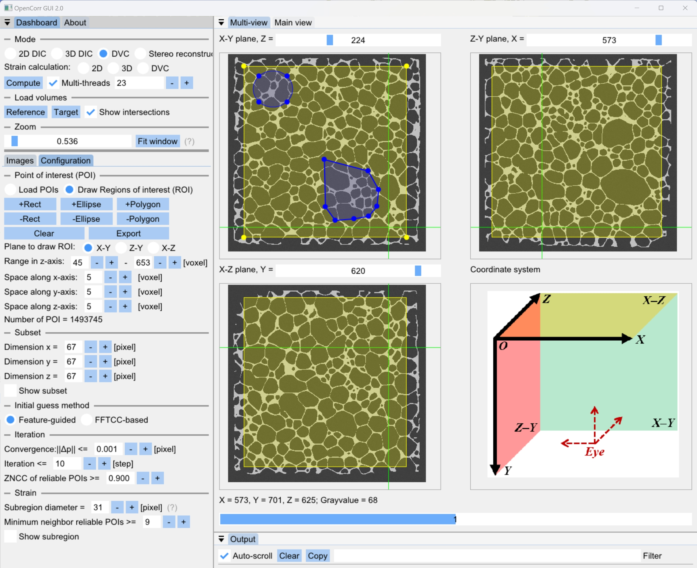

# OpenCorr: 开源数字图像相关法C++程序开发库

OpenCorr是一个开源的C++程序开发库，旨在提供一套轻量而高效的开发工具，帮助对数字图像相关法（Digital image correlation, DIC）或数字体图像相关法（Digital volume correlation, DVC）感兴趣的用户学习和研究算法的原理及实现，或者根据自己的特定需求，像组装乐高积木一样，开发新的DIC或DVC算法，或制作相关处理软件。OpenCorr GUI是我们在这个开发库基础上制作的一个图形界面软件，展示了这个库中大部分DIC和DVC功能。

大家如有问题或建议，欢迎联系我们。具体可通过以下途径获得帮助：

1. 给我们写Email: zhenyujiang (at) scut.edu.cn

2. 在GitHub的项目讨论区交流

3. 加入OpenCorr的QQ讨论群：597895040

   

OpenCorr的代码和文档通过GitHub发布和维护，网址为 https://github.com/vincentjzy/OpenCorr



# 重要更新记录

- 2021.04.23，OpenCorr正式上线
- 2021.04.30，针对OpenMP优化了DIC模块的结构，改造了立体视觉模块的结构
- 2021.05.08，初步完成了OpenCorr架构的说明文档
- 2021.05.17，针对Linux系统进行了兼容性调整，发布了网页首图
- 2021.06.12，发布了根据DIC结果计算应变的示例，更新了相应文档
- 2021.08.14，发布了GPU加速的ICGN模块和调用示例，具体说明请见第五节（5. GPU加速模块）
- 2021.11.03，发布了实现 Stereo DIC（3D DIC）的示例，全面完善了相应模块和文档
- 2021.11.16，完善了Strain模块，实现了目标表面二维和三维应变场的计算
- 2022.04.27，重要更新，内容包括：（i）引入nanoflann加速Feature Affine算法和应变计算中的近邻点搜索；（ii）将第三方程序库（Eigen和OpenCV）升级至最新稳定版；（iii）进一步规范代码
- 2022.05.03，开发了为极线约束辅助匹配估计视差的方法，提供了一个进行立体匹配和重构的示例，展示了SIFT特征和极线约束结合使用的方法。
- 2022.06.23，发布了DVC模块，包括3D FFTCC和3D ICGN算法，其它模块也进行了相应的扩充。
- 2022.10.13，修复了GPU加速ICGN模块显存泄漏的故障。
- 2022.10.21，修复了FeatureAffine和Strain模块在多线程模式下调用NearestNeighbor实例冲突的问题。
- 2022.12.23，OpenCorr 1.0正式发布，增加了3D SIFT特征提取和匹配模块，3D SIFT特征引导的FeatureAffine模块，更新了文档和程序范例。
- 2023.01.13，常规更新，内容包括：（i）增加了Newton-Raphson算法模块（NR），仅适用于2D DIC；（ii）提供了一个自适应DIC的范例，可针对每个POI动态优化其子区形状和尺寸；（iii）修复了Interpolation模块中一个潜在bug；（iv）更新代码和文档。
- 2023.01.18，增加了实例说明。
- 2023.03.06，OpenCorr专题论文“OpenCorr: An open source library for research and development of digital image correlation”发表于Optics and Lasers in Engineering。
- 2024.02.07，ICGN模块重要升级：（i）重构了GPU加速ICGN模块（ICGNGPU）全部代码，增加了DVC功能。该模块的调用方式与CPU版本统一，去除了大多数不必要的数据转换和传输。在examples目录下提供了两个应用例子的程序。（ii）CPU版本的ICGN模块也做了一些效率方面的小优化。
- 2024.06.14，发布图形界面软件OpenCorr GUI 1.0，修订了代码和实例。
- 2024.07.26，发布图形界面软件OpenCorr GUI 2.0，该软件全面支持2D、3D/Stereo DIC和DVC处理。
- 2024.12.11，常规更新，内容包括：（i）增加了反向复合Levenberg-Marquart算法（ICLM）；（ii）根据Czcibor Bohusz-Dobosz的建议优化了代码。
- 2025.02.03，常规更新，内容包括：（i）将智能指针引入DIC和DVC模块增强稳健性；（ii）整理代码。
- 2025.05.06，添加在macOs中使用visual Studio Code编译代码的说明，改善了代码对macOs中OpenMP的兼容性。
- 2026.05.19，发布图形界面软件OpenCorr GUI 3.0，该软件提供了丰富的计算结果可视化功能。

# 目录

1. [如何使用OpenCorr](./1_Get_started_CN.md)
2. [OpenCorr的组织架构](./2_Framework_CN.md)
3. [数据对象](./3_Data_structures_CN.md)
4. [处理方法](./4_Processing_methods_CN.md)
5. [GPU加速模块](./5_GPU_acceleration_CN.md)
6. [实例说明](./6_Examples_CN.md)
7. [图形界面软件](./7_Software_with_GUI_CN.md)

# 开发人员

- 蒋震宇 博士，华南理工大学教授、博士生导师

- 张铃启 博士，日本理化学研究所博士后

- 王添翼 博士，现为美国布鲁克海文国家实验室博士后

- 陈蔚 博士，美的集团先行研究主任工程师

- 黄健文，商汤科技软件工程师

- 杨俊荣，腾讯科技软件工程师

- 林傲宇，中国南方电网工程师

- 李睿，华南理工大学博士生

- 任豪强，华南理工大学博士生

- 贺凯，华南理工大学博士生

- 王洪立，华南理工大学硕士生

# 致谢

OpenCorr 中提供的 DIC和DVC 算法是我们近年来在该领域一系列探索的成果，这些研究工作得到了多个国家自然科学基金项目的资助。在此，特别感谢一直以来给予我大力支持的两位合作者：新加坡南洋理工大学的钱克矛教授和华南理工大学的董守斌教授。

# 相关论文

用户可参阅我们发表的论文，以便深入了解OpenCorr中算法的原理。如果OpenCorr对你的工作有帮助，请引用以下这篇论文，以便更多朋友了解OpenCorr。

```json
@article{jiang2023opencorr,
  title={OpenCorr: An open source library for research and development of digital image correlation},
  author={Jiang, Zhenyu},
  journal={Optics and Lasers in Engineering},
  volume={165},
  pages={107566},
  year={2023},
  publisher={Elsevier}
}
```

1. Z. Jiang, Q. Kemao, H. Miao, J. Yang, L. Tang, Path-independent digital image correlation with high accuracy, speed and robustness, Optics and Lasers in Engineering (2015) 65: 93-102. (https://doi.org/10.1016/j.optlaseng.2014.06.011)
2. L. Zhang, T. Wang, Z. Jiang, Q. Kemao, Y. Liu, Z. Liu, L. Tang, S. Dong, High accuracy digital image correlation powered by GPU-based parallel computing, Optics and Lasers in Engineering (2015) 69: 7-12. (https://doi.org/10.1016/j.optlaseng.2015.01.012)
3. T. Wang, Z. Jiang, Q. Kemao, F. Lin, S.H. Soon, GPU accelerated digital volume correlation, Experimental Mechanics (2016) 56(2): 297-309. (https://doi.org/10.1007/s11340-015-0091-4)
4. Z. Pan, W. Chen, Z. Jiang, L. Tang, Y. Liu, Z. Liu, Performance of global look-up table strategy in digital image correlation with cubic B-spline interpolation and bicubic interpolation, Theoretical and Applied Mechanics Letters (2016) 6(3): 126-130. (https://doi.org/10.1016/j.taml.2016.04.003)
5. W. Chen, Z. Jiang, L. Tang, Y. Liu, Z. Liu, Equal noise resistance of two mainstream iterative sub-pixel registration algorithms in digital image correlation, Experimental Mechanics (2017) 57(6): 979-996. (https://doi.org/10.1007/s11340-017-0294-y)
6. J. Huang, L. Zhang, Z. Jiang, S. Dong, W. Chen, Y. Liu, Z. Liu, L. Zhou, L. Tang, Heterogeneous parallel computing accelerated iterative subpixel digital image correlation, Science China Technological Sciences (2018) 61(1):74-85. (https://doi.org/10.1007/s11431-017-9168-0)
7. J. Yang, J. Huang, Z. Jiang, S. Dong, L. Tang, Y. Liu, Z. Liu, L. Zhou, SIFT-aided path-independent digital image correlation accelerated by parallel computing, Optics and Lasers in Engineering (2020) 127: 105964. (https://doi.org/10.1016/j.optlaseng.2019.105964)
8. J. Yang, J. Huang, Z. Jiang, S. Dong, L. Tang, Y. Liu, Z. Liu, L. Zhou, 3D SIFT aided path independent digital volume correlation and its GPU acceleration, Optics and Lasers in Engineering (2021) 136: 106323. (https://doi.org/10.1016/j.optlaseng.2020.106323)
9. L. Cai, J. Yang, S. Dong, Z. Jiang. GPU accelerated parallel reliability-guided digital volume correlation with automatic seed selection based on 3D SIFT. Parallel Computing (2021) 108: 102824. (https://doi.org/10.1016/j.parco.2021.102824)
10. A. Lin, R. Li, Z. Jiang, S. Dong, Y. Liu, Z. Liu, L. Zhou, L. Tang, Path independent stereo digital image correlation with high speed and analysis resolution, Optics and Lasers in Engineering (2022) 149: 106812. (https://doi.org/10.1016/j.optlaseng.2021.106812)
11. Z. Jiang, OpenCorr: An open source library for research and development of digital image correlation. Optics and Lasers in Engineering (2023) 165: 107566. (https://doi.org/10.1016/j.optlaseng.2023.107566)
12. W. Yin, Y. Ji, J. Chen, R. Li, S. Feng, Q. Chen, B. Pan, Z. Jiang, C. Zuo, Initializing and accelerating Stereo-DIC computation using semi-global matching with geometric constraints. Optics and Lasers in Engineering (2024) 172: 107879. (https://doi.org/10.1016/j.optlaseng.2023.107879)

# 影响

我们欣喜地发现，一些其他院校的同仁在他们的DIC研究中使用OpenCorr开发新算法或作为测试基准。欢迎大家提供更多以下列表中尚未包括的工作。

1. Yuxi Chi, Bing Pan. Accelerating parallel digital image correlation computation with feature mesh interpolation. Measurement (2022) 199: 111554. (https://doi.org/10.1016/j.measurement.2022.111554)
2. Wang Lianpo. Super-robust digital image correlation based on learning template. Optics and Lasers in Engineering (2022) 158: 107164. (https://doi.org/10.1016/j.optlaseng.2022.107164)
3. Y Li, L Wei, X Zhang. Measurement of nonuniform strain distribution in CORC cable due to bending process by a segmentation-aided stereo digital image correlation. Experimental Mechanics (2023) 63: 813-822. (https://doi.org/10.1007/s11340-023-00953-y)
4. Yusheng Wang, Zhixiang Huang, Pengfei Zhu, Rui Zhu, Tianci Hu, Dahai Zhang, Dong Jiang. Effects of compressed speckle image on digital image correlation for vibration measurement. Measurement (2023) 217: 113041. (https://doi.org/10.1016/j.measurement.2023.113041)
5. Yong Su. An analytical study on the low-pass filtering effect of digital image correlation caused by under-matched shape functions. Optics and Lasers in Engineering (2023) 168: 107679. (https://doi.org/10.1016/j.optlaseng.2023.107679)
6. Chuanguo Xiong , Yuhan Gao, Yuhua huang , Fulong Zhu. Specular surface deformation measurement based on projected-speckle deflectometry with digital image correlation. Optics and Lasers in Engineering (2023) 170: 107776. (https://doi.org/10.1016/j.optlaseng.2023.107776)
7. Xiao Hong, Li Chengnan, Feng Mingchi. Large deformation measurement method of speckle images based on deep learning. Acta Optica Sinica (2023) 43(14): 1412001. (https://doi.org/10.3788/AOS222084)
8. Jiashuai Yang, Kemao Qian, Lianpo Wang. R3-DICnet: an end-to-end recursive residual refinement DIC network for larger deformation measurement. Optics Express (2024) 32(1): 907-921. (https://doi.org/10.1364/OE.505655)
9. Derui Li, Bin Cheng, Sheng Xiang. Direct cubic B-spline interpolation: A fuzzy interpolating method for weightless, robust and accurate DVC computation. Optics and Lasers in Engineering (2024) 172: 107886. (https://doi.org/10.1016/j.optlaseng.2023.107886)
10. Datao Li, Xiahui Wei, Yingrong Gao, Jinsong Jiang, Wei Xia, Binhua Wang. Investigations on tensile mechanical properties of rigid insulation tile materials at elevated temperatures based on digital image correlation algorithm. Construction and Building Materials (2024) 413: 134925. (https://doi.org/10.1016/j.conbuildmat.2024.134925)
11. Longyong Tong, Hang Zhou, Brian Sheil. Multicore CPU-based parallel computing accelerated digital image correlation for large soil deformations measurement. Computers and Geotechnics (2024) 166: 106027. (https://doi.org/10.1016/j.compgeo.2023.106027)
12. Hengrui Cui, Zhoumo Zeng, Jian Li, Hui Zhang, Fenglong Yang, Shili Chen. The effect of error coefficient matrices and correlation criteria on dic computation errors. Optics and Lasers in Engineering (2024) 174: 107954. (https://doi.org/10.1016/j.optlaseng.2023.107954)
13. Jiaqiu Wang, Hao Wu, Zhengduo Zhu5, Hujin Xie, Han Yu, Qiuxiang Huang, Yuqiao Xiang, Phani Kumari Paritala, Jessica Benitez Mendieta, Haveena Anbananthan, Jorge Alberto Amaya Catano, Runxin Fang, Luping Wang, Zhiyong Li. Impact of Speckle Deformability on Digital Imaging Correlation. IEEE Access (2024) 12:66466-66477. (https://doi.org/10.1109/ACCESS.2024.3398786)
14. Siqi Wang, Zehui Zhu, Tao Ma, Jianwei Fan. Asphalt concrete characterization using digital image correlation: A systematic review of best practices, applications, and future vision. Journal of Testing and Evaluation (2024) 52(4): 20230485. (https://doi.org/10.1520/JTE20230485)
15. Yujia Cheng, Quanbao Wang, Lightweight digital image correlation network for stratospheric airship skin deformation measurement. Optical Engineering (2024) 63(7): 073103. (https://doi.org/10.1117/1.OE.63.7.073103)
16. Yahong Feng, Lianpo Wang. Stereo-DICNet: An efficient and unified speckle matching network for stereo digital image correlation measurement. Optics and Lasers in Engineering (2024) 179: 108267. (https://doi.org/10.1016/j.optlaseng.2024.108267)
17. Hujin Xie, Han Yu, Hao Wu, Jiaqiu Wang, Shanglin Wu, Jianjian Zhang, Huilin Zhao, Mingyang Yuan, Jessica Benitez Mendieta, Haveena Anbananthan, Craig Winter, Chengcheng Zhu, Zhiyong Li. Quantifying irregular pulsation of intracranial aneurysms using 4D-CTA. Journal of Biomechanics (2024) 174: 112269. (https://doi.org/10.1016/j.jbiomech.2024.112269)
18. Yong Su, Li Lao. Modeling the measurement accuracy of one-dimensional boundary subsets in digital image correlation. Optics and Lasers in Engineering (2024) 181: 108362. (https://doi.org/10.1016/j.optlaseng.2024.108362)
19. Han Yu, Zidun Wang, Hao Wu, Zhengduo Zhu, Jiaqiu Wang, Runxing Fang, Shanglin Wu, Hujin Xie, Xianjue Huang, Jessica Benitez Mendieta, Haveena Anbananthan, Zhiyong Li. In-vivo left atrial surface motion and strain measurement using novel mesh regularized image block matching method with 4D-CTA. Journal of Biomechanics (2024) 176: 112354. (https://doi.org/10.1016/j.jbiomech.2024.112354)
20. Peng Shi, Keming Zhang, Junxiang Peng. Method for luminescent digital image correlation deformation measurement in non-illuminated environments. Applied Optics (2024) 63(31): 8248-8256. (https://doi.org/10.1364/AO.540467)
21. Guowen Wang, Yuan Zhou, Zhiyuan Wang, Jian Zhou, Shanyong Xuan, Xuefeng Yao. StrainNet-LD: Large Displacement digital image correlation based on deep learning and displacement-field decomposition. Optics and Lasers in Engineering (2024) 183: 108502. (https://doi.org/10.1016/j.optlaseng.2024.108502)
22. Annada Prasad Moharana, Amit Rai Dixit. 2-Dimensional strain mapping and post curing effects on viscoelastic properties of glass fiber infused photocurable composites prepared using Vat-photopolymerization process. Rapid Prototyping Journal (2024) (https://doi.org/10.1108/RPJ-06-2024-0254)
23. Jiashuai Yang, Yahong Feng, Lianpo Wang. Efficient and robust deformation measurement based on unsupervised learning. Measurement (2025) 242 (Part A): 115908. (https://doi.org/10.1016/j.measurement.2024.115908)
24. Émélie Gagnon, Jennifer J Day. The practicality of quality assessment metrics for millimetre-scale digital image correlation speckle patterns. Strain (2025) 61(1): e12491. 
25. Zhengduo Zhu, Jiaqiu Wang, Hao Wu, Minglong Chen, Zidun Wang, Runxin Fang, Xianjue Huang, Hujin Xie, Han Yu, Yuchu Tian, Zhiyong Li. Performance test of digital volume correlation on tracking left atrium motion from cardiac CT. Acta Mechanica Sinica (2025) 41(4): 624216. (https://doi.org/10.1007/s10409-024-24216-x)
26. Zitong Wang, Pan Zhu, Jiaxi Guan, Lu Liu, Xinglin Zhou. ECI-Net: A modular and lightweight Deep DIC network for real-time robust 2D displacement measurement. Optics & Laser Technology (2025) 183: 112376. (https://doi.org/10.1016/j.optlastec.2024.112376)
27. Yaru Wang, Qingchuan Zhang, Yong Su. Theoretical analysis of systematic errors in Gaussian weighted digital image correlation due to undermatched shape functions. Optics & Laser Technology (2025) 184: 112332. (https://doi.org/10.1016/j.optlastec.2024.112332)
